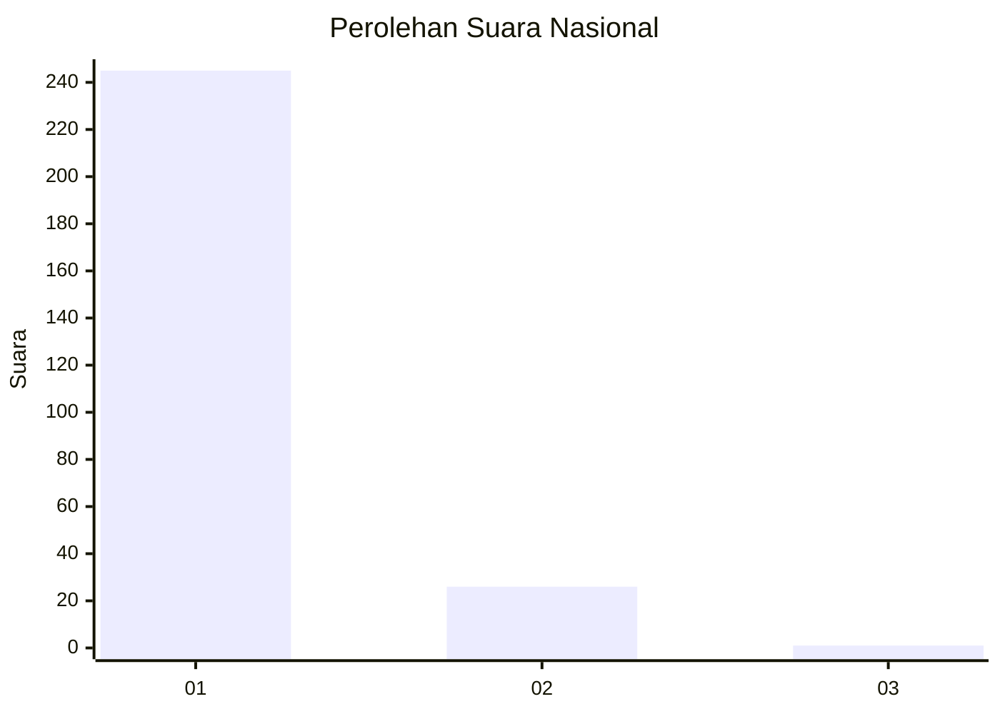
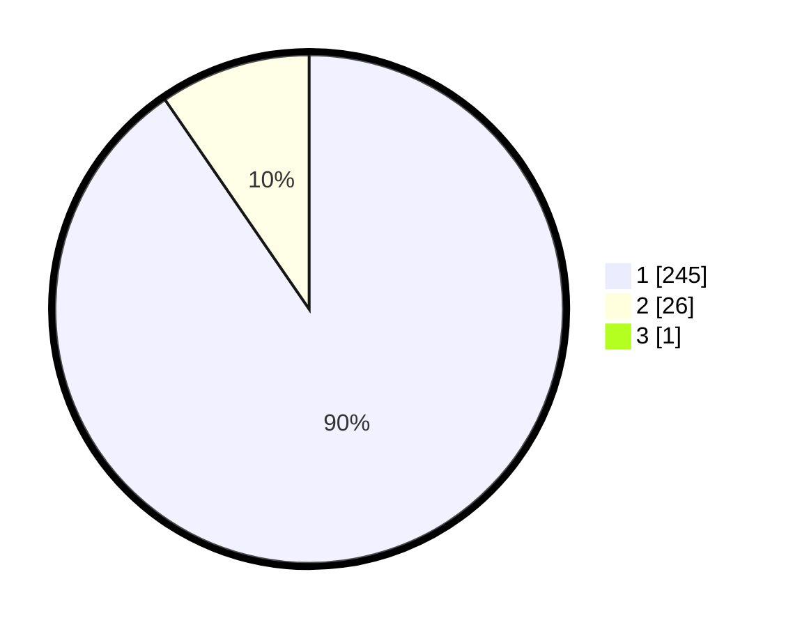

# Hasil

## Grafik

## Tabel

| No. | Nama Paslon    | Suara | Suara (raw) | Persentase |
|:--- |:-------------- | -----:| -----------:| ----------:|
| 1   | ANIES MUHAIMIN | 245   | [245][p-1]  | 90,07      |
| 2   | PRABOWO GIBRAN | 26    | [26][p-2]   | 9,56       |
| 3   | GANJAR MAHFUD  | 1     | [1][p-3]    | 0,37       |

[p-1]: https://github.com/gigit-pemilu/pemilu-2024/blob/main/pilpres/hitung-suara/sub/11-aceh/sub/06-aceh-besar/sub/23-blang-bintang/sub/2016-cot-jambo/sub/001-tps/sub/paslon-1.txt
[p-2]: https://github.com/gigit-pemilu/pemilu-2024/blob/main/pilpres/hitung-suara/sub/11-aceh/sub/06-aceh-besar/sub/23-blang-bintang/sub/2016-cot-jambo/sub/001-tps/sub/paslon-2.txt
[p-3]: https://github.com/gigit-pemilu/pemilu-2024/blob/main/pilpres/hitung-suara/sub/11-aceh/sub/06-aceh-besar/sub/23-blang-bintang/sub/2016-cot-jambo/sub/001-tps/sub/paslon-3.txt

## Foto C Plano

https://sirekap-obj-formc.kpu.go.id/ac48/pemilu/ppwp/11/06/23/20/16/1106232016001-20240215-071256--f285334c-53e3-415b-8e91-629176a204d1.jpg

https://sirekap-obj-formc.kpu.go.id/ac48/pemilu/ppwp/11/06/23/20/16/1106232016001-20240214-230805--cca513b1-5447-429a-b379-e6f0c537df83.jpg

https://sirekap-obj-formc.kpu.go.id/ac48/pemilu/ppwp/11/06/23/20/16/1106232016001-20240214-231017--758baa3f-5575-4db0-a301-047929f499d5.jpg

## Metadata

| Key        | Value               |
| ---------- | ------------------- |
| Time Stamp | 2024-02-15 16:00:26 |

