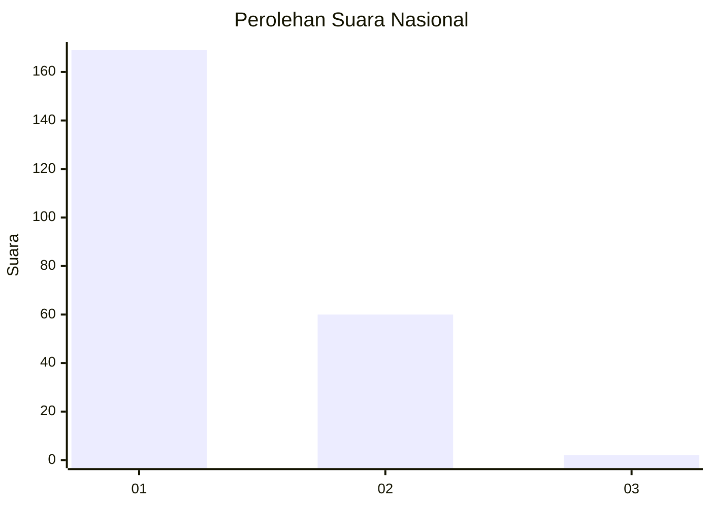
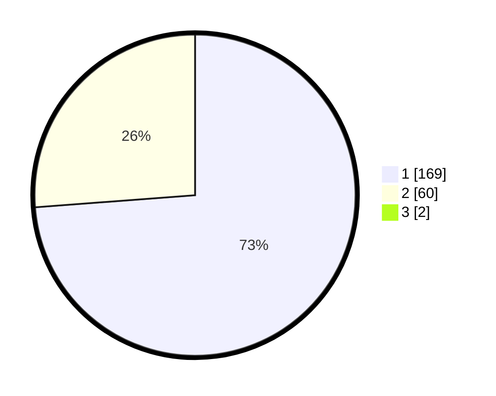

# Hasil

## Grafik

## Tabel

| No. | Nama Paslon    | Suara | Suara (raw) | Persentase |
|:--- |:-------------- | -----:| -----------:| ----------:|
| 1   | ANIES MUHAIMIN | 169   | [169][p-1]  | 73,16      |
| 2   | PRABOWO GIBRAN | 60    | [60][p-2]   | 25,97      |
| 3   | GANJAR MAHFUD  | 2     | [2][p-3]    | 0,87       |

[p-1]: https://github.com/gigit-pemilu/pemilu-2024/blob/main/pilpres/hitung-suara/sub/11-aceh/sub/06-aceh-besar/sub/23-blang-bintang/sub/2018-bueng-pageu/sub/001-tps/sub/paslon-1.txt
[p-2]: https://github.com/gigit-pemilu/pemilu-2024/blob/main/pilpres/hitung-suara/sub/11-aceh/sub/06-aceh-besar/sub/23-blang-bintang/sub/2018-bueng-pageu/sub/001-tps/sub/paslon-2.txt
[p-3]: https://github.com/gigit-pemilu/pemilu-2024/blob/main/pilpres/hitung-suara/sub/11-aceh/sub/06-aceh-besar/sub/23-blang-bintang/sub/2018-bueng-pageu/sub/001-tps/sub/paslon-3.txt

## Foto C Plano

https://sirekap-obj-formc.kpu.go.id/e752/pemilu/ppwp/11/06/23/20/18/1106232018001-20240215-061239--547bbf93-42d8-4a7f-b31e-188a25923a4c.jpg

https://sirekap-obj-formc.kpu.go.id/e752/pemilu/ppwp/11/06/23/20/18/1106232018001-20240215-061413--2e2990b8-9e87-4511-bcd0-0434132db6c0.jpg

https://sirekap-obj-formc.kpu.go.id/e752/pemilu/ppwp/11/06/23/20/18/1106232018001-20240215-061517--b0ad24f7-a7d6-4feb-a788-15bfd6f456a1.jpg

## Metadata

| Key        | Value               |
| ---------- | ------------------- |
| Time Stamp | 2024-02-16 00:00:26 |

