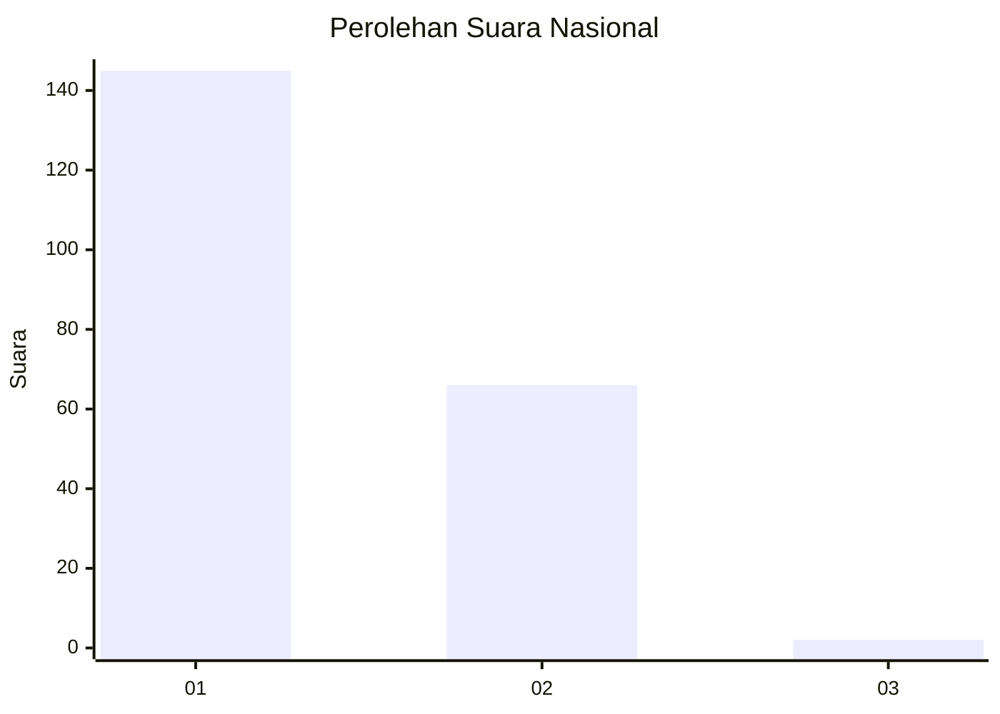
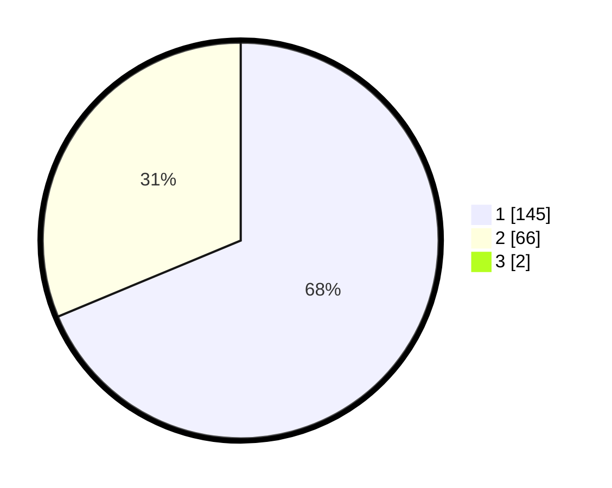

# Hasil

## Grafik

## Tabel

| No. | Nama Paslon    | Suara | Suara (raw) | Persentase |
|:--- |:-------------- | -----:| -----------:| ----------:|
| 1   | ANIES MUHAIMIN | 145   | [145][p-1]  | 68,08      |
| 2   | PRABOWO GIBRAN | 66    | [66][p-2]   | 30,99      |
| 3   | GANJAR MAHFUD  | 2     | [2][p-3]    | 0,94       |

[p-1]: https://github.com/gigit-pemilu/pemilu-2024/blob/main/pilpres/hitung-suara/sub/11-aceh/sub/06-aceh-besar/sub/23-blang-bintang/sub/2018-bueng-pageu/sub/002-tps/sub/paslon-1.txt
[p-2]: https://github.com/gigit-pemilu/pemilu-2024/blob/main/pilpres/hitung-suara/sub/11-aceh/sub/06-aceh-besar/sub/23-blang-bintang/sub/2018-bueng-pageu/sub/002-tps/sub/paslon-2.txt
[p-3]: https://github.com/gigit-pemilu/pemilu-2024/blob/main/pilpres/hitung-suara/sub/11-aceh/sub/06-aceh-besar/sub/23-blang-bintang/sub/2018-bueng-pageu/sub/002-tps/sub/paslon-3.txt

## Foto C Plano

https://sirekap-obj-formc.kpu.go.id/92f9/pemilu/ppwp/11/06/23/20/18/1106232018002-20240215-053057--812628ce-1e2b-48bf-96e3-b403e9d2993a.jpg

https://sirekap-obj-formc.kpu.go.id/92f9/pemilu/ppwp/11/06/23/20/18/1106232018002-20240215-053259--c4a520f1-b22f-410b-928d-1552eae00bd6.jpg

https://sirekap-obj-formc.kpu.go.id/92f9/pemilu/ppwp/11/06/23/20/18/1106232018002-20240215-053431--35a9c50e-b59c-4f4e-bb35-17675f472c37.jpg

## Metadata

| Key        | Value               |
| ---------- | ------------------- |
| Time Stamp | 2024-02-15 15:00:29 |

