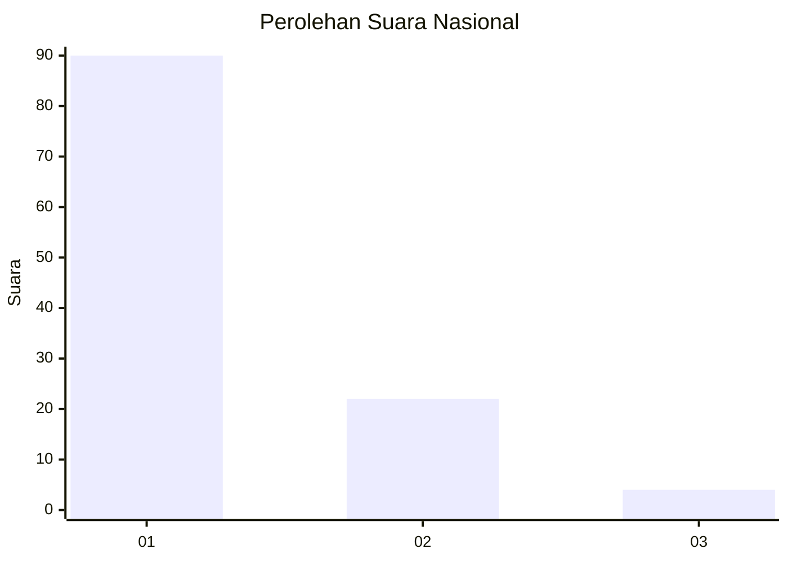
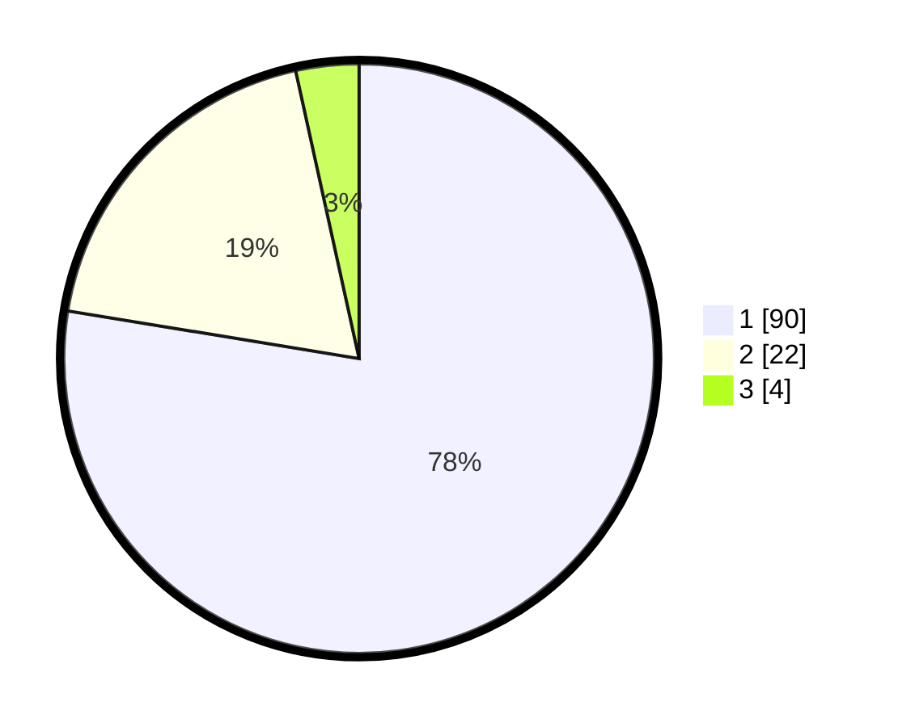

# Hasil

## Grafik

## Tabel

| No. | Nama Paslon    | Suara | Suara (raw) | Persentase |
|:--- |:-------------- | -----:| -----------:| ----------:|
| 1   | ANIES MUHAIMIN | 90    | [90][p-1]   | 77,59      |
| 2   | PRABOWO GIBRAN | 22    | [22][p-2]   | 18,97      |
| 3   | GANJAR MAHFUD  | 4     | [4][p-3]    | 3,45       |

[p-1]: https://github.com/gigit-pemilu/pemilu-2024/blob/main/pilpres/hitung-suara/sub/11-aceh/sub/06-aceh-besar/sub/23-blang-bintang/sub/2019-cot-sayun/sub/001-tps/sub/paslon-1.txt
[p-2]: https://github.com/gigit-pemilu/pemilu-2024/blob/main/pilpres/hitung-suara/sub/11-aceh/sub/06-aceh-besar/sub/23-blang-bintang/sub/2019-cot-sayun/sub/001-tps/sub/paslon-2.txt
[p-3]: https://github.com/gigit-pemilu/pemilu-2024/blob/main/pilpres/hitung-suara/sub/11-aceh/sub/06-aceh-besar/sub/23-blang-bintang/sub/2019-cot-sayun/sub/001-tps/sub/paslon-3.txt

## Foto C Plano

https://sirekap-obj-formc.kpu.go.id/9c03/pemilu/ppwp/11/06/23/20/19/1106232019001-20240214-224456--b646ee86-db3c-4c87-821d-d32de980285e.jpg

https://sirekap-obj-formc.kpu.go.id/9c03/pemilu/ppwp/11/06/23/20/19/1106232019001-20240214-224643--9532c7ab-5449-46e1-b98c-12c0c3039bbf.jpg

https://sirekap-obj-formc.kpu.go.id/9c03/pemilu/ppwp/11/06/23/20/19/1106232019001-20240214-224755--f08ca8df-3338-492b-8fe1-25de0623f0fd.jpg

## Metadata

| Key        | Value               |
| ---------- | ------------------- |
| Time Stamp | 2024-02-15 15:00:29 |

