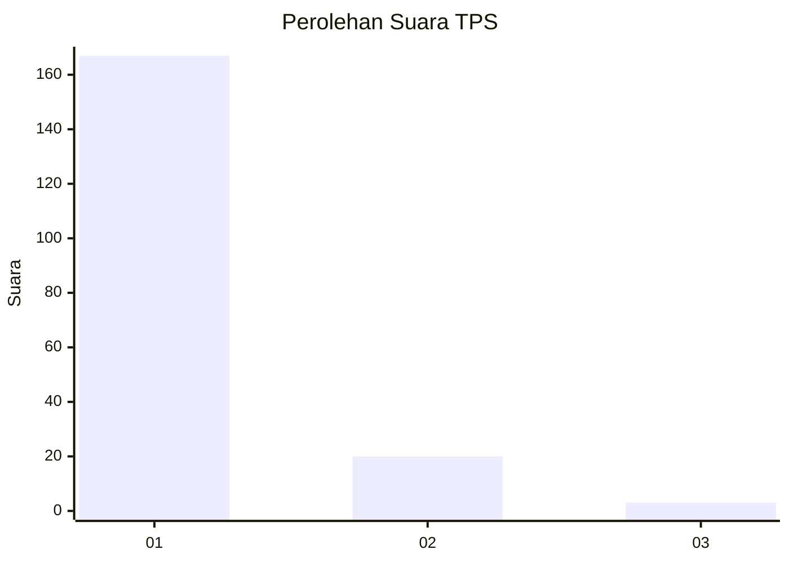
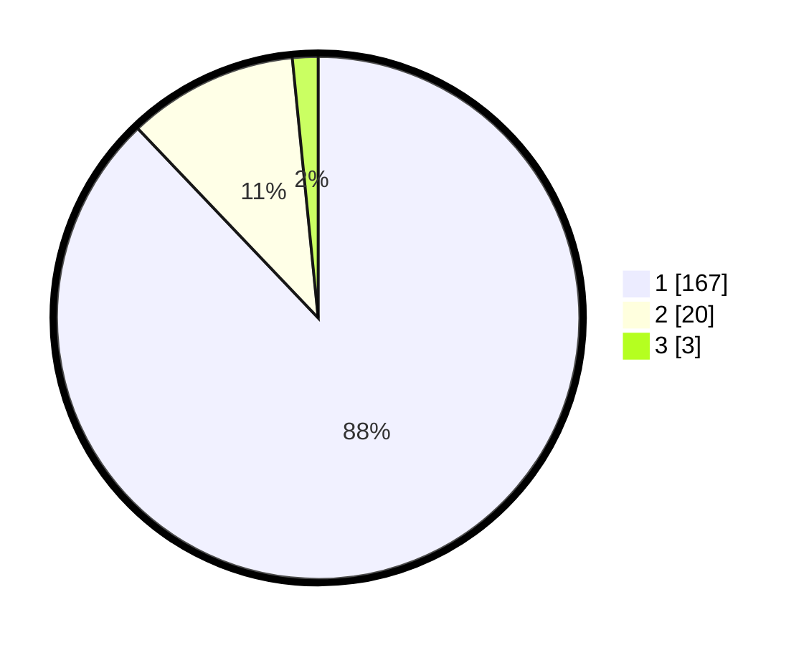

# Hasil

## Grafik

## Tabel

| No. | Nama Paslon    | Suara | Suara (raw) | Persentase |
|:--- |:-------------- | -----:| -----------:| ----------:|
| 1   | ANIES MUHAIMIN | 167   | [167][p-1]  | 87,89      |
| 2   | PRABOWO GIBRAN | 20    | [20][p-2]   | 10,53      |
| 3   | GANJAR MAHFUD  | 3     | [3][p-3]    | 1,58       |

[p-1]: https://github.com/gigit-pemilu/pemilu-2024-11-aceh/blob/main/pilpres/hitung-suara/sub/11-aceh/sub/06-aceh-besar/sub/23-blang-bintang/sub/2022-cot-bagie/sub/002-tps/sub/paslon-1.txt
[p-2]: https://github.com/gigit-pemilu/pemilu-2024-11-aceh/blob/main/pilpres/hitung-suara/sub/11-aceh/sub/06-aceh-besar/sub/23-blang-bintang/sub/2022-cot-bagie/sub/002-tps/sub/paslon-2.txt
[p-3]: https://github.com/gigit-pemilu/pemilu-2024-11-aceh/blob/main/pilpres/hitung-suara/sub/11-aceh/sub/06-aceh-besar/sub/23-blang-bintang/sub/2022-cot-bagie/sub/002-tps/sub/paslon-3.txt

## Foto C Plano

https://sirekap-obj-formc.kpu.go.id/2997/pemilu/ppwp/11/06/23/20/22/1106232022002-20240217-173100--080479dd-0733-4ab0-9d19-9d142aac6b2a.jpg

https://sirekap-obj-formc.kpu.go.id/2997/pemilu/ppwp/11/06/23/20/22/1106232022002-20240217-174339--b53c894e-4307-4632-90a9-1de7966bedd5.jpg

https://sirekap-obj-formc.kpu.go.id/2997/pemilu/ppwp/11/06/23/20/22/1106232022002-20240217-174529--ac707daf-361b-4819-911e-919c49489180.jpg

## Metadata

| Key        | Value               |
| ---------- | ------------------- |
| Time Stamp | 2024-02-19 21:00:00 |

