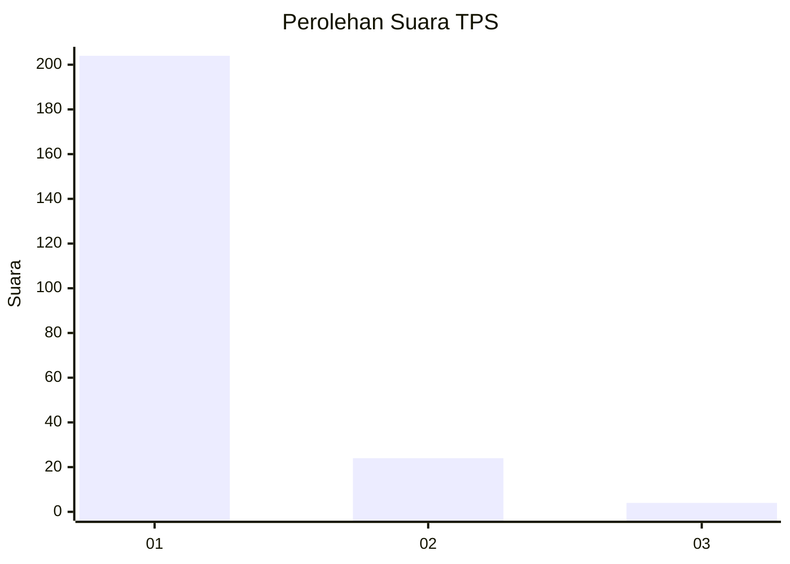
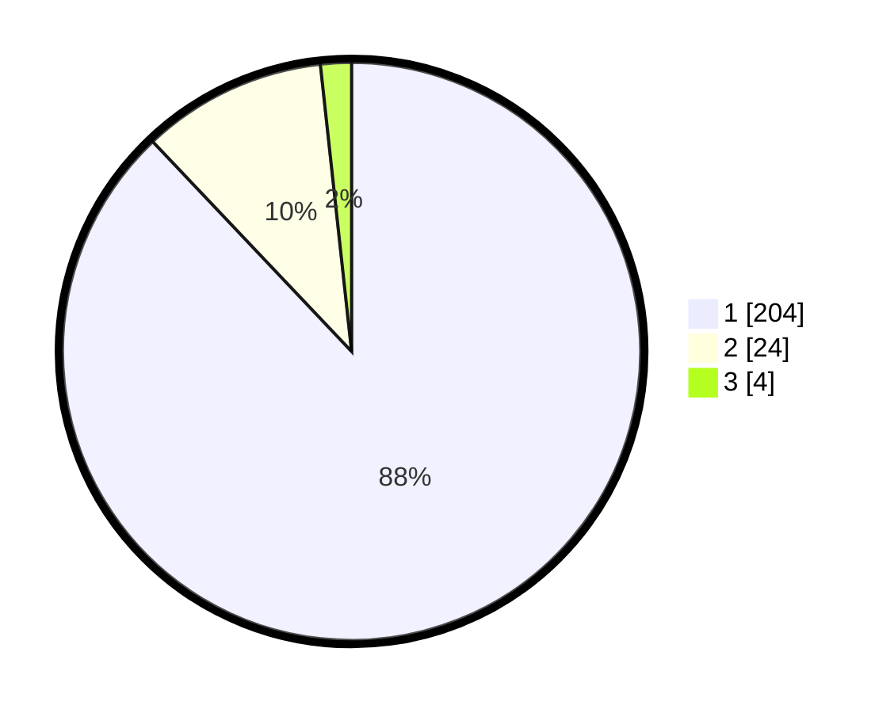

# Hasil

## Grafik

## Tabel

| No. | Nama Paslon    | Suara | Suara (raw) | Persentase |
|:--- |:-------------- | -----:| -----------:| ----------:|
| 1   | ANIES MUHAIMIN | 204   | [204][p-1]  | 87,93      |
| 2   | PRABOWO GIBRAN | 24    | [24][p-2]   | 10,34      |
| 3   | GANJAR MAHFUD  | 4     | [4][p-3]    | 1,72       |

[p-1]: https://github.com/gigit-pemilu/pemilu-2024-11-aceh/blob/main/pilpres/hitung-suara/sub/11-aceh/sub/06-aceh-besar/sub/23-blang-bintang/sub/2023-kayee-kunyet/sub/001-tps/sub/paslon-1.txt
[p-2]: https://github.com/gigit-pemilu/pemilu-2024-11-aceh/blob/main/pilpres/hitung-suara/sub/11-aceh/sub/06-aceh-besar/sub/23-blang-bintang/sub/2023-kayee-kunyet/sub/001-tps/sub/paslon-2.txt
[p-3]: https://github.com/gigit-pemilu/pemilu-2024-11-aceh/blob/main/pilpres/hitung-suara/sub/11-aceh/sub/06-aceh-besar/sub/23-blang-bintang/sub/2023-kayee-kunyet/sub/001-tps/sub/paslon-3.txt

## Foto C Plano

https://sirekap-obj-formc.kpu.go.id/8fee/pemilu/ppwp/11/06/23/20/23/1106232023001-20240215-051024--a624b0f1-5a0a-45dc-8263-101f8cae75f3.jpg

https://sirekap-obj-formc.kpu.go.id/8fee/pemilu/ppwp/11/06/23/20/23/1106232023001-20240219-174803--c37f07f6-3f07-4fa4-8896-7a10401844f8.jpg

https://sirekap-obj-formc.kpu.go.id/8fee/pemilu/ppwp/11/06/23/20/23/1106232023001-20240219-185245--5694242d-3fc6-40e6-ba72-10d40eb36569.jpg

## Metadata

| Key        | Value               |
| ---------- | ------------------- |
| Time Stamp | 2024-02-19 22:00:00 |

