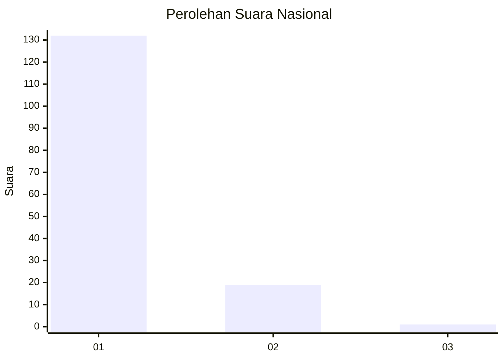
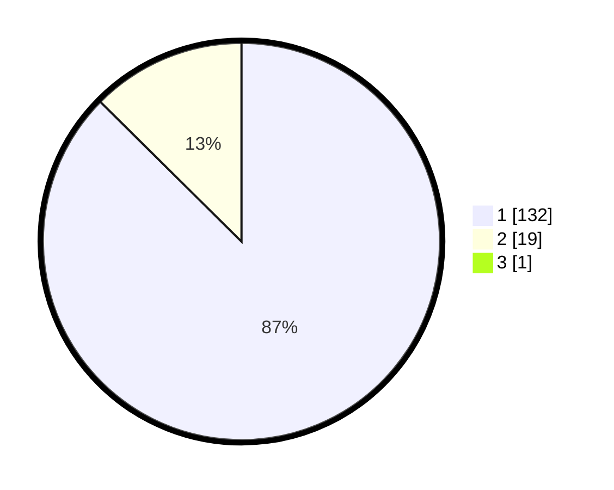

# Hasil

## Grafik

## Tabel

| No. | Nama Paslon    | Suara | Suara (raw) | Persentase |
|:--- |:-------------- | -----:| -----------:| ----------:|
| 1   | ANIES MUHAIMIN | 132   | [132][p-1]  | 86,84      |
| 2   | PRABOWO GIBRAN | 19    | [19][p-2]   | 12,50      |
| 3   | GANJAR MAHFUD  | 1     | [1][p-3]    | 0,66       |

[p-1]: https://github.com/gigit-pemilu/pemilu-2024/blob/main/pilpres/hitung-suara/sub/11-aceh/sub/06-aceh-besar/sub/23-blang-bintang/sub/2025-empee-bata/sub/001-tps/sub/paslon-1.txt
[p-2]: https://github.com/gigit-pemilu/pemilu-2024/blob/main/pilpres/hitung-suara/sub/11-aceh/sub/06-aceh-besar/sub/23-blang-bintang/sub/2025-empee-bata/sub/001-tps/sub/paslon-2.txt
[p-3]: https://github.com/gigit-pemilu/pemilu-2024/blob/main/pilpres/hitung-suara/sub/11-aceh/sub/06-aceh-besar/sub/23-blang-bintang/sub/2025-empee-bata/sub/001-tps/sub/paslon-3.txt

## Foto C Plano

https://sirekap-obj-formc.kpu.go.id/9a18/pemilu/ppwp/11/06/23/20/25/1106232025001-20240215-005310--617d9566-99f8-4f62-9a83-49aae891afc0.jpg

https://sirekap-obj-formc.kpu.go.id/9a18/pemilu/ppwp/11/06/23/20/25/1106232025001-20240215-005604--cc9d3c4c-78fa-45fb-ae12-93d4547c1834.jpg

https://sirekap-obj-formc.kpu.go.id/9a18/pemilu/ppwp/11/06/23/20/25/1106232025001-20240215-005749--c4db9aa3-402b-4dd0-b513-869aa481805b.jpg

## Metadata

| Key        | Value               |
| ---------- | ------------------- |
| Time Stamp | 2024-02-16 00:00:26 |

