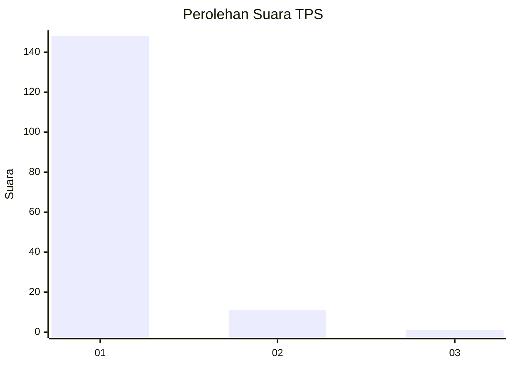
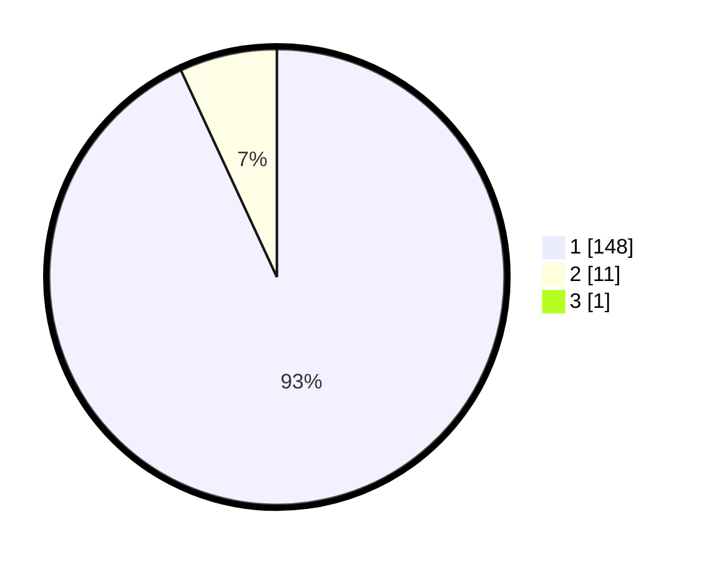

# Hasil

## Grafik

## Tabel

| No. | Nama Paslon    | Suara | Suara (raw) | Persentase |
|:--- |:-------------- | -----:| -----------:| ----------:|
| 1   | ANIES MUHAIMIN | 148   | [148][p-1]  | 92,50      |
| 2   | PRABOWO GIBRAN | 11    | [11][p-2]   | 6,88       |
| 3   | GANJAR MAHFUD  | 1     | [1][p-3]    | 0,63       |

[p-1]: https://github.com/gigit-pemilu/pemilu-2024-11-aceh/blob/main/pilpres/hitung-suara/sub/11-aceh/sub/06-aceh-besar/sub/23-blang-bintang/sub/2025-empee-bata/sub/002-tps/sub/paslon-1.txt
[p-2]: https://github.com/gigit-pemilu/pemilu-2024-11-aceh/blob/main/pilpres/hitung-suara/sub/11-aceh/sub/06-aceh-besar/sub/23-blang-bintang/sub/2025-empee-bata/sub/002-tps/sub/paslon-2.txt
[p-3]: https://github.com/gigit-pemilu/pemilu-2024-11-aceh/blob/main/pilpres/hitung-suara/sub/11-aceh/sub/06-aceh-besar/sub/23-blang-bintang/sub/2025-empee-bata/sub/002-tps/sub/paslon-3.txt

## Foto C Plano

https://sirekap-obj-formc.kpu.go.id/d736/pemilu/ppwp/11/06/23/20/25/1106232025002-20240215-005248--3a7afbb8-6a7b-4409-94c3-261cb122ed54.jpg

https://sirekap-obj-formc.kpu.go.id/d736/pemilu/ppwp/11/06/23/20/25/1106232025002-20240215-005644--3536067c-c8c4-4677-ba90-a50352610100.jpg

https://sirekap-obj-formc.kpu.go.id/d736/pemilu/ppwp/11/06/23/20/25/1106232025002-20240215-005857--6fb60796-1947-456b-aeff-3ca28c76dbef.jpg

## Metadata

| Key        | Value               |
| ---------- | ------------------- |
| Time Stamp | 2024-02-16 00:00:26 |

