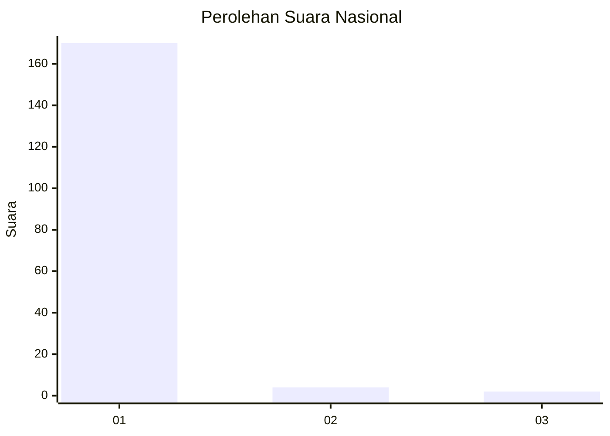
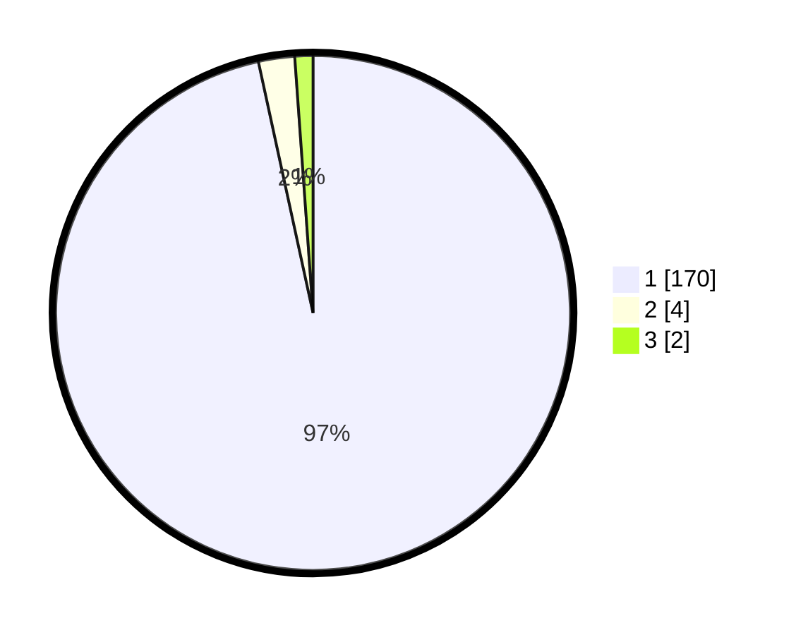

# Hasil

## Grafik

## Tabel

| No. | Nama Paslon    | Suara | Suara (raw) | Persentase |
|:--- |:-------------- | -----:| -----------:| ----------:|
| 1   | ANIES MUHAIMIN | 170   | [170][p-1]  | 96,59      |
| 2   | PRABOWO GIBRAN | 4     | [4][p-2]    | 2,27       |
| 3   | GANJAR MAHFUD  | 2     | [2][p-3]    | 1,14       |

[p-1]: https://github.com/gigit-pemilu/pemilu-2024/blob/main/pilpres/hitung-suara/sub/11-aceh/sub/07-pidie/sub/03-batee/sub/2003-bintang-hu/sub/001-tps/sub/paslon-1.txt
[p-2]: https://github.com/gigit-pemilu/pemilu-2024/blob/main/pilpres/hitung-suara/sub/11-aceh/sub/07-pidie/sub/03-batee/sub/2003-bintang-hu/sub/001-tps/sub/paslon-2.txt
[p-3]: https://github.com/gigit-pemilu/pemilu-2024/blob/main/pilpres/hitung-suara/sub/11-aceh/sub/07-pidie/sub/03-batee/sub/2003-bintang-hu/sub/001-tps/sub/paslon-3.txt

## Foto C Plano

https://sirekap-obj-formc.kpu.go.id/b3aa/pemilu/ppwp/11/07/03/20/03/1107032003001-20240215-044351--67441d14-2e26-4bff-a186-4060fc5368f7.jpg

https://sirekap-obj-formc.kpu.go.id/b3aa/pemilu/ppwp/11/07/03/20/03/1107032003001-20240215-044453--99508bfd-2b31-45f9-8090-61b2f5468135.jpg

https://sirekap-obj-formc.kpu.go.id/b3aa/pemilu/ppwp/11/07/03/20/03/1107032003001-20240215-140438--182e3d65-4f94-4fc9-9661-ad2dc9500da7.jpg

## Metadata

| Key        | Value               |
| ---------- | ------------------- |
| Time Stamp | 2024-02-24 22:31:28 |

