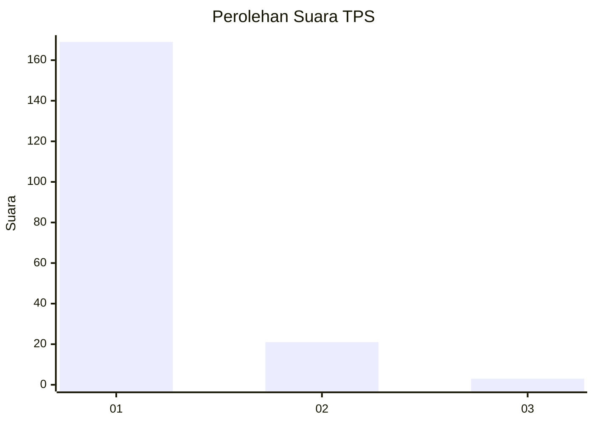
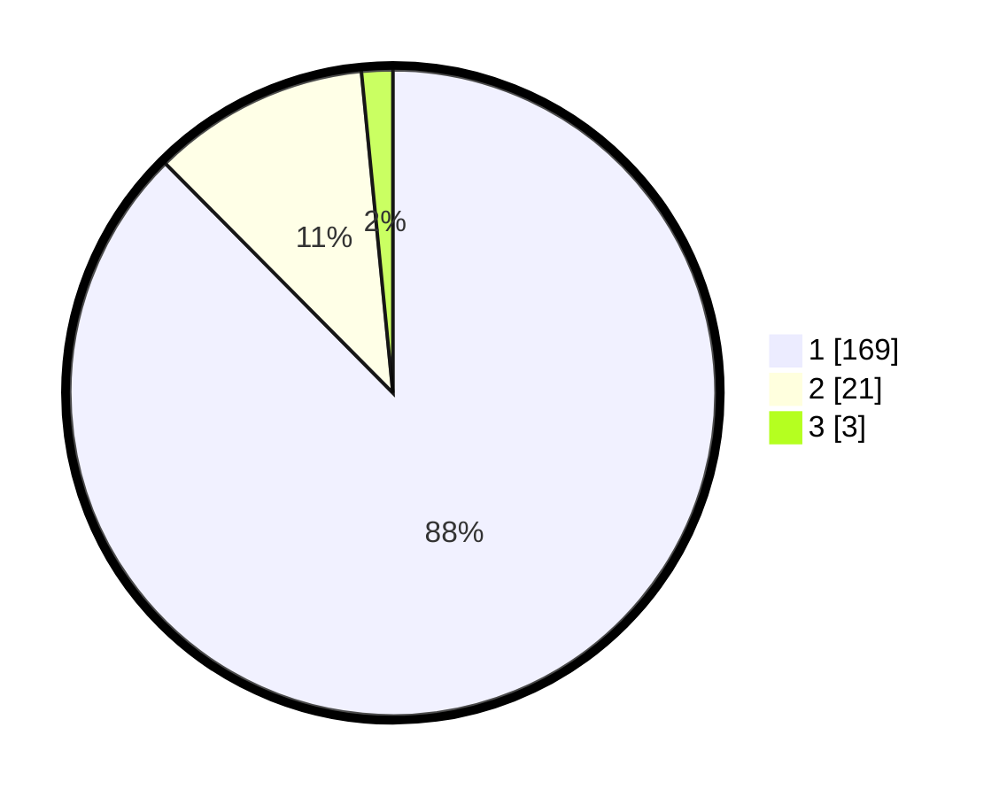

# Hasil

## Grafik

## Tabel

| No. | Nama Paslon    | Suara | Suara (raw) | Persentase |
|:--- |:-------------- | -----:| -----------:| ----------:|
| 1   | ANIES MUHAIMIN | 169   | [169][p-1]  | 87,56      |
| 2   | PRABOWO GIBRAN | 21    | [21][p-2]   | 10,88      |
| 3   | GANJAR MAHFUD  | 3     | [3][p-3]    | 1,55       |

[p-1]: https://github.com/gigit-pemilu/pemilu-2024-11-aceh/blob/main/pilpres/hitung-suara/sub/11-aceh/sub/07-pidie/sub/03-batee/sub/2004-pulo-tukok/sub/001-tps/sub/paslon-1.txt
[p-2]: https://github.com/gigit-pemilu/pemilu-2024-11-aceh/blob/main/pilpres/hitung-suara/sub/11-aceh/sub/07-pidie/sub/03-batee/sub/2004-pulo-tukok/sub/001-tps/sub/paslon-2.txt
[p-3]: https://github.com/gigit-pemilu/pemilu-2024-11-aceh/blob/main/pilpres/hitung-suara/sub/11-aceh/sub/07-pidie/sub/03-batee/sub/2004-pulo-tukok/sub/001-tps/sub/paslon-3.txt

## Foto C Plano

https://sirekap-obj-formc.kpu.go.id/e9b8/pemilu/ppwp/11/07/03/20/04/1107032004001-20240215-161030--d91047fa-83c6-453b-b7b2-8726a469274f.jpg

https://sirekap-obj-formc.kpu.go.id/e9b8/pemilu/ppwp/11/07/03/20/04/1107032004001-20240215-161152--5b6ba82d-1388-4a60-887a-4bc7913f16c3.jpg

https://sirekap-obj-formc.kpu.go.id/e9b8/pemilu/ppwp/11/07/03/20/04/1107032004001-20240215-161259--1a1b99d0-55f1-4f36-a8b8-bfc84d20aa42.jpg

## Metadata

| Key        | Value               |
| ---------- | ------------------- |
| Time Stamp | 2024-02-15 23:29:50 |

## DATA PEMILIH TETAP

Jumlah pemilih dalam DPT: **215**.
 * L: **106**.
 * P: **109**.

## DATA PENGGUNA HAK PILIH

Jumlah pengguna hak pilih dalam DPT: **200**.
 * L: **95**.
 * P: **105**.

Jumlah pengguna hak pilih dalam DPTb: **0**.
 * L: **0**.
 * P: **0**.

Jumlah pengguna hak pilih dalam DPK: **3**.
 * L: **3**.
 * P: **0**.

Jumlah pengguna hak pilih: **203**.
 * L: **98**.
 * P: **105**.

## JUMLAH SUARA SAH DAN TIDAK SAH

JUMLAH SELURUH SUARA SAH: **193**.

JUMLAH SUARA TIDAK SAH: **10**.

JUMLAH SELURUH SUARA SAH DAN SUARA TIDAK SAH: **203**.

