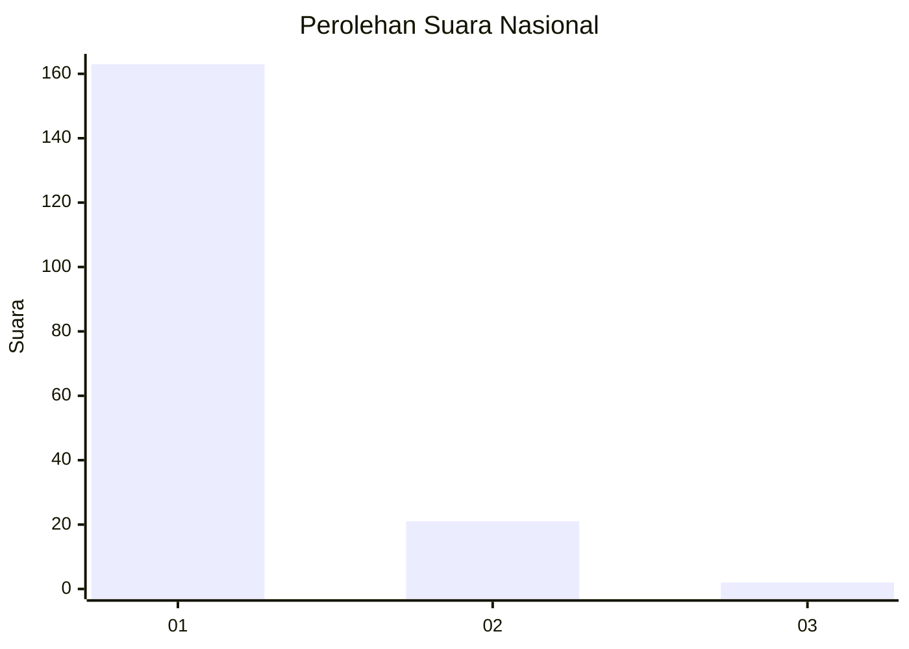
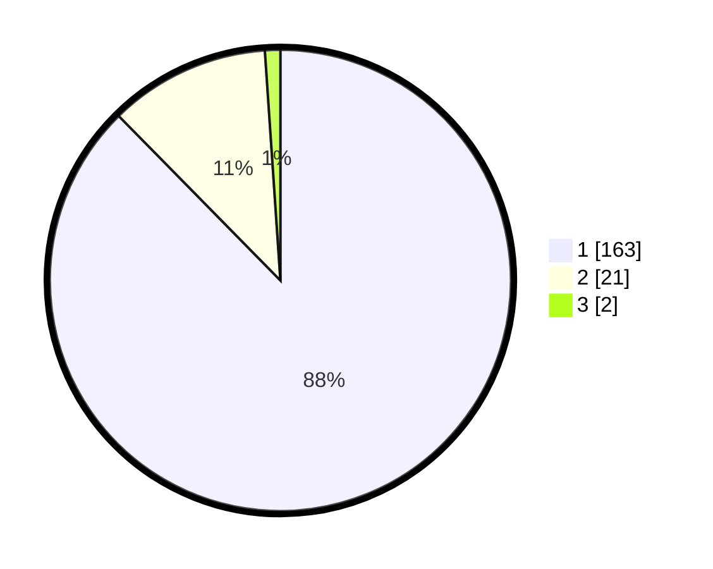

# Hasil

## Grafik

## Tabel

| No. | Nama Paslon    | Suara | Suara (raw) | Persentase |
|:--- |:-------------- | -----:| -----------:| ----------:|
| 1   | ANIES MUHAIMIN | 163   | [163][p-1]  | 87,63      |
| 2   | PRABOWO GIBRAN | 21    | [21][p-2]   | 11,29      |
| 3   | GANJAR MAHFUD  | 2     | [2][p-3]    | 1,08       |

[p-1]: https://github.com/gigit-pemilu/pemilu-2024/blob/main/pilpres/hitung-suara/sub/11-aceh/sub/07-pidie/sub/03-batee/sub/2004-pulo-tukok/sub/002-tps/sub/paslon-1.txt
[p-2]: https://github.com/gigit-pemilu/pemilu-2024/blob/main/pilpres/hitung-suara/sub/11-aceh/sub/07-pidie/sub/03-batee/sub/2004-pulo-tukok/sub/002-tps/sub/paslon-2.txt
[p-3]: https://github.com/gigit-pemilu/pemilu-2024/blob/main/pilpres/hitung-suara/sub/11-aceh/sub/07-pidie/sub/03-batee/sub/2004-pulo-tukok/sub/002-tps/sub/paslon-3.txt

## Foto C Plano

https://sirekap-obj-formc.kpu.go.id/948e/pemilu/ppwp/11/07/03/20/04/1107032004002-20240215-144802--70a95118-c105-4c13-a92b-b9cd56415a25.jpg

https://sirekap-obj-formc.kpu.go.id/948e/pemilu/ppwp/11/07/03/20/04/1107032004002-20240215-145647--bac5454f-7888-442c-8ab0-370cc4a39c7c.jpg

https://sirekap-obj-formc.kpu.go.id/948e/pemilu/ppwp/11/07/03/20/04/1107032004002-20240215-145359--839ff0f0-11cd-4d44-bc39-d5e2e4ee0509.jpg

## Metadata

| Key        | Value               |
| ---------- | ------------------- |
| Time Stamp | 2024-02-16 02:30:27 |

