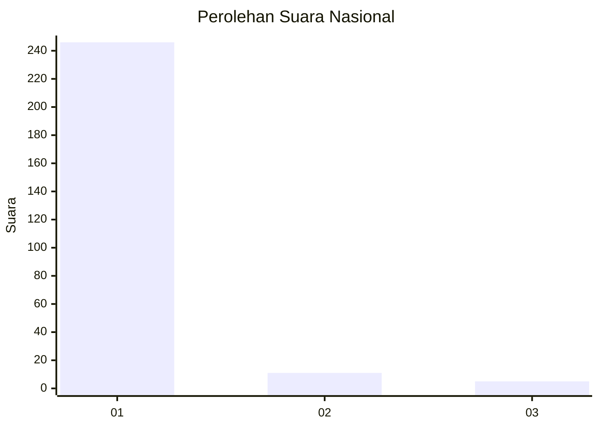
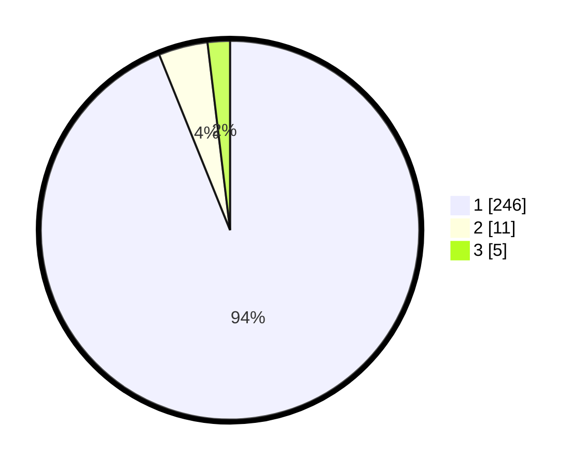

# Hasil

## Grafik

## Tabel

| No. | Nama Paslon    | Suara | Suara (raw) | Persentase |
|:--- |:-------------- | -----:| -----------:| ----------:|
| 1   | ANIES MUHAIMIN | 246   | [246][p-1]  | 93,89      |
| 2   | PRABOWO GIBRAN | 11    | [11][p-2]   | 4,20       |
| 3   | GANJAR MAHFUD  | 5     | [5][p-3]    | 1,91       |

[p-1]: https://github.com/gigit-pemilu/pemilu-2024/blob/main/pilpres/hitung-suara/sub/11-aceh/sub/07-pidie/sub/03-batee/sub/2005-pulo-bungong/sub/001-tps/sub/paslon-1.txt
[p-2]: https://github.com/gigit-pemilu/pemilu-2024/blob/main/pilpres/hitung-suara/sub/11-aceh/sub/07-pidie/sub/03-batee/sub/2005-pulo-bungong/sub/001-tps/sub/paslon-2.txt
[p-3]: https://github.com/gigit-pemilu/pemilu-2024/blob/main/pilpres/hitung-suara/sub/11-aceh/sub/07-pidie/sub/03-batee/sub/2005-pulo-bungong/sub/001-tps/sub/paslon-3.txt

## Foto C Plano

https://sirekap-obj-formc.kpu.go.id/a4ac/pemilu/ppwp/11/07/03/20/05/1107032005001-20240215-202509--33336224-a1ff-4e79-9b43-b85a0a0116b1.jpg

https://sirekap-obj-formc.kpu.go.id/a4ac/pemilu/ppwp/11/07/03/20/05/1107032005001-20240215-202653--bc4b00bf-a4f0-45bb-a53e-819d3b893295.jpg

https://sirekap-obj-formc.kpu.go.id/a4ac/pemilu/ppwp/11/07/03/20/05/1107032005001-20240215-202840--e3c87ec5-3068-4f01-b775-929bc0119c3a.jpg

## Metadata

| Key        | Value               |
| ---------- | ------------------- |
| Time Stamp | 2024-02-16 01:30:27 |

