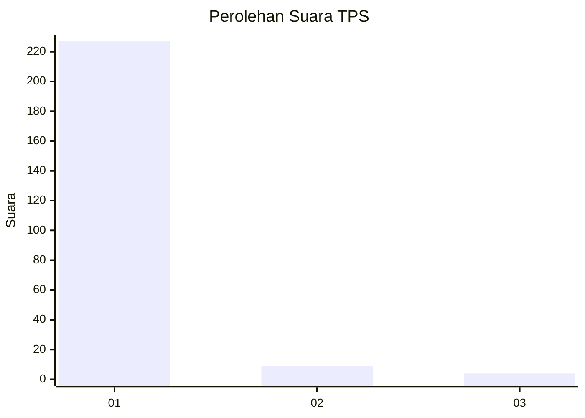
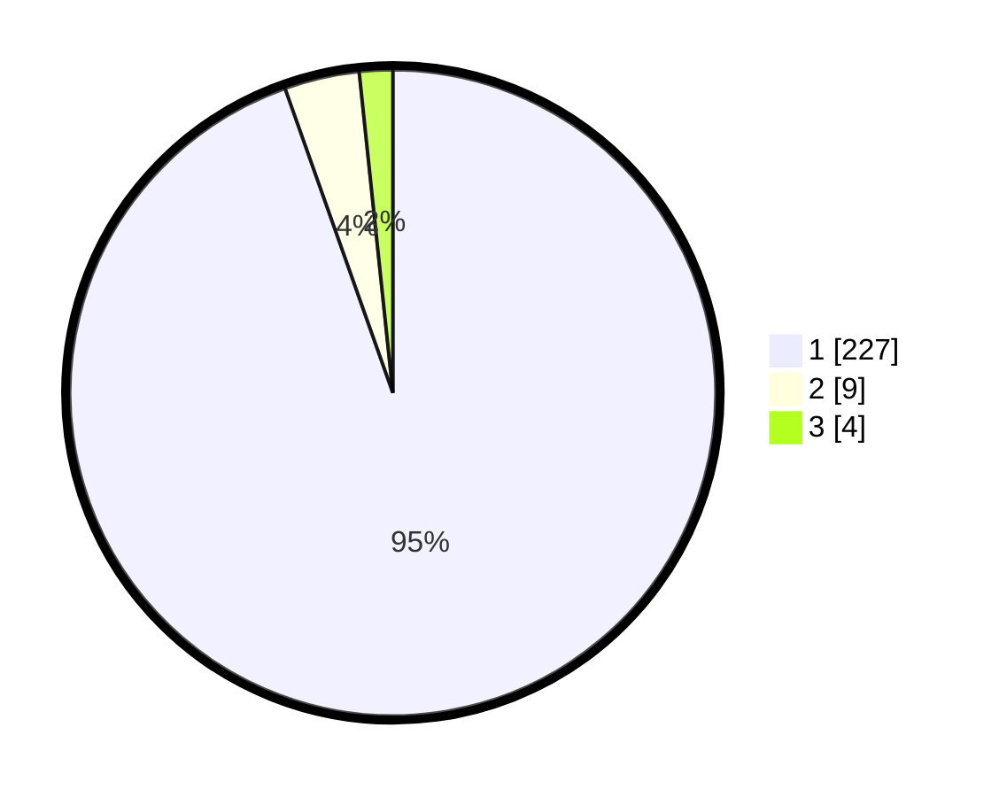

# Hasil

## Grafik

## Tabel

| No. | Nama Paslon    | Suara | Suara (raw) | Persentase |
|:--- |:-------------- | -----:| -----------:| ----------:|
| 1   | ANIES MUHAIMIN | 227   | [227][p-1]  | 94,58      |
| 2   | PRABOWO GIBRAN | 9     | [9][p-2]    | 3,75       |
| 3   | GANJAR MAHFUD  | 4     | [4][p-3]    | 1,67       |

[p-1]: https://github.com/gigit-pemilu/pemilu-2024-11-aceh/blob/main/pilpres/hitung-suara/sub/11-aceh/sub/07-pidie/sub/03-batee/sub/2005-pulo-bungong/sub/002-tps/sub/paslon-1.txt
[p-2]: https://github.com/gigit-pemilu/pemilu-2024-11-aceh/blob/main/pilpres/hitung-suara/sub/11-aceh/sub/07-pidie/sub/03-batee/sub/2005-pulo-bungong/sub/002-tps/sub/paslon-2.txt
[p-3]: https://github.com/gigit-pemilu/pemilu-2024-11-aceh/blob/main/pilpres/hitung-suara/sub/11-aceh/sub/07-pidie/sub/03-batee/sub/2005-pulo-bungong/sub/002-tps/sub/paslon-3.txt

## Foto C Plano

https://sirekap-obj-formc.kpu.go.id/928e/pemilu/ppwp/11/07/03/20/05/1107032005002-20240215-200025--80a49890-72dc-47a2-b158-438d6d3228b8.jpg

https://sirekap-obj-formc.kpu.go.id/928e/pemilu/ppwp/11/07/03/20/05/1107032005002-20240215-200257--5d59da29-2556-493e-817f-02c5ae5dad2c.jpg

https://sirekap-obj-formc.kpu.go.id/928e/pemilu/ppwp/11/07/03/20/05/1107032005002-20240215-200849--fe6935f2-64e2-4add-829c-011517f48906.jpg

## Metadata

| Key        | Value               |
| ---------- | ------------------- |
| Time Stamp | 2024-02-15 22:30:27 |

