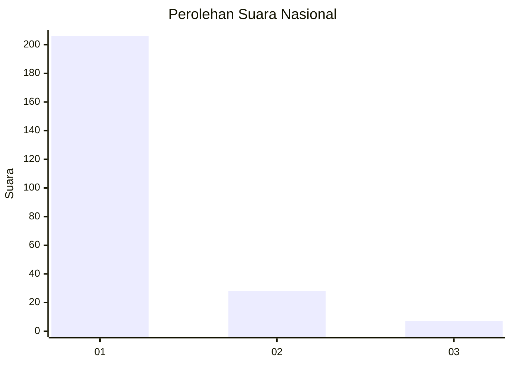
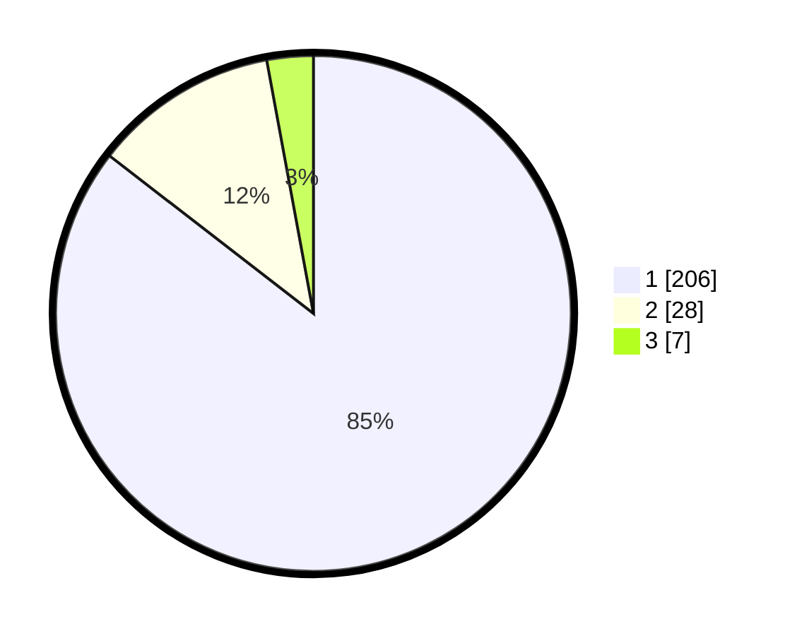

# Hasil

## Grafik

## Tabel

| No. | Nama Paslon    | Suara | Suara (raw) | Persentase |
|:--- |:-------------- | -----:| -----------:| ----------:|
| 1   | ANIES MUHAIMIN | 206   | [206][p-1]  | 85,48      |
| 2   | PRABOWO GIBRAN | 28    | [28][p-2]   | 11,62      |
| 3   | GANJAR MAHFUD  | 7     | [7][p-3]    | 2,90       |

[p-1]: https://github.com/gigit-pemilu/pemilu-2024/blob/main/pilpres/hitung-suara/sub/11-aceh/sub/07-pidie/sub/03-batee/sub/2006-geunteng-barat/sub/001-tps/sub/paslon-1.txt
[p-2]: https://github.com/gigit-pemilu/pemilu-2024/blob/main/pilpres/hitung-suara/sub/11-aceh/sub/07-pidie/sub/03-batee/sub/2006-geunteng-barat/sub/001-tps/sub/paslon-2.txt
[p-3]: https://github.com/gigit-pemilu/pemilu-2024/blob/main/pilpres/hitung-suara/sub/11-aceh/sub/07-pidie/sub/03-batee/sub/2006-geunteng-barat/sub/001-tps/sub/paslon-3.txt

## Foto C Plano

https://sirekap-obj-formc.kpu.go.id/28e6/pemilu/ppwp/11/07/03/20/06/1107032006001-20240215-020742--94524959-8ff4-4e4a-bcc3-af3f7b154dfc.jpg

https://sirekap-obj-formc.kpu.go.id/28e6/pemilu/ppwp/11/07/03/20/06/1107032006001-20240215-020704--f0393fa2-7fbb-4599-b5c1-03c94d7c184a.jpg

https://sirekap-obj-formc.kpu.go.id/28e6/pemilu/ppwp/11/07/03/20/06/1107032006001-20240215-020835--0c797a78-07ff-4776-a589-b377b3a8a2cb.jpg

## Metadata

| Key        | Value               |
| ---------- | ------------------- |
| Time Stamp | 2024-02-16 03:00:26 |

