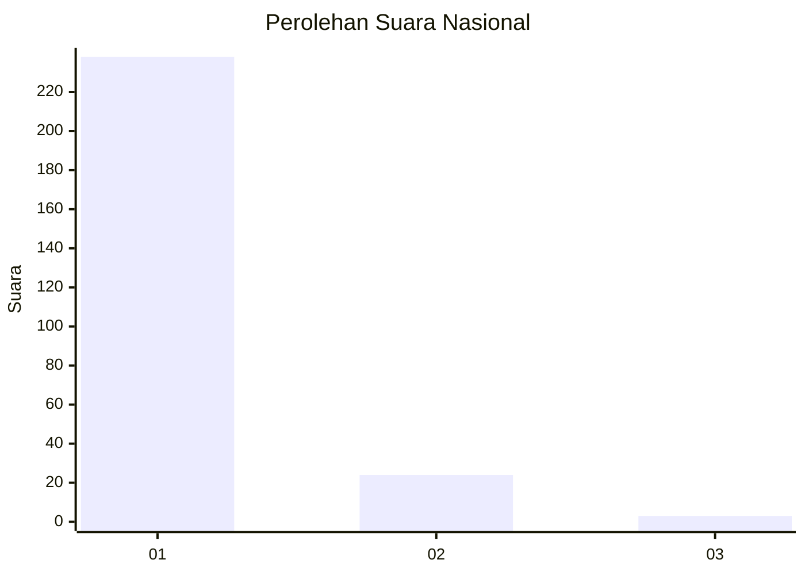
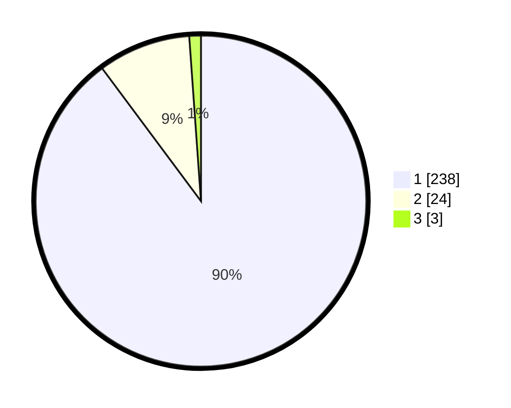

# Hasil

## Grafik

## Tabel

| No. | Nama Paslon    | Suara | Suara (raw) | Persentase |
|:--- |:-------------- | -----:| -----------:| ----------:|
| 1   | ANIES MUHAIMIN | 238   | [238][p-1]  | 89,81      |
| 2   | PRABOWO GIBRAN | 24    | [24][p-2]   | 9,06       |
| 3   | GANJAR MAHFUD  | 3     | [3][p-3]    | 1,13       |

[p-1]: https://github.com/gigit-pemilu/pemilu-2024/blob/main/pilpres/hitung-suara/sub/11-aceh/sub/07-pidie/sub/03-batee/sub/2006-geunteng-barat/sub/003-tps/sub/paslon-1.txt
[p-2]: https://github.com/gigit-pemilu/pemilu-2024/blob/main/pilpres/hitung-suara/sub/11-aceh/sub/07-pidie/sub/03-batee/sub/2006-geunteng-barat/sub/003-tps/sub/paslon-2.txt
[p-3]: https://github.com/gigit-pemilu/pemilu-2024/blob/main/pilpres/hitung-suara/sub/11-aceh/sub/07-pidie/sub/03-batee/sub/2006-geunteng-barat/sub/003-tps/sub/paslon-3.txt

## Foto C Plano

https://sirekap-obj-formc.kpu.go.id/bfba/pemilu/ppwp/11/07/03/20/06/1107032006003-20240215-023724--1b46e559-a1a0-42bc-a8d4-d5b67307e883.jpg

https://sirekap-obj-formc.kpu.go.id/bfba/pemilu/ppwp/11/07/03/20/06/1107032006003-20240215-024430--790ff815-7d4e-404b-9e35-9e5f1badbbe1.jpg

https://sirekap-obj-formc.kpu.go.id/bfba/pemilu/ppwp/11/07/03/20/06/1107032006003-20240215-024336--6318f284-385f-48d6-8a27-13c04e771387.jpg

## Metadata

| Key        | Value               |
| ---------- | ------------------- |
| Time Stamp | 2024-02-16 03:00:26 |

