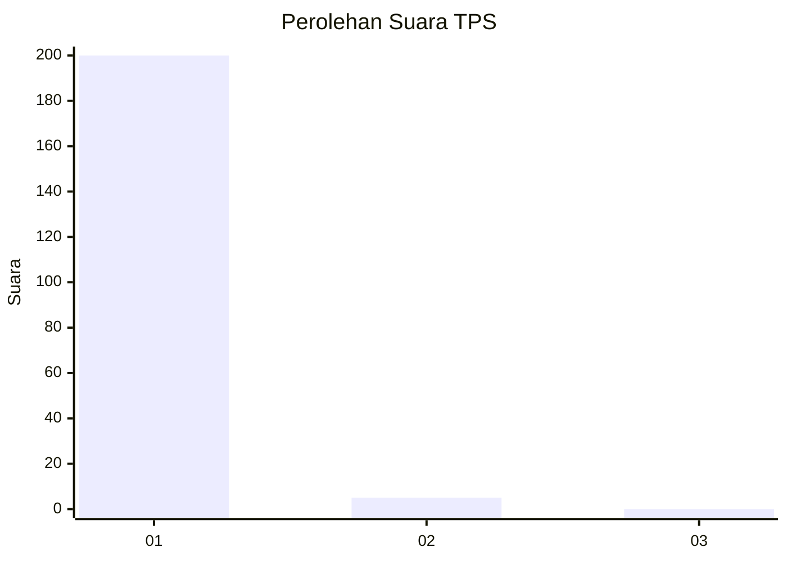
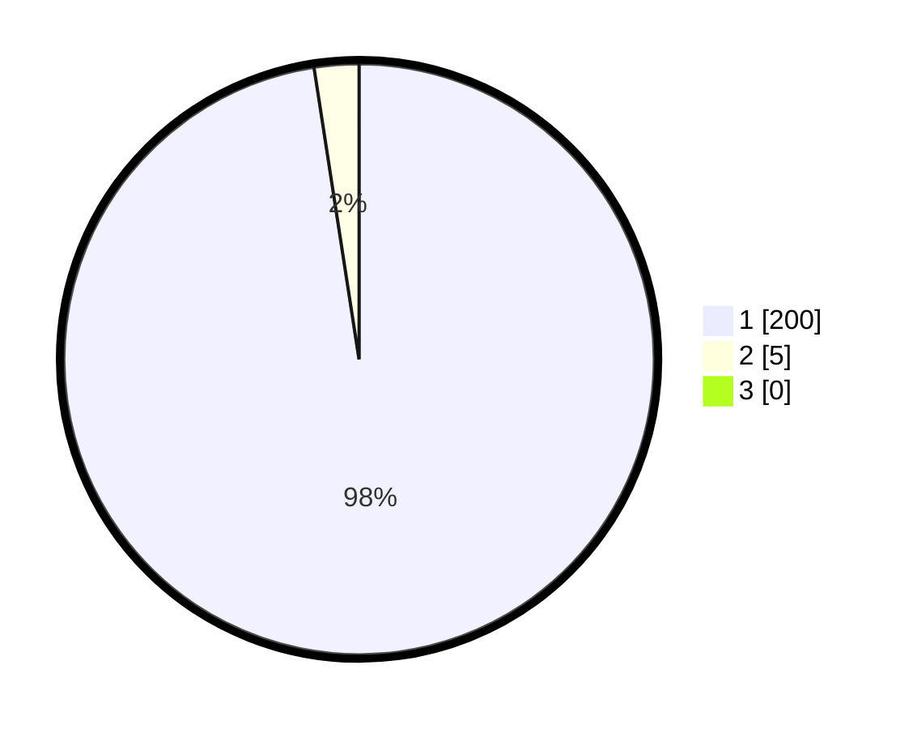

# Hasil

## Grafik

## Tabel

| No. | Nama Paslon    | Suara | Suara (raw) | Persentase |
|:--- |:-------------- | -----:| -----------:| ----------:|
| 1   | ANIES MUHAIMIN | 200   | [200][p-1]  | 97,56      |
| 2   | PRABOWO GIBRAN | 5     | [5][p-2]    | 2,44       |
| 3   | GANJAR MAHFUD  | 0     | [0][p-3]    | 0,00       |

[p-1]: https://github.com/gigit-pemilu/pemilu-2024-11-aceh/blob/main/pilpres/hitung-suara/sub/11-aceh/sub/07-pidie/sub/03-batee/sub/2008-calong-cut/sub/001-tps/sub/paslon-1.txt
[p-2]: https://github.com/gigit-pemilu/pemilu-2024-11-aceh/blob/main/pilpres/hitung-suara/sub/11-aceh/sub/07-pidie/sub/03-batee/sub/2008-calong-cut/sub/001-tps/sub/paslon-2.txt
[p-3]: https://github.com/gigit-pemilu/pemilu-2024-11-aceh/blob/main/pilpres/hitung-suara/sub/11-aceh/sub/07-pidie/sub/03-batee/sub/2008-calong-cut/sub/001-tps/sub/paslon-3.txt

## Foto C Plano

https://sirekap-obj-formc.kpu.go.id/7528/pemilu/ppwp/11/07/03/20/08/1107032008001-20240216-104108--46023612-c630-4330-baca-e346cba6c604.jpg

https://sirekap-obj-formc.kpu.go.id/7528/pemilu/ppwp/11/07/03/20/08/1107032008001-20240215-082212--d5fee68c-58ef-4708-8a72-32a20006a2be.jpg

https://sirekap-obj-formc.kpu.go.id/7528/pemilu/ppwp/11/07/03/20/08/1107032008001-20240215-082314--94716214-bbfd-4846-b916-eea56bf71339.jpg

## Metadata

| Key        | Value               |
| ---------- | ------------------- |
| Time Stamp | 2024-02-16 11:00:29 |

