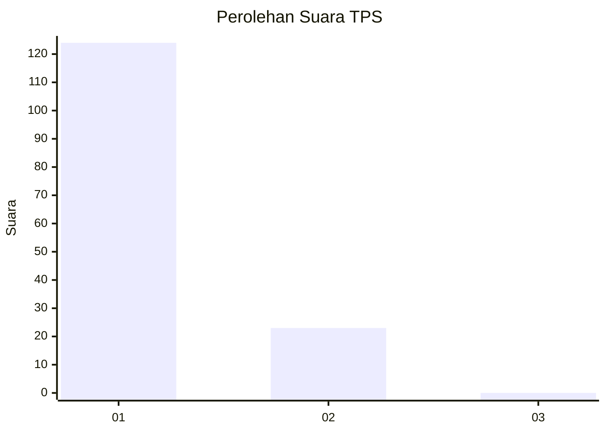
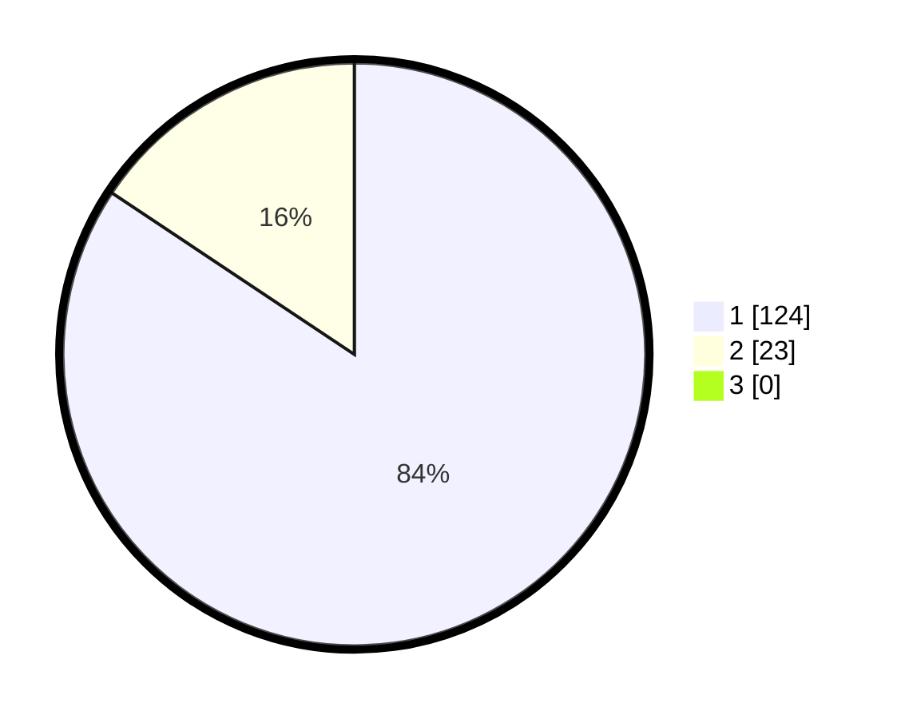

# Hasil

## Grafik

## Tabel

| No. | Nama Paslon    | Suara | Suara (raw) | Persentase |
|:--- |:-------------- | -----:| -----------:| ----------:|
| 1   | ANIES MUHAIMIN | 124   | [124][p-1]  | 84,35      |
| 2   | PRABOWO GIBRAN | 23    | [23][p-2]   | 15,65      |
| 3   | GANJAR MAHFUD  | 0     | [0][p-3]    | 0,00       |

[p-1]: https://github.com/gigit-pemilu/pemilu-2024-11-aceh/blob/main/pilpres/hitung-suara/sub/11-aceh/sub/07-pidie/sub/03-batee/sub/2011-tuha/sub/001-tps/sub/paslon-1.txt
[p-2]: https://github.com/gigit-pemilu/pemilu-2024-11-aceh/blob/main/pilpres/hitung-suara/sub/11-aceh/sub/07-pidie/sub/03-batee/sub/2011-tuha/sub/001-tps/sub/paslon-2.txt
[p-3]: https://github.com/gigit-pemilu/pemilu-2024-11-aceh/blob/main/pilpres/hitung-suara/sub/11-aceh/sub/07-pidie/sub/03-batee/sub/2011-tuha/sub/001-tps/sub/paslon-3.txt

## Foto C Plano

https://sirekap-obj-formc.kpu.go.id/3894/pemilu/ppwp/11/07/03/20/11/1107032011001-20240215-105225--524a739d-159c-4f06-b282-d8f91de2c3a8.jpg

https://sirekap-obj-formc.kpu.go.id/3894/pemilu/ppwp/11/07/03/20/11/1107032011001-20240215-200727--6a625dda-74e9-447c-91cd-7ae6c8b54e0a.jpg

https://sirekap-obj-formc.kpu.go.id/3894/pemilu/ppwp/11/07/03/20/11/1107032011001-20240215-105003--7ceccc66-b590-47cc-adf5-2a7a90dd2b47.jpg

## Metadata

| Key        | Value               |
| ---------- | ------------------- |
| Time Stamp | 2024-02-24 22:31:28 |

