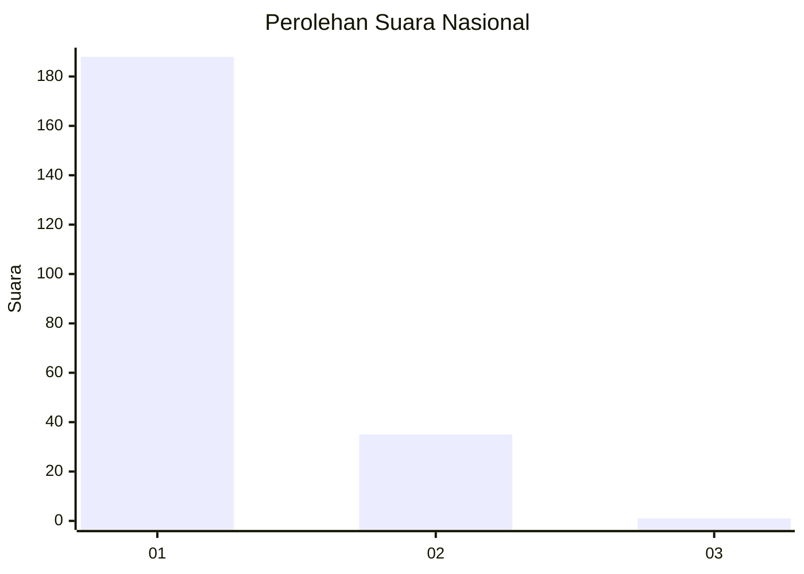
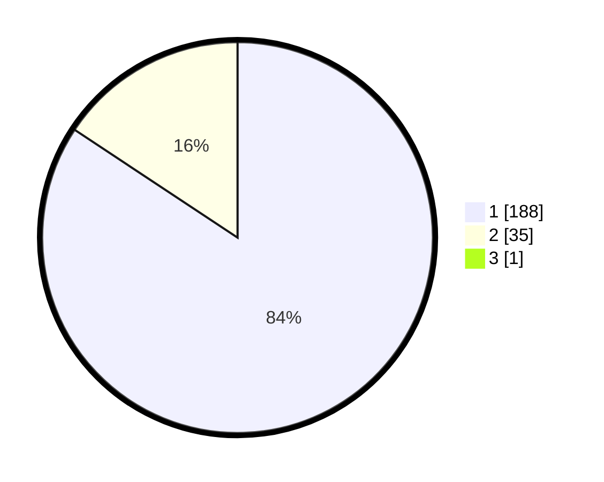

# Hasil

## Grafik

## Tabel

| No. | Nama Paslon    | Suara | Suara (raw) | Persentase |
|:--- |:-------------- | -----:| -----------:| ----------:|
| 1   | ANIES MUHAIMIN | 188   | [188][p-1]  | 83,93      |
| 2   | PRABOWO GIBRAN | 35    | [35][p-2]   | 15,63      |
| 3   | GANJAR MAHFUD  | 1     | [1][p-3]    | 0,45       |

[p-1]: https://github.com/gigit-pemilu/pemilu-2024/blob/main/pilpres/hitung-suara/sub/11-aceh/sub/07-pidie/sub/03-batee/sub/2012-dayah/sub/001-tps/sub/paslon-1.txt
[p-2]: https://github.com/gigit-pemilu/pemilu-2024/blob/main/pilpres/hitung-suara/sub/11-aceh/sub/07-pidie/sub/03-batee/sub/2012-dayah/sub/001-tps/sub/paslon-2.txt
[p-3]: https://github.com/gigit-pemilu/pemilu-2024/blob/main/pilpres/hitung-suara/sub/11-aceh/sub/07-pidie/sub/03-batee/sub/2012-dayah/sub/001-tps/sub/paslon-3.txt

## Foto C Plano

https://sirekap-obj-formc.kpu.go.id/78be/pemilu/ppwp/11/07/03/20/12/1107032012001-20240215-054024--c00e5eb3-f057-40bf-995e-576f505410a7.jpg

https://sirekap-obj-formc.kpu.go.id/78be/pemilu/ppwp/11/07/03/20/12/1107032012001-20240215-054158--609a9eb2-b119-409d-ae2b-3a80ec89cfad.jpg

https://sirekap-obj-formc.kpu.go.id/78be/pemilu/ppwp/11/07/03/20/12/1107032012001-20240215-054504--0657e437-6010-4084-9499-eef50d76b1c7.jpg

## Metadata

| Key        | Value               |
| ---------- | ------------------- |
| Time Stamp | 2024-02-24 22:31:28 |

