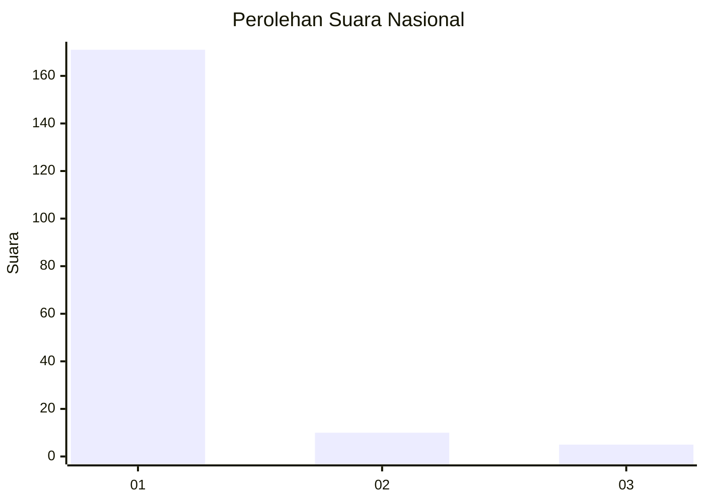
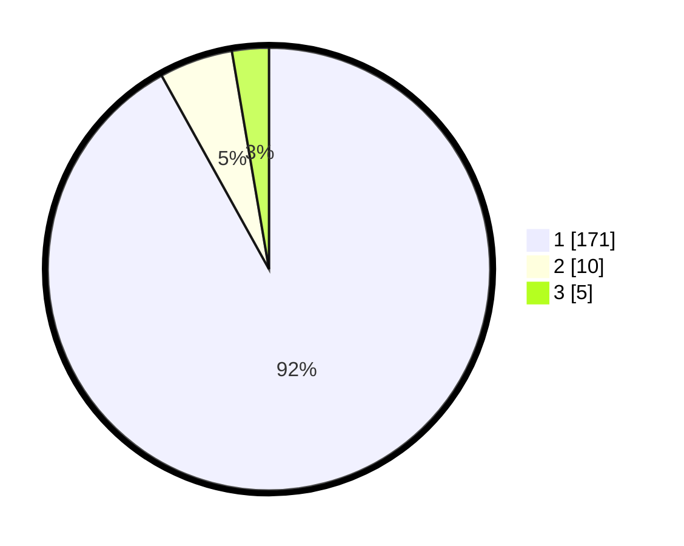

# Hasil

## Grafik

## Tabel

| No. | Nama Paslon    | Suara | Suara (raw) | Persentase |
|:--- |:-------------- | -----:| -----------:| ----------:|
| 1   | ANIES MUHAIMIN | 171   | [171][p-1]  | 91,94      |
| 2   | PRABOWO GIBRAN | 10    | [10][p-2]   | 5,38       |
| 3   | GANJAR MAHFUD  | 5     | [5][p-3]    | 2,69       |

[p-1]: https://github.com/gigit-pemilu/pemilu-2024/blob/main/pilpres/hitung-suara/sub/11-aceh/sub/07-pidie/sub/03-batee/sub/2013-mesjid/sub/001-tps/sub/paslon-1.txt
[p-2]: https://github.com/gigit-pemilu/pemilu-2024/blob/main/pilpres/hitung-suara/sub/11-aceh/sub/07-pidie/sub/03-batee/sub/2013-mesjid/sub/001-tps/sub/paslon-2.txt
[p-3]: https://github.com/gigit-pemilu/pemilu-2024/blob/main/pilpres/hitung-suara/sub/11-aceh/sub/07-pidie/sub/03-batee/sub/2013-mesjid/sub/001-tps/sub/paslon-3.txt

## Foto C Plano

https://sirekap-obj-formc.kpu.go.id/9ee5/pemilu/ppwp/11/07/03/20/13/1107032013001-20240215-153351--de2fee1f-711b-49f3-8729-d5cc8233e185.jpg

https://sirekap-obj-formc.kpu.go.id/9ee5/pemilu/ppwp/11/07/03/20/13/1107032013001-20240215-153532--836406d2-08eb-4d67-a0bf-e4d6d654baed.jpg

https://sirekap-obj-formc.kpu.go.id/9ee5/pemilu/ppwp/11/07/03/20/13/1107032013001-20240215-153638--5d9a6a77-ee61-4989-8229-5660b10140d1.jpg

## Metadata

| Key        | Value               |
| ---------- | ------------------- |
| Time Stamp | 2024-02-24 22:31:28 |

