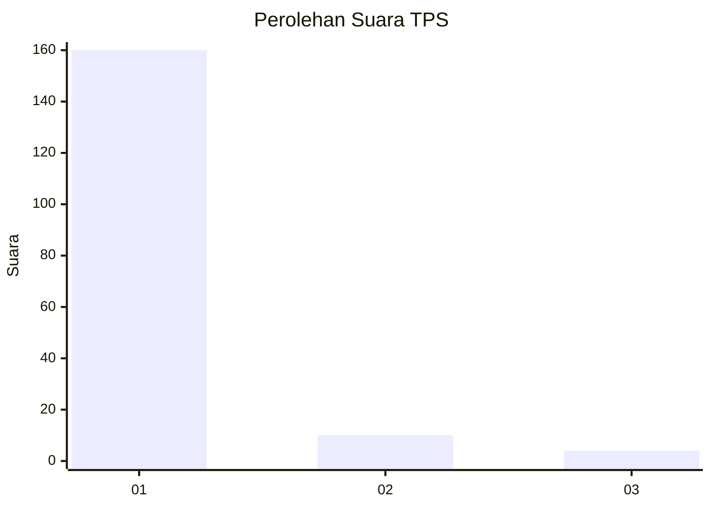
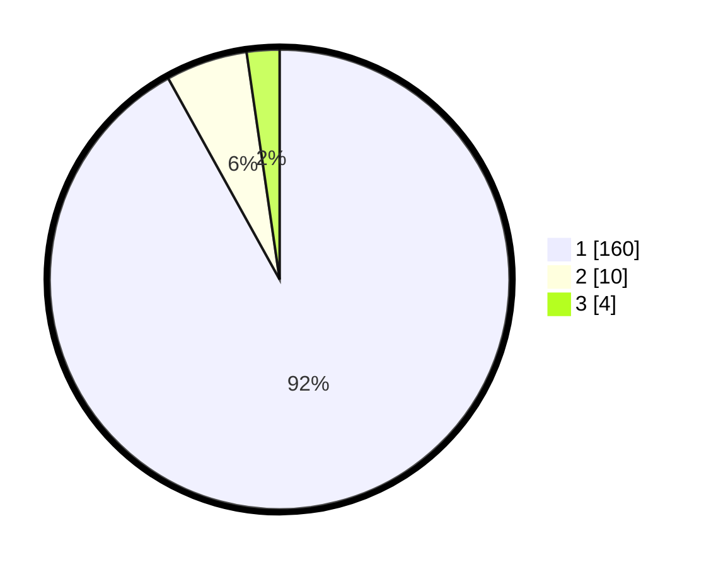

# Hasil

## Grafik

## Tabel

| No. | Nama Paslon    | Suara | Suara (raw) | Persentase |
|:--- |:-------------- | -----:| -----------:| ----------:|
| 1   | ANIES MUHAIMIN | 160   | [160][p-1]  | 91,95      |
| 2   | PRABOWO GIBRAN | 10    | [10][p-2]   | 5,75       |
| 3   | GANJAR MAHFUD  | 4     | [4][p-3]    | 2,30       |

[p-1]: https://github.com/gigit-pemilu/pemilu-2024-11-aceh/blob/main/pilpres/hitung-suara/sub/11-aceh/sub/07-pidie/sub/03-batee/sub/2013-mesjid/sub/002-tps/sub/paslon-1.txt
[p-2]: https://github.com/gigit-pemilu/pemilu-2024-11-aceh/blob/main/pilpres/hitung-suara/sub/11-aceh/sub/07-pidie/sub/03-batee/sub/2013-mesjid/sub/002-tps/sub/paslon-2.txt
[p-3]: https://github.com/gigit-pemilu/pemilu-2024-11-aceh/blob/main/pilpres/hitung-suara/sub/11-aceh/sub/07-pidie/sub/03-batee/sub/2013-mesjid/sub/002-tps/sub/paslon-3.txt

## Foto C Plano

https://sirekap-obj-formc.kpu.go.id/2583/pemilu/ppwp/11/07/03/20/13/1107032013002-20240215-161440--2ef2c0a9-ebd0-4a7e-804d-6fe500ce3726.jpg

https://sirekap-obj-formc.kpu.go.id/2583/pemilu/ppwp/11/07/03/20/13/1107032013002-20240215-161647--6ffd9ffb-8d13-489a-8bbe-680931630af0.jpg

https://sirekap-obj-formc.kpu.go.id/2583/pemilu/ppwp/11/07/03/20/13/1107032013002-20240215-161937--fe69a690-b19c-49d6-9ff1-af3103c6012e.jpg

## Metadata

| Key        | Value               |
| ---------- | ------------------- |
| Time Stamp | 2024-02-16 03:00:26 |

