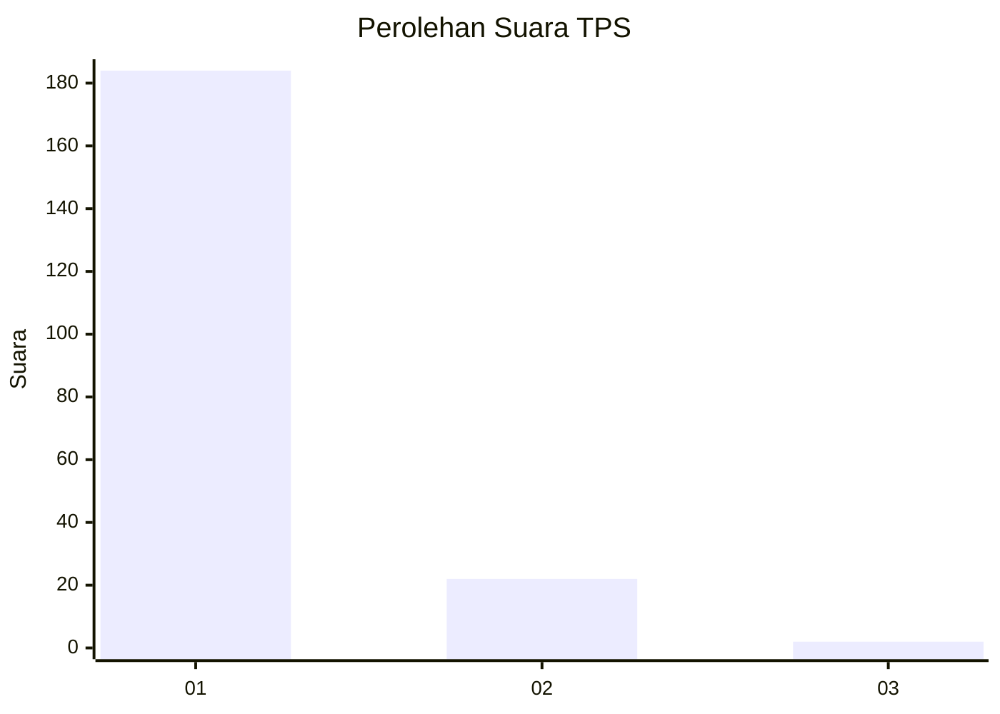
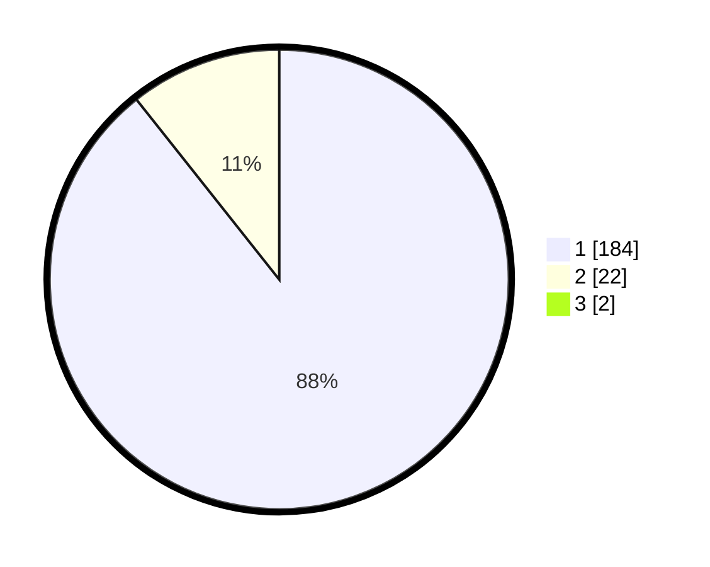

# Hasil

## Grafik

## Tabel

| No. | Nama Paslon    | Suara | Suara (raw) | Persentase |
|:--- |:-------------- | -----:| -----------:| ----------:|
| 1   | ANIES MUHAIMIN | 184   | [184][p-1]  | 88,46      |
| 2   | PRABOWO GIBRAN | 22    | [22][p-2]   | 10,58      |
| 3   | GANJAR MAHFUD  | 2     | [2][p-3]    | 0,96       |

[p-1]: https://github.com/gigit-pemilu/pemilu-2024-11-aceh/blob/main/pilpres/hitung-suara/sub/11-aceh/sub/07-pidie/sub/03-batee/sub/2017-mee/sub/002-tps/sub/paslon-1.txt
[p-2]: https://github.com/gigit-pemilu/pemilu-2024-11-aceh/blob/main/pilpres/hitung-suara/sub/11-aceh/sub/07-pidie/sub/03-batee/sub/2017-mee/sub/002-tps/sub/paslon-2.txt
[p-3]: https://github.com/gigit-pemilu/pemilu-2024-11-aceh/blob/main/pilpres/hitung-suara/sub/11-aceh/sub/07-pidie/sub/03-batee/sub/2017-mee/sub/002-tps/sub/paslon-3.txt

## Foto C Plano

https://sirekap-obj-formc.kpu.go.id/6649/pemilu/ppwp/11/07/03/20/17/1107032017002-20240215-112207--66259083-71b8-4bf0-858a-51ab4cbe2f2a.jpg

https://sirekap-obj-formc.kpu.go.id/6649/pemilu/ppwp/11/07/03/20/17/1107032017002-20240215-112340--b538895e-870c-4b23-bc72-54fc7398ef96.jpg

https://sirekap-obj-formc.kpu.go.id/6649/pemilu/ppwp/11/07/03/20/17/1107032017002-20240215-202355--bcb0b08c-4e9c-4e7e-8508-d214157a6526.jpg

## Metadata

| Key        | Value               |
| ---------- | ------------------- |
| Time Stamp | 2024-02-15 23:29:50 |

