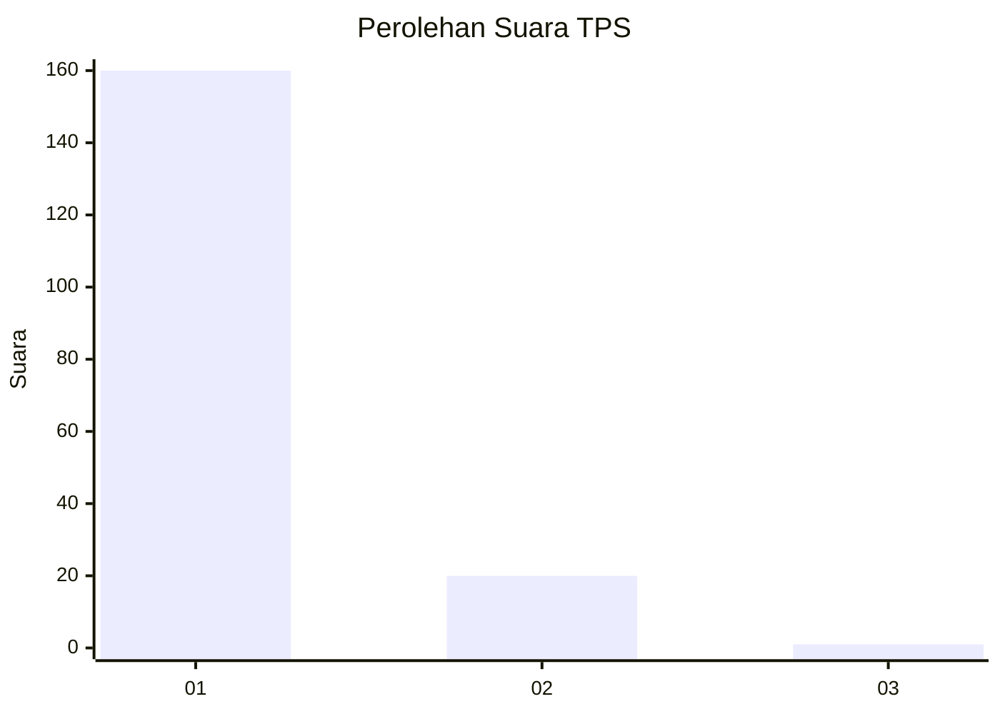
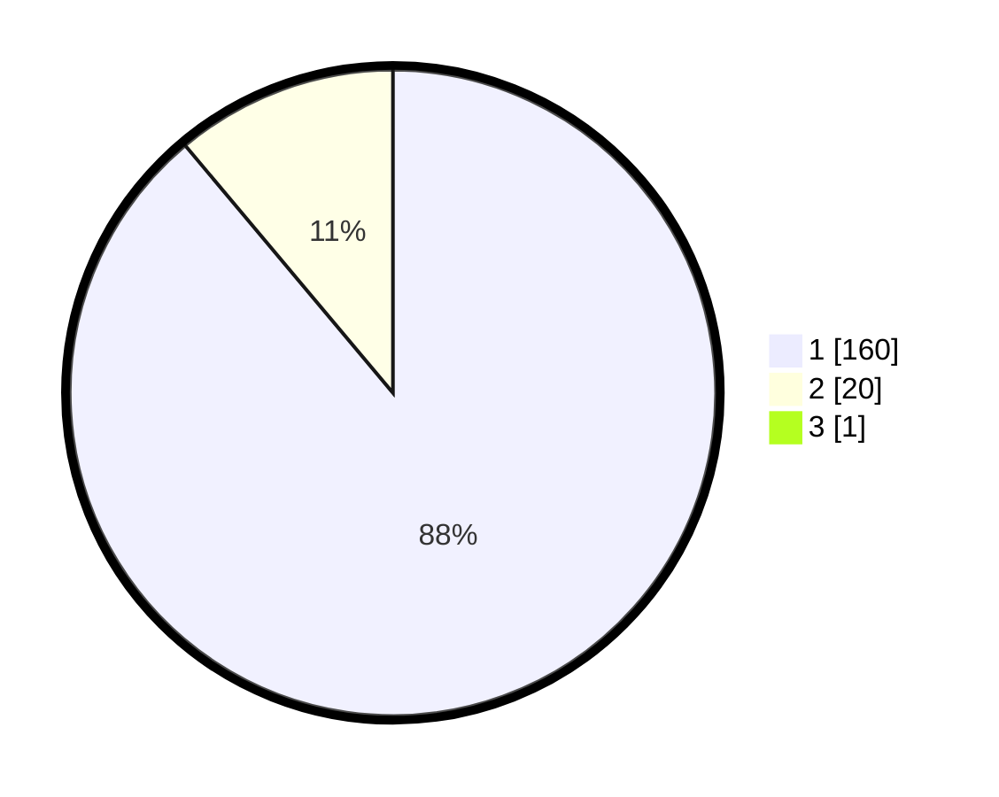

# Hasil

## Grafik

## Tabel

| No. | Nama Paslon    | Suara | Suara (raw) | Persentase |
|:--- |:-------------- | -----:| -----------:| ----------:|
| 1   | ANIES MUHAIMIN | 160   | [160][p-1]  | 88,40      |
| 2   | PRABOWO GIBRAN | 20    | [20][p-2]   | 11,05      |
| 3   | GANJAR MAHFUD  | 1     | [1][p-3]    | 0,55       |

[p-1]: https://github.com/gigit-pemilu/pemilu-2024-11-aceh/blob/main/pilpres/hitung-suara/sub/11-aceh/sub/07-pidie/sub/03-batee/sub/2018-pulo-pande/sub/001-tps/sub/paslon-1.txt
[p-2]: https://github.com/gigit-pemilu/pemilu-2024-11-aceh/blob/main/pilpres/hitung-suara/sub/11-aceh/sub/07-pidie/sub/03-batee/sub/2018-pulo-pande/sub/001-tps/sub/paslon-2.txt
[p-3]: https://github.com/gigit-pemilu/pemilu-2024-11-aceh/blob/main/pilpres/hitung-suara/sub/11-aceh/sub/07-pidie/sub/03-batee/sub/2018-pulo-pande/sub/001-tps/sub/paslon-3.txt

## Foto C Plano

https://sirekap-obj-formc.kpu.go.id/9de3/pemilu/ppwp/11/07/03/20/18/1107032018001-20240215-102618--83f605c2-3b4c-4217-8150-c53d2911fb64.jpg

https://sirekap-obj-formc.kpu.go.id/9de3/pemilu/ppwp/11/07/03/20/18/1107032018001-20240215-140303--4c7624ee-3b13-4112-bc06-f469c86c1007.jpg

https://sirekap-obj-formc.kpu.go.id/9de3/pemilu/ppwp/11/07/03/20/18/1107032018001-20240215-143914--e3e6cda7-d1bf-4a73-a34a-12e307067505.jpg

## Metadata

| Key        | Value               |
| ---------- | ------------------- |
| Time Stamp | 2024-02-16 03:00:26 |

