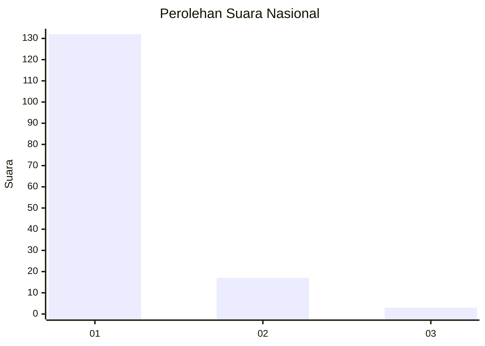
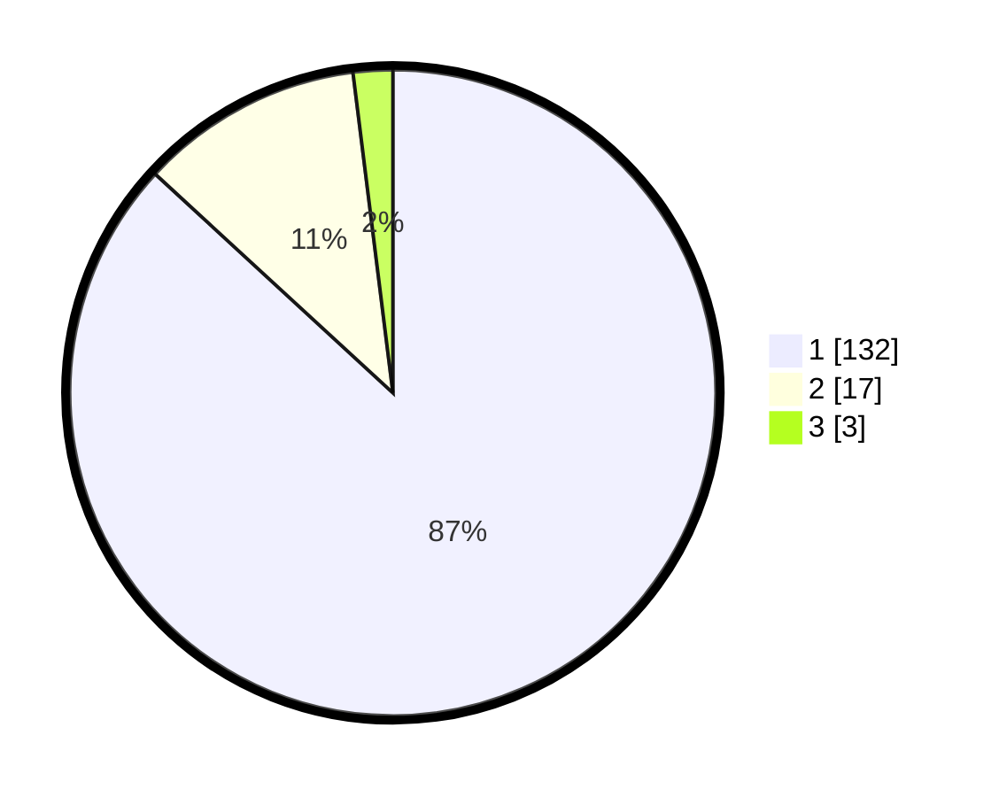

# Hasil

## Grafik

## Tabel

| No. | Nama Paslon    | Suara | Suara (raw) | Persentase |
|:--- |:-------------- | -----:| -----------:| ----------:|
| 1   | ANIES MUHAIMIN | 132   | [132][p-1]  | 86,84      |
| 2   | PRABOWO GIBRAN | 17    | [17][p-2]   | 11,18      |
| 3   | GANJAR MAHFUD  | 3     | [3][p-3]    | 1,97       |

[p-1]: https://github.com/gigit-pemilu/pemilu-2024/blob/main/pilpres/hitung-suara/sub/11-aceh/sub/07-pidie/sub/03-batee/sub/2018-pulo-pande/sub/002-tps/sub/paslon-1.txt
[p-2]: https://github.com/gigit-pemilu/pemilu-2024/blob/main/pilpres/hitung-suara/sub/11-aceh/sub/07-pidie/sub/03-batee/sub/2018-pulo-pande/sub/002-tps/sub/paslon-2.txt
[p-3]: https://github.com/gigit-pemilu/pemilu-2024/blob/main/pilpres/hitung-suara/sub/11-aceh/sub/07-pidie/sub/03-batee/sub/2018-pulo-pande/sub/002-tps/sub/paslon-3.txt

## Foto C Plano

https://sirekap-obj-formc.kpu.go.id/999f/pemilu/ppwp/11/07/03/20/18/1107032018002-20240215-125337--0437c094-43a4-4300-97a3-f0ca4745ab71.jpg

https://sirekap-obj-formc.kpu.go.id/999f/pemilu/ppwp/11/07/03/20/18/1107032018002-20240215-125632--f8a6545b-6516-4de7-98ab-69de73d7a2a3.jpg

https://sirekap-obj-formc.kpu.go.id/999f/pemilu/ppwp/11/07/03/20/18/1107032018002-20240215-125826--ae2657a3-bece-4e43-8c6d-da8cac21b322.jpg

## Metadata

| Key        | Value               |
| ---------- | ------------------- |
| Time Stamp | 2024-02-16 03:00:26 |

