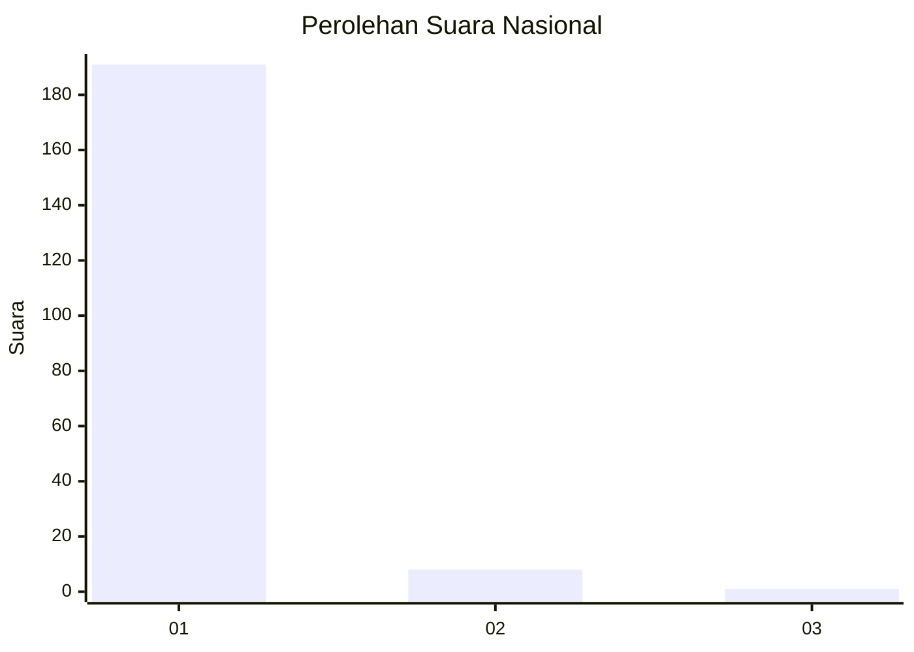
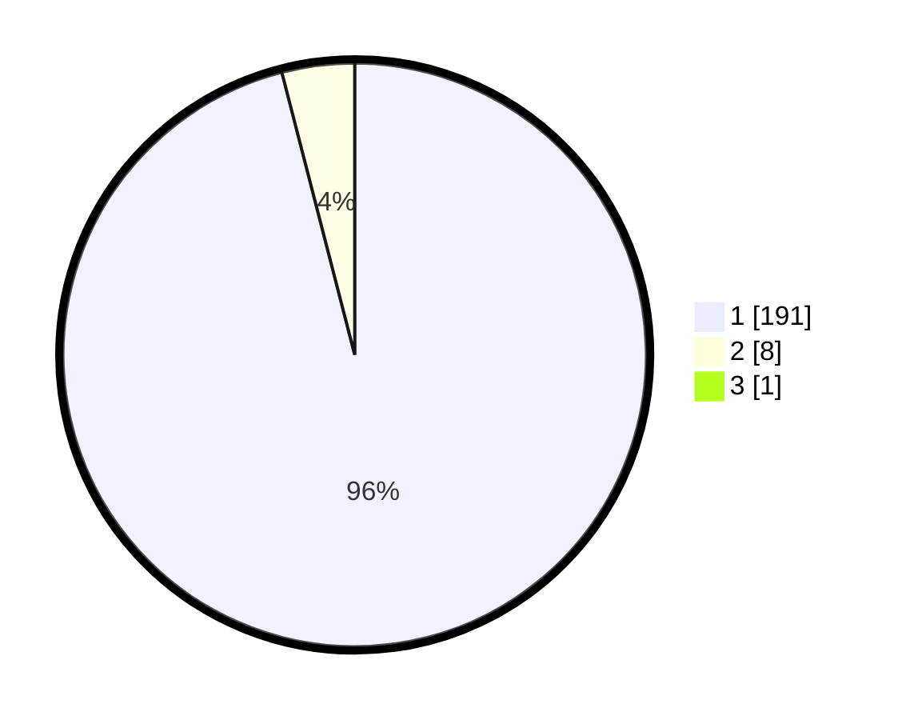

# Hasil

## Grafik

## Tabel

| No. | Nama Paslon    | Suara | Suara (raw) | Persentase |
|:--- |:-------------- | -----:| -----------:| ----------:|
| 1   | ANIES MUHAIMIN | 191   | [191][p-1]  | 95,50      |
| 2   | PRABOWO GIBRAN | 8     | [8][p-2]    | 4,00       |
| 3   | GANJAR MAHFUD  | 1     | [1][p-3]    | 0,50       |

[p-1]: https://github.com/gigit-pemilu/pemilu-2024/blob/main/pilpres/hitung-suara/sub/11-aceh/sub/07-pidie/sub/03-batee/sub/2019-seulatan/sub/001-tps/sub/paslon-1.txt
[p-2]: https://github.com/gigit-pemilu/pemilu-2024/blob/main/pilpres/hitung-suara/sub/11-aceh/sub/07-pidie/sub/03-batee/sub/2019-seulatan/sub/001-tps/sub/paslon-2.txt
[p-3]: https://github.com/gigit-pemilu/pemilu-2024/blob/main/pilpres/hitung-suara/sub/11-aceh/sub/07-pidie/sub/03-batee/sub/2019-seulatan/sub/001-tps/sub/paslon-3.txt

## Foto C Plano

https://sirekap-obj-formc.kpu.go.id/b151/pemilu/ppwp/11/07/03/20/19/1107032019001-20240215-144735--4d262989-6398-47d6-9180-c66e5659156e.jpg

https://sirekap-obj-formc.kpu.go.id/b151/pemilu/ppwp/11/07/03/20/19/1107032019001-20240215-145046--f50a0902-1296-413b-8633-14848e326806.jpg

https://sirekap-obj-formc.kpu.go.id/b151/pemilu/ppwp/11/07/03/20/19/1107032019001-20240215-142452--cac6c45c-fc0b-4cff-9bbd-78ee75ea1ea4.jpg

## Metadata

| Key        | Value               |
| ---------- | ------------------- |
| Time Stamp | 2024-02-15 19:30:26 |

