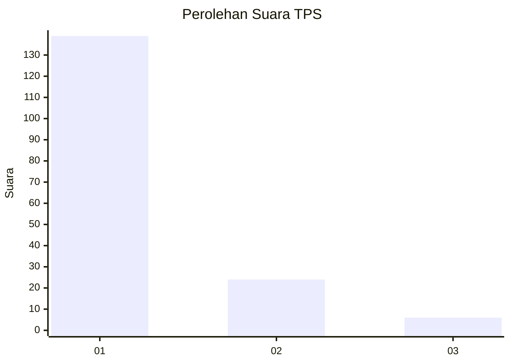
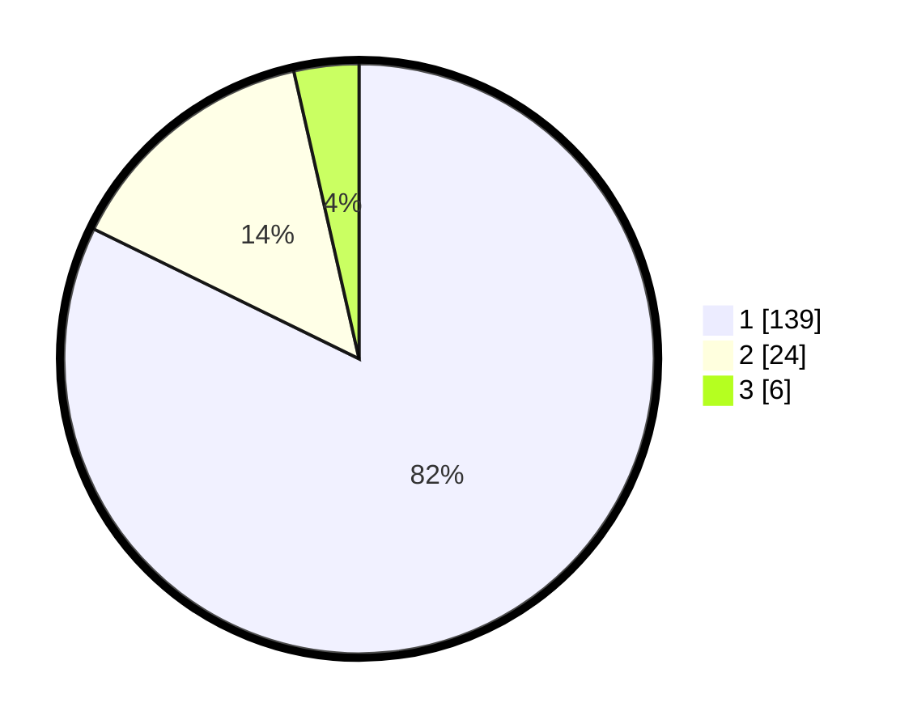

# Hasil

## Grafik

## Tabel

| No. | Nama Paslon    | Suara | Suara (raw) | Persentase |
|:--- |:-------------- | -----:| -----------:| ----------:|
| 1   | ANIES MUHAIMIN | 139   | [139][p-1]  | 82,25      |
| 2   | PRABOWO GIBRAN | 24    | [24][p-2]   | 14,20      |
| 3   | GANJAR MAHFUD  | 6     | [6][p-3]    | 3,55       |

[p-1]: https://github.com/gigit-pemilu/pemilu-2024-11-aceh/blob/main/pilpres/hitung-suara/sub/11-aceh/sub/07-pidie/sub/03-batee/sub/2019-seulatan/sub/002-tps/sub/paslon-1.txt
[p-2]: https://github.com/gigit-pemilu/pemilu-2024-11-aceh/blob/main/pilpres/hitung-suara/sub/11-aceh/sub/07-pidie/sub/03-batee/sub/2019-seulatan/sub/002-tps/sub/paslon-2.txt
[p-3]: https://github.com/gigit-pemilu/pemilu-2024-11-aceh/blob/main/pilpres/hitung-suara/sub/11-aceh/sub/07-pidie/sub/03-batee/sub/2019-seulatan/sub/002-tps/sub/paslon-3.txt

## Foto C Plano

https://sirekap-obj-formc.kpu.go.id/69fc/pemilu/ppwp/11/07/03/20/19/1107032019002-20240215-145404--cb7a4abd-a8c5-461f-95f0-ab28b2c310b7.jpg

https://sirekap-obj-formc.kpu.go.id/69fc/pemilu/ppwp/11/07/03/20/19/1107032019002-20240215-145548--f616d394-00d4-414c-9ca8-fbe144913429.jpg

https://sirekap-obj-formc.kpu.go.id/69fc/pemilu/ppwp/11/07/03/20/19/1107032019002-20240215-150548--771712f7-87af-4142-8ad1-97d8cab330c7.jpg

## Metadata

| Key        | Value               |
| ---------- | ------------------- |
| Time Stamp | 2024-02-16 03:00:26 |

