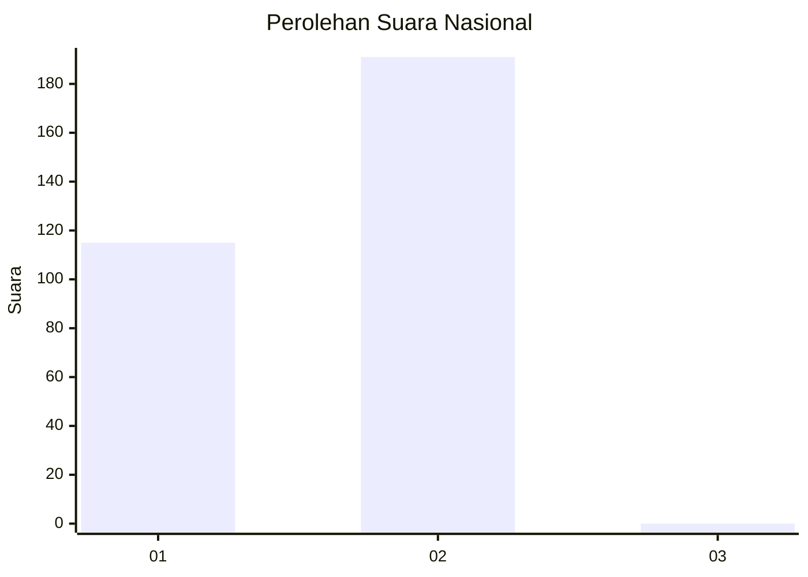
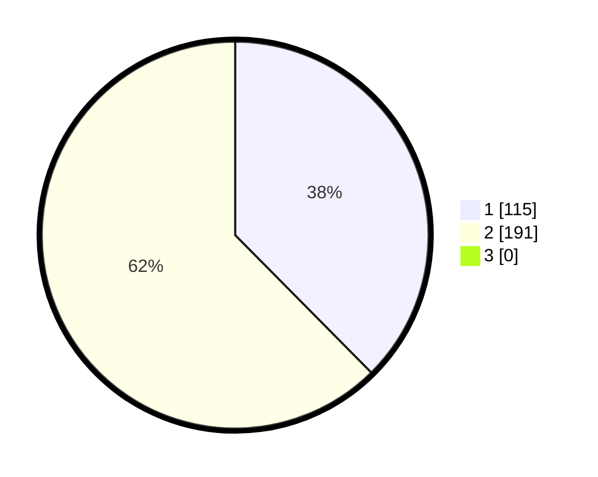

# Hasil

## Grafik

## Tabel

| No. | Nama Paslon    | Suara | Suara (raw) | Persentase |
|:--- |:-------------- | -----:| -----------:| ----------:|
| 1   | ANIES MUHAIMIN | 115   | [115][p-1]  | 37,58      |
| 2   | PRABOWO GIBRAN | 191   | [191][p-2]  | 62,42      |
| 3   | GANJAR MAHFUD  | 0     | [0][p-3]    | 0,00       |

[p-1]: https://github.com/gigit-pemilu/pemilu-2024/blob/main/pilpres/hitung-suara/sub/11-aceh/sub/07-pidie/sub/03-batee/sub/2020-alue-lada/sub/001-tps/sub/paslon-1.txt
[p-2]: https://github.com/gigit-pemilu/pemilu-2024/blob/main/pilpres/hitung-suara/sub/11-aceh/sub/07-pidie/sub/03-batee/sub/2020-alue-lada/sub/001-tps/sub/paslon-2.txt
[p-3]: https://github.com/gigit-pemilu/pemilu-2024/blob/main/pilpres/hitung-suara/sub/11-aceh/sub/07-pidie/sub/03-batee/sub/2020-alue-lada/sub/001-tps/sub/paslon-3.txt

## Foto C Plano

https://sirekap-obj-formc.kpu.go.id/b7d7/pemilu/ppwp/11/07/03/20/20/1107032020001-20240215-161203--e1984085-6ecf-4534-959a-094b53633c82.jpg

https://sirekap-obj-formc.kpu.go.id/b7d7/pemilu/ppwp/11/07/03/20/20/1107032020001-20240215-165904--c866c1f6-b3f3-4a64-aa9f-d5863184d012.jpg

https://sirekap-obj-formc.kpu.go.id/b7d7/pemilu/ppwp/11/07/03/20/20/1107032020001-20240215-165940--156e219a-1d89-4ccf-88fc-57a5a2fb178d.jpg

## Metadata

| Key        | Value               |
| ---------- | ------------------- |
| Time Stamp | 2024-02-24 22:31:28 |

