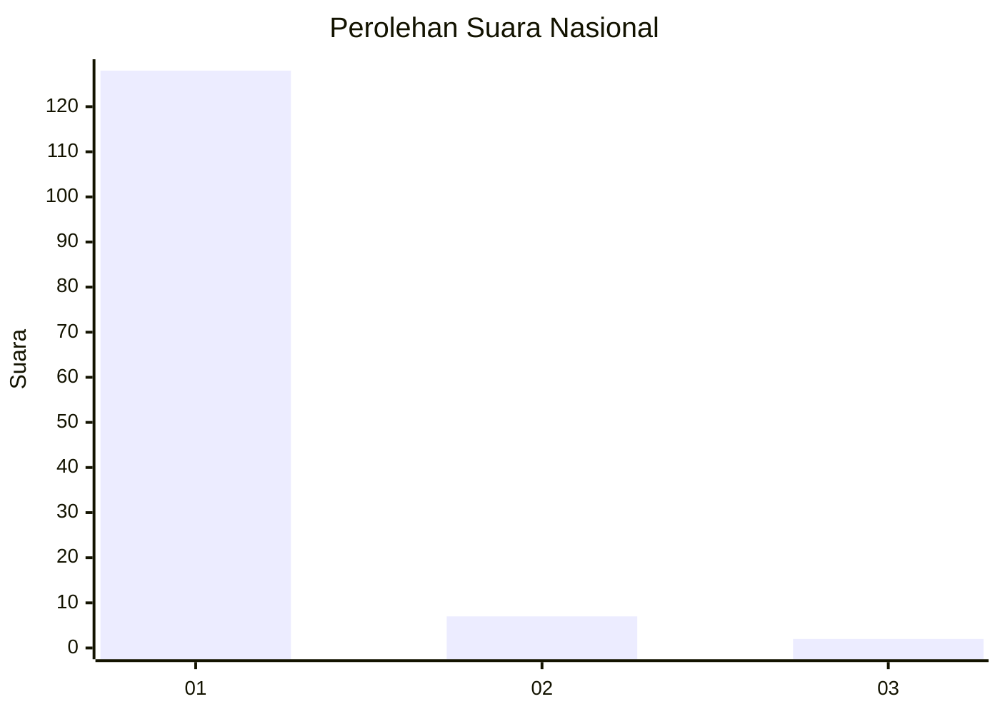
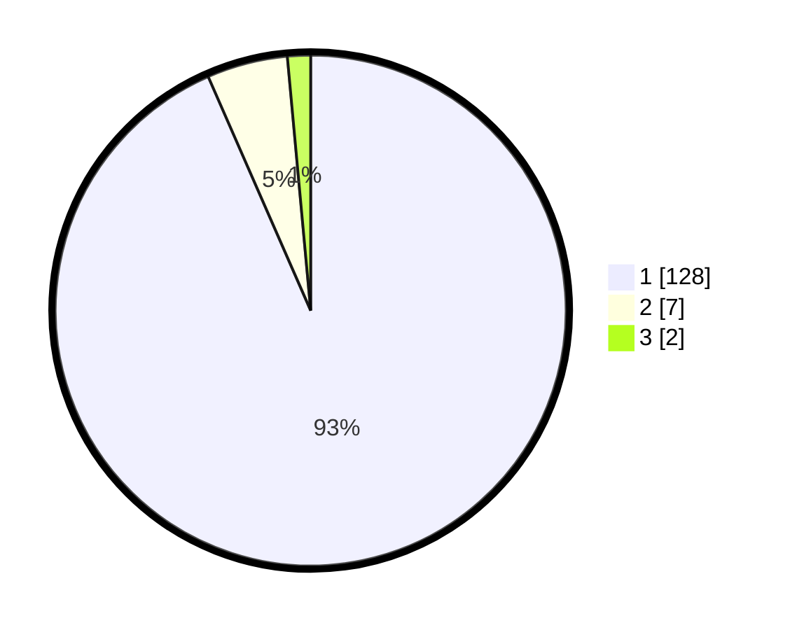

# Hasil

## Grafik

## Tabel

| No. | Nama Paslon    | Suara | Suara (raw) | Persentase |
|:--- |:-------------- | -----:| -----------:| ----------:|
| 1   | ANIES MUHAIMIN | 128   | [128][p-1]  | 93,43      |
| 2   | PRABOWO GIBRAN | 7     | [7][p-2]    | 5,11       |
| 3   | GANJAR MAHFUD  | 2     | [2][p-3]    | 1,46       |

[p-1]: https://github.com/gigit-pemilu/pemilu-2024/blob/main/pilpres/hitung-suara/sub/11-aceh/sub/07-pidie/sub/03-batee/sub/2020-alue-lada/sub/002-tps/sub/paslon-1.txt
[p-2]: https://github.com/gigit-pemilu/pemilu-2024/blob/main/pilpres/hitung-suara/sub/11-aceh/sub/07-pidie/sub/03-batee/sub/2020-alue-lada/sub/002-tps/sub/paslon-2.txt
[p-3]: https://github.com/gigit-pemilu/pemilu-2024/blob/main/pilpres/hitung-suara/sub/11-aceh/sub/07-pidie/sub/03-batee/sub/2020-alue-lada/sub/002-tps/sub/paslon-3.txt

## Foto C Plano

https://sirekap-obj-formc.kpu.go.id/d574/pemilu/ppwp/11/07/03/20/20/1107032020002-20240215-174259--ea8beaa2-fc86-4724-888e-489bbf667fc0.jpg

https://sirekap-obj-formc.kpu.go.id/d574/pemilu/ppwp/11/07/03/20/20/1107032020002-20240215-174846--054c955e-9a9c-48f6-ac7f-5790f757d225.jpg

https://sirekap-obj-formc.kpu.go.id/d574/pemilu/ppwp/11/07/03/20/20/1107032020002-20240215-175021--6058d432-eea4-4857-9a1a-0c3cf097f26a.jpg

## Metadata

| Key        | Value               |
| ---------- | ------------------- |
| Time Stamp | 2024-02-16 03:00:26 |

