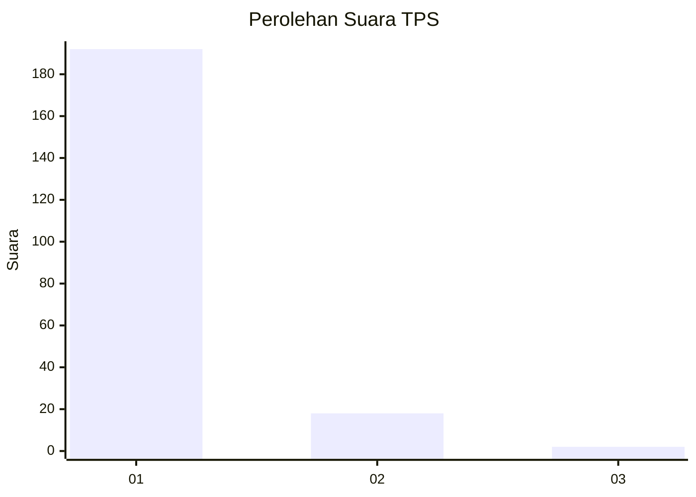
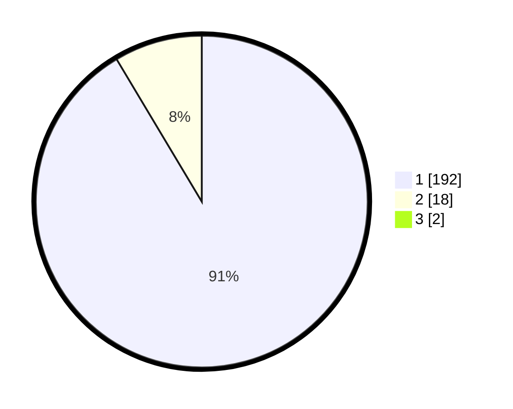

# Hasil

## Grafik

## Tabel

| No. | Nama Paslon    | Suara | Suara (raw) | Persentase |
|:--- |:-------------- | -----:| -----------:| ----------:|
| 1   | ANIES MUHAIMIN | 192   | [192][p-1]  | 90,57      |
| 2   | PRABOWO GIBRAN | 18    | [18][p-2]   | 8,49       |
| 3   | GANJAR MAHFUD  | 2     | [2][p-3]    | 0,94       |

[p-1]: https://github.com/gigit-pemilu/pemilu-2024-11-aceh/blob/main/pilpres/hitung-suara/sub/11-aceh/sub/07-pidie/sub/03-batee/sub/2023-crueng/sub/006-tps/sub/paslon-1.txt
[p-2]: https://github.com/gigit-pemilu/pemilu-2024-11-aceh/blob/main/pilpres/hitung-suara/sub/11-aceh/sub/07-pidie/sub/03-batee/sub/2023-crueng/sub/006-tps/sub/paslon-2.txt
[p-3]: https://github.com/gigit-pemilu/pemilu-2024-11-aceh/blob/main/pilpres/hitung-suara/sub/11-aceh/sub/07-pidie/sub/03-batee/sub/2023-crueng/sub/006-tps/sub/paslon-3.txt

## Foto C Plano

https://sirekap-obj-formc.kpu.go.id/ab94/pemilu/ppwp/11/07/03/20/23/1107032023006-20240215-163002--4e96b203-c3e2-4eda-ae35-0962b1eaea99.jpg

https://sirekap-obj-formc.kpu.go.id/ab94/pemilu/ppwp/11/07/03/20/23/1107032023006-20240215-163114--86dd695c-d05a-4a30-8621-a87ecb1d8032.jpg

https://sirekap-obj-formc.kpu.go.id/ab94/pemilu/ppwp/11/07/03/20/23/1107032023006-20240215-163215--6de9fda5-9232-4b94-be01-e264429a405f.jpg

## Metadata

| Key        | Value               |
| ---------- | ------------------- |
| Time Stamp | 2024-02-16 02:00:27 |

