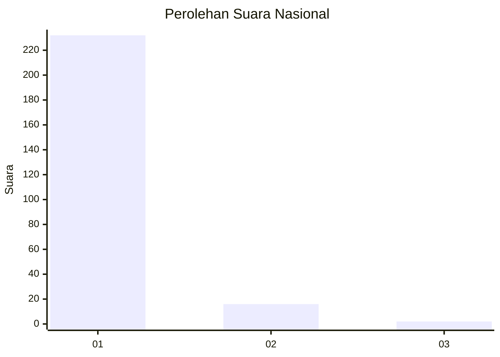
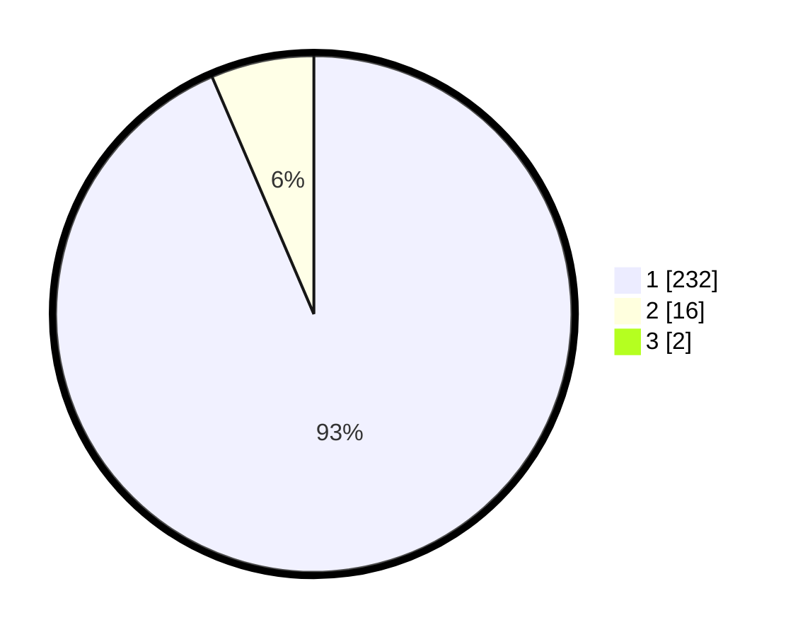

# Hasil

## Grafik

## Tabel

| No. | Nama Paslon    | Suara | Suara (raw) | Persentase |
|:--- |:-------------- | -----:| -----------:| ----------:|
| 1   | ANIES MUHAIMIN | 232   | [232][p-1]  | 92,80      |
| 2   | PRABOWO GIBRAN | 16    | [16][p-2]   | 6,40       |
| 3   | GANJAR MAHFUD  | 2     | [2][p-3]    | 0,80       |

[p-1]: https://github.com/gigit-pemilu/pemilu-2024/blob/main/pilpres/hitung-suara/sub/11-aceh/sub/07-pidie/sub/03-batee/sub/2025-kulee/sub/001-tps/sub/paslon-1.txt
[p-2]: https://github.com/gigit-pemilu/pemilu-2024/blob/main/pilpres/hitung-suara/sub/11-aceh/sub/07-pidie/sub/03-batee/sub/2025-kulee/sub/001-tps/sub/paslon-2.txt
[p-3]: https://github.com/gigit-pemilu/pemilu-2024/blob/main/pilpres/hitung-suara/sub/11-aceh/sub/07-pidie/sub/03-batee/sub/2025-kulee/sub/001-tps/sub/paslon-3.txt

## Foto C Plano

https://sirekap-obj-formc.kpu.go.id/b2fc/pemilu/ppwp/11/07/03/20/25/1107032025001-20240215-174500--7528d14a-3ba4-465e-8241-0500e43af58b.jpg

https://sirekap-obj-formc.kpu.go.id/b2fc/pemilu/ppwp/11/07/03/20/25/1107032025001-20240215-174719--2f38d5c4-3109-48d4-970a-6f462211e03a.jpg

https://sirekap-obj-formc.kpu.go.id/b2fc/pemilu/ppwp/11/07/03/20/25/1107032025001-20240215-174904--8dd55ee5-d318-4068-8bd8-0d890e2e3e50.jpg

## Metadata

| Key        | Value               |
| ---------- | ------------------- |
| Time Stamp | 2024-02-16 03:00:26 |

