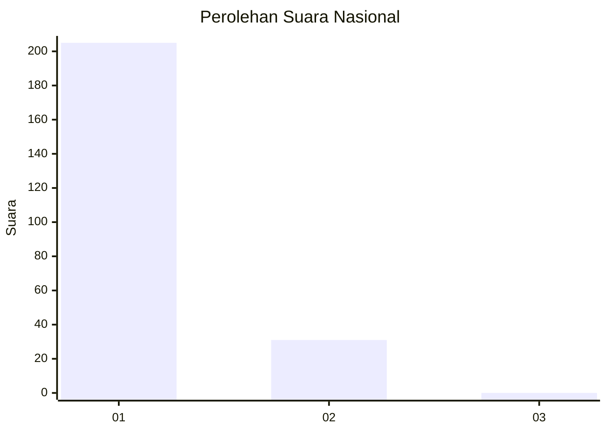
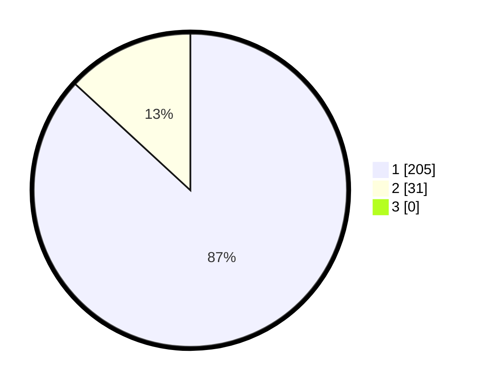

# Hasil

## Grafik

## Tabel

| No. | Nama Paslon    | Suara | Suara (raw) | Persentase |
|:--- |:-------------- | -----:| -----------:| ----------:|
| 1   | ANIES MUHAIMIN | 205   | [205][p-1]  | 86,86      |
| 2   | PRABOWO GIBRAN | 31    | [31][p-2]   | 13,14      |
| 3   | GANJAR MAHFUD  | 0     | [0][p-3]    | 0,00       |

[p-1]: https://github.com/gigit-pemilu/pemilu-2024/blob/main/pilpres/hitung-suara/sub/11-aceh/sub/07-pidie/sub/03-batee/sub/2025-kulee/sub/002-tps/sub/paslon-1.txt
[p-2]: https://github.com/gigit-pemilu/pemilu-2024/blob/main/pilpres/hitung-suara/sub/11-aceh/sub/07-pidie/sub/03-batee/sub/2025-kulee/sub/002-tps/sub/paslon-2.txt
[p-3]: https://github.com/gigit-pemilu/pemilu-2024/blob/main/pilpres/hitung-suara/sub/11-aceh/sub/07-pidie/sub/03-batee/sub/2025-kulee/sub/002-tps/sub/paslon-3.txt

## Foto C Plano

https://sirekap-obj-formc.kpu.go.id/2dbf/pemilu/ppwp/11/07/03/20/25/1107032025002-20240215-163238--caed8fed-105b-45f7-87eb-790f1c766999.jpg

https://sirekap-obj-formc.kpu.go.id/2dbf/pemilu/ppwp/11/07/03/20/25/1107032025002-20240215-163322--73526ba1-67f1-46c5-be8d-020e609ca4cd.jpg

https://sirekap-obj-formc.kpu.go.id/2dbf/pemilu/ppwp/11/07/03/20/25/1107032025002-20240215-163404--cd582ea7-35e3-4ea4-98da-5ed43f3d79ad.jpg

## Metadata

| Key        | Value               |
| ---------- | ------------------- |
| Time Stamp | 2024-02-15 19:30:26 |

