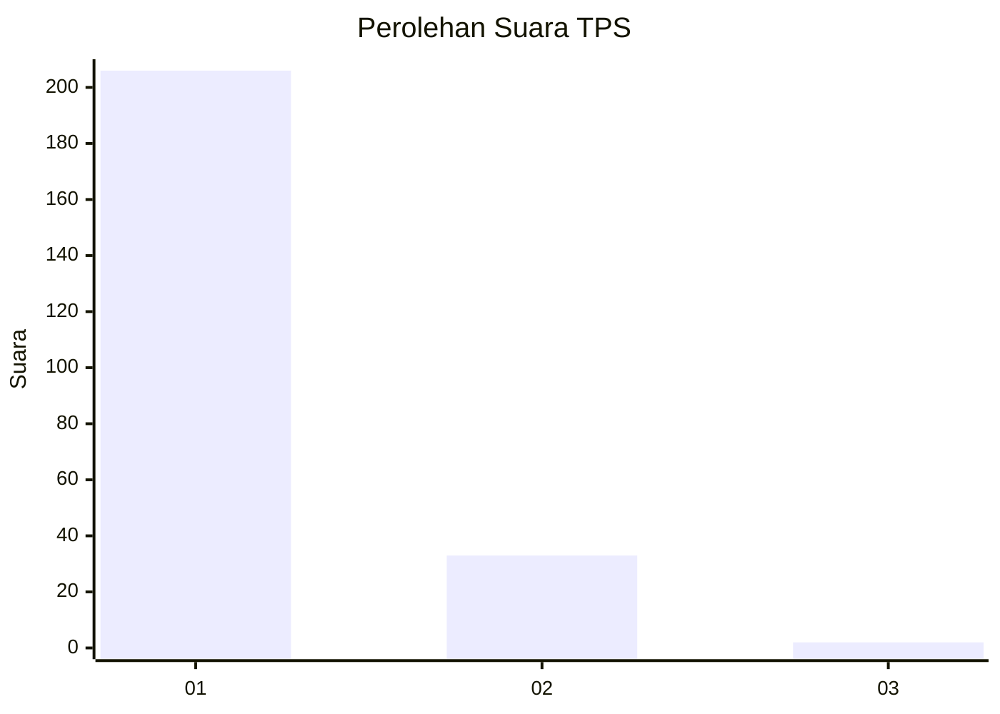
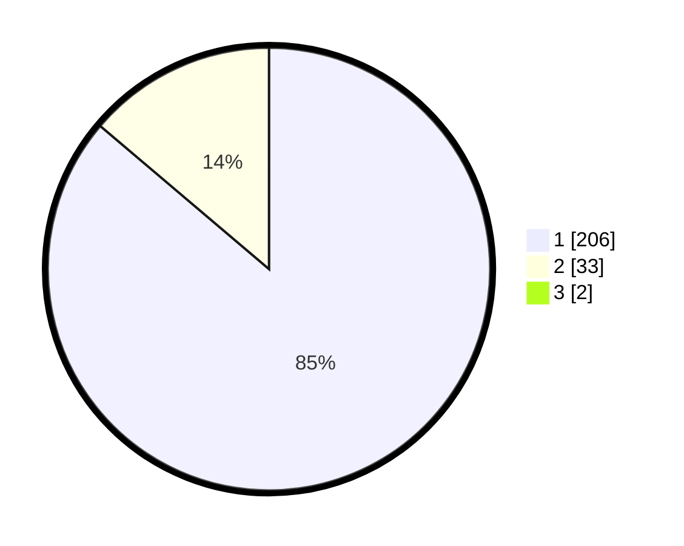

# Hasil

## Grafik

## Tabel

| No. | Nama Paslon    | Suara | Suara (raw) | Persentase |
|:--- |:-------------- | -----:| -----------:| ----------:|
| 1   | ANIES MUHAIMIN | 206   | [206][p-1]  | 85,48      |
| 2   | PRABOWO GIBRAN | 33    | [33][p-2]   | 13,69      |
| 3   | GANJAR MAHFUD  | 2     | [2][p-3]    | 0,83       |

[p-1]: https://github.com/gigit-pemilu/pemilu-2024-11-aceh/blob/main/pilpres/hitung-suara/sub/11-aceh/sub/07-pidie/sub/03-batee/sub/2025-kulee/sub/003-tps/sub/paslon-1.txt
[p-2]: https://github.com/gigit-pemilu/pemilu-2024-11-aceh/blob/main/pilpres/hitung-suara/sub/11-aceh/sub/07-pidie/sub/03-batee/sub/2025-kulee/sub/003-tps/sub/paslon-2.txt
[p-3]: https://github.com/gigit-pemilu/pemilu-2024-11-aceh/blob/main/pilpres/hitung-suara/sub/11-aceh/sub/07-pidie/sub/03-batee/sub/2025-kulee/sub/003-tps/sub/paslon-3.txt

## Foto C Plano

https://sirekap-obj-formc.kpu.go.id/4634/pemilu/ppwp/11/07/03/20/25/1107032025003-20240215-130657--2089d11b-ceb9-4b75-91da-5a2ef4fb190a.jpg

https://sirekap-obj-formc.kpu.go.id/4634/pemilu/ppwp/11/07/03/20/25/1107032025003-20240215-130848--329d4c3f-52e1-4e85-8bbc-d330e41d535c.jpg

https://sirekap-obj-formc.kpu.go.id/4634/pemilu/ppwp/11/07/03/20/25/1107032025003-20240215-131229--ae1504f2-5dfc-4d20-b2c1-0ef1078c2ef5.jpg

## Metadata

| Key        | Value               |
| ---------- | ------------------- |
| Time Stamp | 2024-02-16 03:00:26 |

