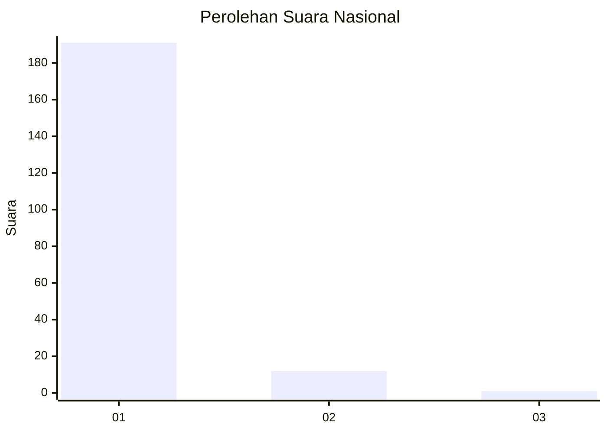
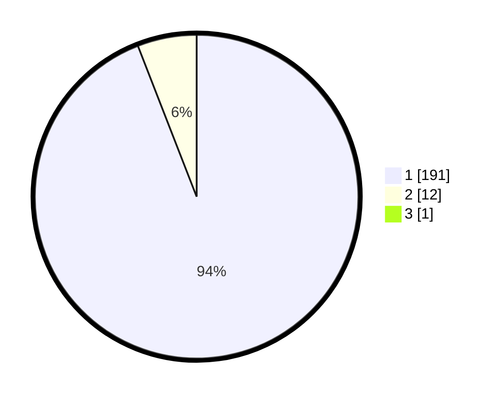

# Hasil

## Grafik

## Tabel

| No. | Nama Paslon    | Suara | Suara (raw) | Persentase |
|:--- |:-------------- | -----:| -----------:| ----------:|
| 1   | ANIES MUHAIMIN | 191   | [191][p-1]  | 93,63      |
| 2   | PRABOWO GIBRAN | 12    | [12][p-2]   | 5,88       |
| 3   | GANJAR MAHFUD  | 1     | [1][p-3]    | 0,49       |

[p-1]: https://github.com/gigit-pemilu/pemilu-2024/blob/main/pilpres/hitung-suara/sub/11-aceh/sub/07-pidie/sub/03-batee/sub/2026-kulam/sub/001-tps/sub/paslon-1.txt
[p-2]: https://github.com/gigit-pemilu/pemilu-2024/blob/main/pilpres/hitung-suara/sub/11-aceh/sub/07-pidie/sub/03-batee/sub/2026-kulam/sub/001-tps/sub/paslon-2.txt
[p-3]: https://github.com/gigit-pemilu/pemilu-2024/blob/main/pilpres/hitung-suara/sub/11-aceh/sub/07-pidie/sub/03-batee/sub/2026-kulam/sub/001-tps/sub/paslon-3.txt

## Foto C Plano

https://sirekap-obj-formc.kpu.go.id/20e0/pemilu/ppwp/11/07/03/20/26/1107032026001-20240214-203952--9d562fc2-d9e7-48a4-b46d-a6c03154ac56.jpg

https://sirekap-obj-formc.kpu.go.id/20e0/pemilu/ppwp/11/07/03/20/26/1107032026001-20240214-210646--ab2850de-9551-4a2b-9972-911c19db3dab.jpg

https://sirekap-obj-formc.kpu.go.id/20e0/pemilu/ppwp/11/07/03/20/26/1107032026001-20240214-210812--4f69063e-6522-4a40-83da-08fa1d5a8dc8.jpg

## Metadata

| Key        | Value               |
| ---------- | ------------------- |
| Time Stamp | 2024-02-24 22:31:28 |

