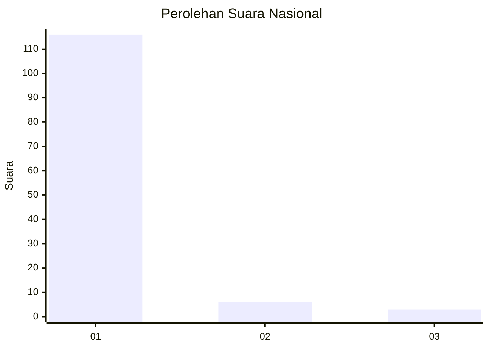
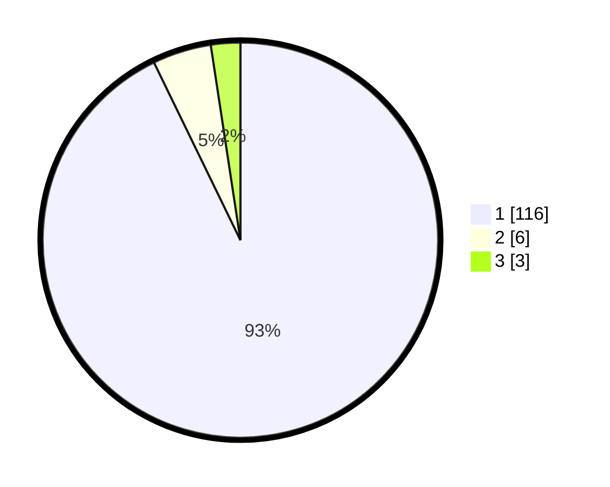

# Hasil

## Grafik

## Tabel

| No. | Nama Paslon    | Suara | Suara (raw) | Persentase |
|:--- |:-------------- | -----:| -----------:| ----------:|
| 1   | ANIES MUHAIMIN | 116   | [116][p-1]  | 92,80      |
| 2   | PRABOWO GIBRAN | 6     | [6][p-2]    | 4,80       |
| 3   | GANJAR MAHFUD  | 3     | [3][p-3]    | 2,40       |

[p-1]: https://github.com/gigit-pemilu/pemilu-2024/blob/main/pilpres/hitung-suara/sub/11-aceh/sub/07-pidie/sub/03-batee/sub/2028-pasi-beurandeh/sub/002-tps/sub/paslon-1.txt
[p-2]: https://github.com/gigit-pemilu/pemilu-2024/blob/main/pilpres/hitung-suara/sub/11-aceh/sub/07-pidie/sub/03-batee/sub/2028-pasi-beurandeh/sub/002-tps/sub/paslon-2.txt
[p-3]: https://github.com/gigit-pemilu/pemilu-2024/blob/main/pilpres/hitung-suara/sub/11-aceh/sub/07-pidie/sub/03-batee/sub/2028-pasi-beurandeh/sub/002-tps/sub/paslon-3.txt

## Foto C Plano

https://sirekap-obj-formc.kpu.go.id/6d25/pemilu/ppwp/11/07/03/20/28/1107032028002-20240215-143151--0c4f83ca-0b68-4f5d-80e8-13de0697f846.jpg

https://sirekap-obj-formc.kpu.go.id/6d25/pemilu/ppwp/11/07/03/20/28/1107032028002-20240215-164604--4ab79721-f725-4abd-9c6d-9e99db7c37f4.jpg

https://sirekap-obj-formc.kpu.go.id/6d25/pemilu/ppwp/11/07/03/20/28/1107032028002-20240215-165152--7df75065-ff51-416c-a66d-abb2f04a1626.jpg

## Metadata

| Key        | Value               |
| ---------- | ------------------- |
| Time Stamp | 2024-02-16 03:00:26 |

