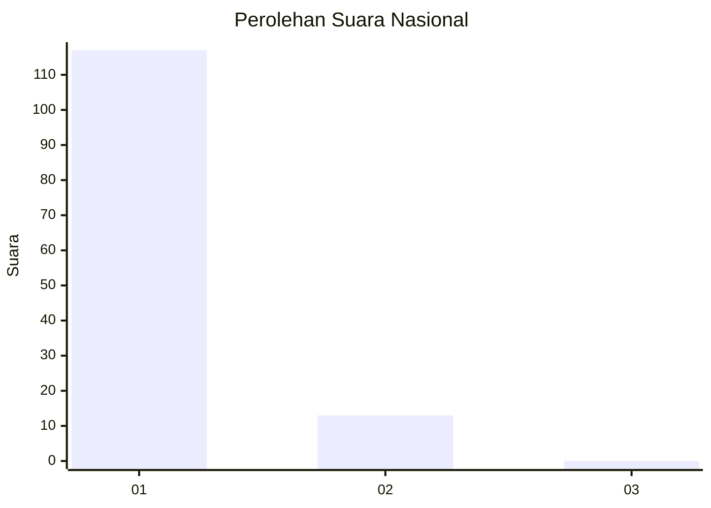
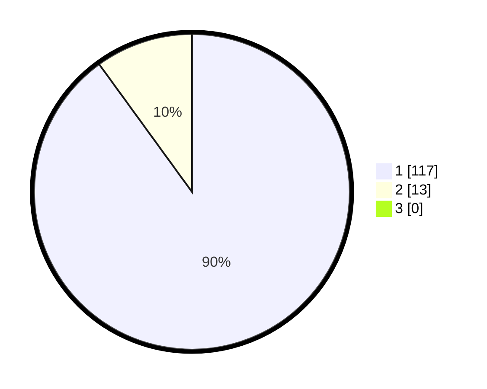

# Hasil

## Grafik

## Tabel

| No. | Nama Paslon    | Suara | Suara (raw) | Persentase |
|:--- |:-------------- | -----:| -----------:| ----------:|
| 1   | ANIES MUHAIMIN | 117   | [117][p-1]  | 90,00      |
| 2   | PRABOWO GIBRAN | 13    | [13][p-2]   | 10,00      |
| 3   | GANJAR MAHFUD  | 0     | [0][p-3]    | 0,00       |

[p-1]: https://github.com/gigit-pemilu/pemilu-2024/blob/main/pilpres/hitung-suara/sub/11-aceh/sub/07-pidie/sub/04-delima/sub/2001-tunong/sub/002-tps/sub/paslon-1.txt
[p-2]: https://github.com/gigit-pemilu/pemilu-2024/blob/main/pilpres/hitung-suara/sub/11-aceh/sub/07-pidie/sub/04-delima/sub/2001-tunong/sub/002-tps/sub/paslon-2.txt
[p-3]: https://github.com/gigit-pemilu/pemilu-2024/blob/main/pilpres/hitung-suara/sub/11-aceh/sub/07-pidie/sub/04-delima/sub/2001-tunong/sub/002-tps/sub/paslon-3.txt

## Foto C Plano

https://sirekap-obj-formc.kpu.go.id/e483/pemilu/ppwp/11/07/04/20/01/1107042001002-20240215-030723--5c01f40e-d440-4774-ba23-bd226acc7145.jpg

https://sirekap-obj-formc.kpu.go.id/e483/pemilu/ppwp/11/07/04/20/01/1107042001002-20240215-025759--80c65a80-d635-4c51-af21-a8a4b5f67e59.jpg

https://sirekap-obj-formc.kpu.go.id/e483/pemilu/ppwp/11/07/04/20/01/1107042001002-20240215-025903--2d09b4c7-9c73-4dc6-8b25-26dc617c35a4.jpg

## Metadata

| Key        | Value               |
| ---------- | ------------------- |
| Time Stamp | 2024-02-16 03:00:26 |

