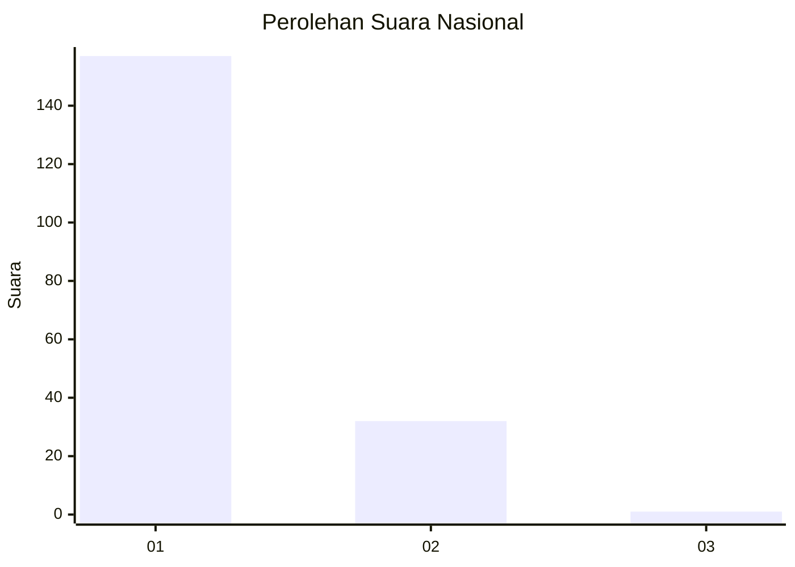
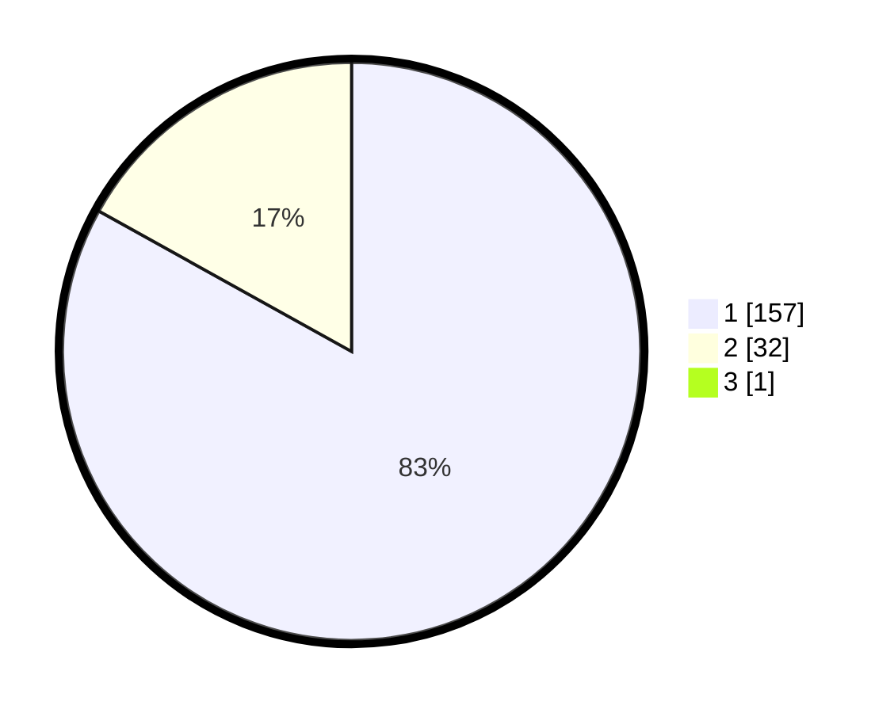

# Hasil

## Grafik

## Tabel

| No. | Nama Paslon    | Suara | Suara (raw) | Persentase |
|:--- |:-------------- | -----:| -----------:| ----------:|
| 1   | ANIES MUHAIMIN | 157   | [157][p-1]  | 82,63      |
| 2   | PRABOWO GIBRAN | 32    | [32][p-2]   | 16,84      |
| 3   | GANJAR MAHFUD  | 1     | [1][p-3]    | 0,53       |

[p-1]: https://github.com/gigit-pemilu/pemilu-2024/blob/main/pilpres/hitung-suara/sub/11-aceh/sub/07-pidie/sub/04-delima/sub/2002-raya/sub/001-tps/sub/paslon-1.txt
[p-2]: https://github.com/gigit-pemilu/pemilu-2024/blob/main/pilpres/hitung-suara/sub/11-aceh/sub/07-pidie/sub/04-delima/sub/2002-raya/sub/001-tps/sub/paslon-2.txt
[p-3]: https://github.com/gigit-pemilu/pemilu-2024/blob/main/pilpres/hitung-suara/sub/11-aceh/sub/07-pidie/sub/04-delima/sub/2002-raya/sub/001-tps/sub/paslon-3.txt

## Foto C Plano

https://sirekap-obj-formc.kpu.go.id/5f68/pemilu/ppwp/11/07/04/20/02/1107042002001-20240215-101708--6f2802fd-9ec7-4244-bf0d-df7b5ad8935c.jpg

https://sirekap-obj-formc.kpu.go.id/5f68/pemilu/ppwp/11/07/04/20/02/1107042002001-20240214-205407--08e92d19-76e5-4c16-a31d-ba32133a59b4.jpg

https://sirekap-obj-formc.kpu.go.id/5f68/pemilu/ppwp/11/07/04/20/02/1107042002001-20240214-205450--b50eee0d-78c0-424b-a6c2-7911833faf4a.jpg

## Metadata

| Key        | Value               |
| ---------- | ------------------- |
| Time Stamp | 2024-02-15 21:01:18 |

