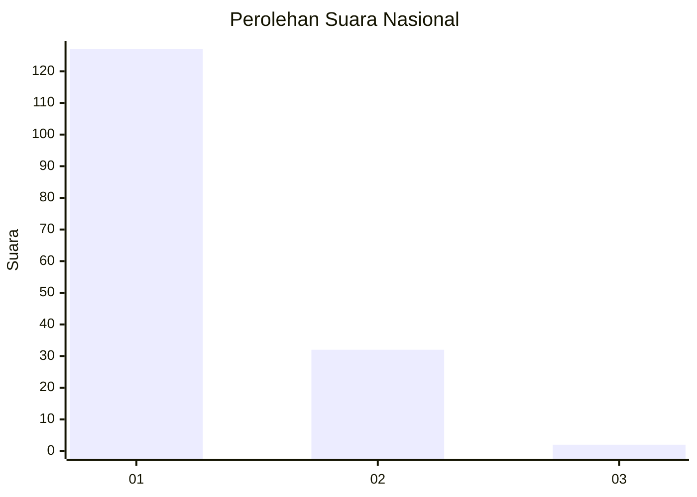
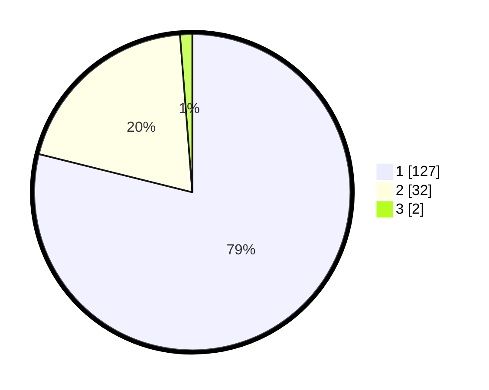

# Hasil

## Grafik

## Tabel

| No. | Nama Paslon    | Suara | Suara (raw) | Persentase |
|:--- |:-------------- | -----:| -----------:| ----------:|
| 1   | ANIES MUHAIMIN | 127   | [127][p-1]  | 78,88      |
| 2   | PRABOWO GIBRAN | 32    | [32][p-2]   | 19,88      |
| 3   | GANJAR MAHFUD  | 2     | [2][p-3]    | 1,24       |

[p-1]: https://github.com/gigit-pemilu/pemilu-2024/blob/main/pilpres/hitung-suara/sub/11-aceh/sub/07-pidie/sub/04-delima/sub/2002-raya/sub/002-tps/sub/paslon-1.txt
[p-2]: https://github.com/gigit-pemilu/pemilu-2024/blob/main/pilpres/hitung-suara/sub/11-aceh/sub/07-pidie/sub/04-delima/sub/2002-raya/sub/002-tps/sub/paslon-2.txt
[p-3]: https://github.com/gigit-pemilu/pemilu-2024/blob/main/pilpres/hitung-suara/sub/11-aceh/sub/07-pidie/sub/04-delima/sub/2002-raya/sub/002-tps/sub/paslon-3.txt

## Foto C Plano

https://sirekap-obj-formc.kpu.go.id/01c8/pemilu/ppwp/11/07/04/20/02/1107042002002-20240214-202432--890e8286-facf-4f8e-8038-43922491f6b2.jpg

https://sirekap-obj-formc.kpu.go.id/01c8/pemilu/ppwp/11/07/04/20/02/1107042002002-20240215-103950--eb459841-3460-4c37-982b-0471d97f8885.jpg

https://sirekap-obj-formc.kpu.go.id/01c8/pemilu/ppwp/11/07/04/20/02/1107042002002-20240215-104137--5fb98ccd-ff77-4922-b89b-9a38fd3316b8.jpg

## Metadata

| Key        | Value               |
| ---------- | ------------------- |
| Time Stamp | 2024-02-15 15:30:25 |

## DATA PEMILIH TETAP

Jumlah pemilih dalam DPT: **181**.
 * L: **86**.
 * P: **95**.

## DATA PENGGUNA HAK PILIH

Jumlah pengguna hak pilih dalam DPT: **169**.
 * L: **76**.
 * P: **93**.

Jumlah pengguna hak pilih dalam DPTb: **0**.
 * L: **0**.
 * P: **0**.

Jumlah pengguna hak pilih dalam DPK: **1**.
 * L: **0**.
 * P: **1**.

Jumlah pengguna hak pilih: **170**.
 * L: **76**.
 * P: **94**.

## JUMLAH SUARA SAH DAN TIDAK SAH

JUMLAH SELURUH SUARA SAH: **161**.

JUMLAH SUARA TIDAK SAH: **9**.

JUMLAH SELURUH SUARA SAH DAN SUARA TIDAK SAH: **170**.

