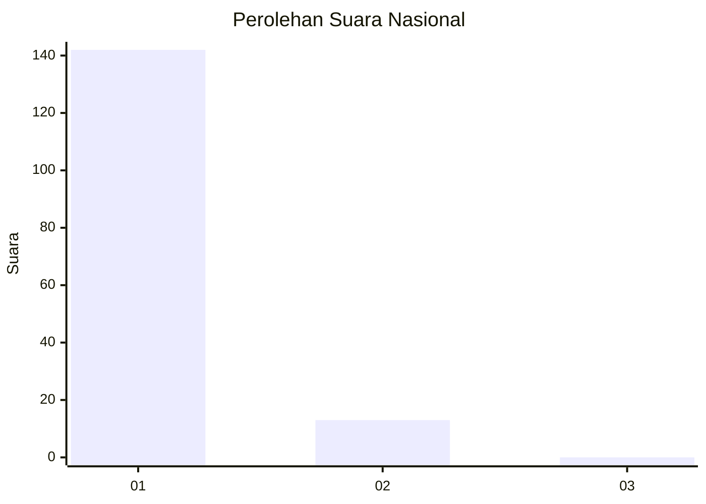
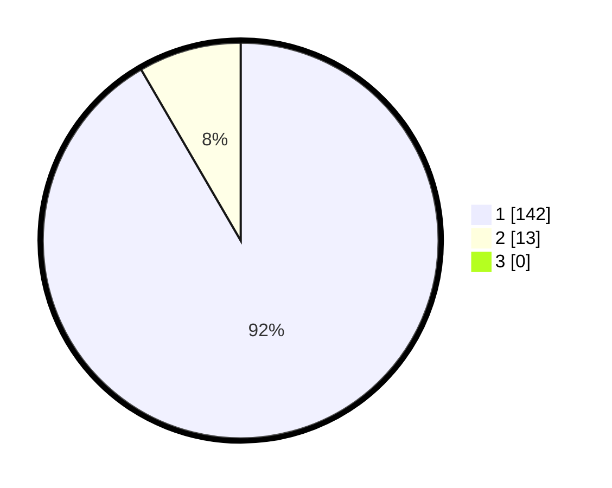

# Hasil

## Grafik

## Tabel

| No. | Nama Paslon    | Suara | Suara (raw) | Persentase |
|:--- |:-------------- | -----:| -----------:| ----------:|
| 1   | ANIES MUHAIMIN | 142   | [142][p-1]  | 91,61      |
| 2   | PRABOWO GIBRAN | 13    | [13][p-2]   | 8,39       |
| 3   | GANJAR MAHFUD  | 0     | [0][p-3]    | 0,00       |

[p-1]: https://github.com/gigit-pemilu/pemilu-2024/blob/main/pilpres/hitung-suara/sub/11-aceh/sub/07-pidie/sub/04-delima/sub/2004-cut/sub/002-tps/sub/paslon-1.txt
[p-2]: https://github.com/gigit-pemilu/pemilu-2024/blob/main/pilpres/hitung-suara/sub/11-aceh/sub/07-pidie/sub/04-delima/sub/2004-cut/sub/002-tps/sub/paslon-2.txt
[p-3]: https://github.com/gigit-pemilu/pemilu-2024/blob/main/pilpres/hitung-suara/sub/11-aceh/sub/07-pidie/sub/04-delima/sub/2004-cut/sub/002-tps/sub/paslon-3.txt

## Foto C Plano

https://sirekap-obj-formc.kpu.go.id/7c28/pemilu/ppwp/11/07/04/20/04/1107042004002-20240215-105815--9269eabe-e6ce-4868-99ea-3ae4318edb26.jpg

https://sirekap-obj-formc.kpu.go.id/7c28/pemilu/ppwp/11/07/04/20/04/1107042004002-20240215-071415--8bbf532b-e2cc-4fbd-ab2e-c166997d5604.jpg

https://sirekap-obj-formc.kpu.go.id/7c28/pemilu/ppwp/11/07/04/20/04/1107042004002-20240215-105855--0a637358-92c9-4a72-bf61-dc36822d62dc.jpg

## Metadata

| Key        | Value               |
| ---------- | ------------------- |
| Time Stamp | 2024-02-16 03:00:26 |

