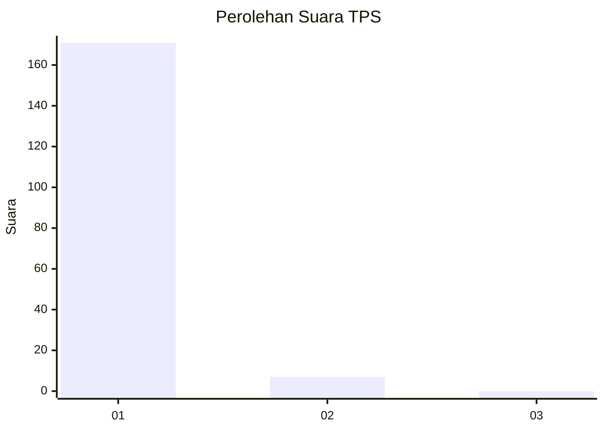
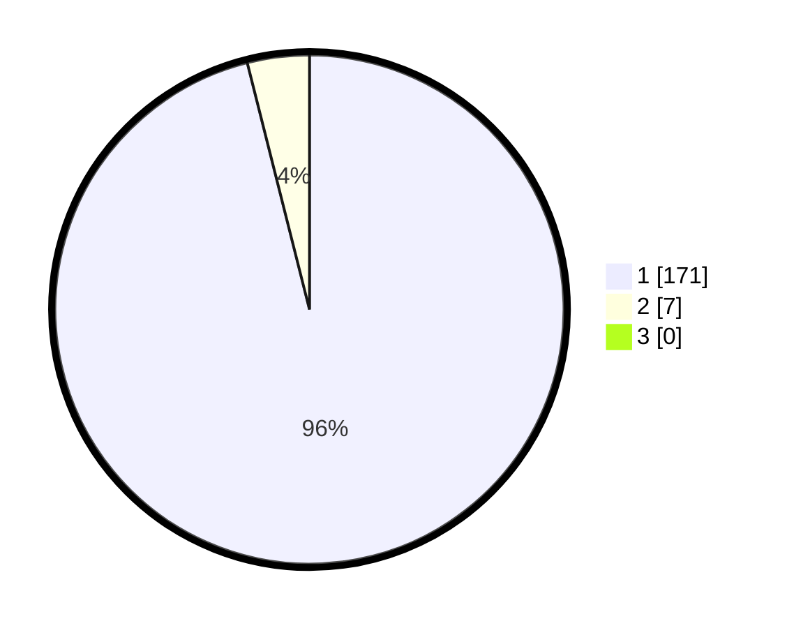

# Hasil

## Grafik

## Tabel

| No. | Nama Paslon    | Suara | Suara (raw) | Persentase |
|:--- |:-------------- | -----:| -----------:| ----------:|
| 1   | ANIES MUHAIMIN | 171   | [171][p-1]  | 96,07      |
| 2   | PRABOWO GIBRAN | 7     | [7][p-2]    | 3,93       |
| 3   | GANJAR MAHFUD  | 0     | [0][p-3]    | 0,00       |

[p-1]: https://github.com/gigit-pemilu/pemilu-2024-11-aceh/blob/main/pilpres/hitung-suara/sub/11-aceh/sub/07-pidie/sub/04-delima/sub/2006-tanjong/sub/001-tps/sub/paslon-1.txt
[p-2]: https://github.com/gigit-pemilu/pemilu-2024-11-aceh/blob/main/pilpres/hitung-suara/sub/11-aceh/sub/07-pidie/sub/04-delima/sub/2006-tanjong/sub/001-tps/sub/paslon-2.txt
[p-3]: https://github.com/gigit-pemilu/pemilu-2024-11-aceh/blob/main/pilpres/hitung-suara/sub/11-aceh/sub/07-pidie/sub/04-delima/sub/2006-tanjong/sub/001-tps/sub/paslon-3.txt

## Foto C Plano

https://sirekap-obj-formc.kpu.go.id/06d7/pemilu/ppwp/11/07/04/20/06/1107042006001-20240214-234102--2fede7c8-c9a9-4650-84d8-84f1a3151cdb.jpg

https://sirekap-obj-formc.kpu.go.id/06d7/pemilu/ppwp/11/07/04/20/06/1107042006001-20240214-234414--645fdbca-1d48-4603-9b8e-f9a6298ee667.jpg

https://sirekap-obj-formc.kpu.go.id/06d7/pemilu/ppwp/11/07/04/20/06/1107042006001-20240214-234500--b972b1ac-c865-4ee9-9f1d-0040ea52797d.jpg

## Metadata

| Key        | Value               |
| ---------- | ------------------- |
| Time Stamp | 2024-02-16 03:00:26 |

