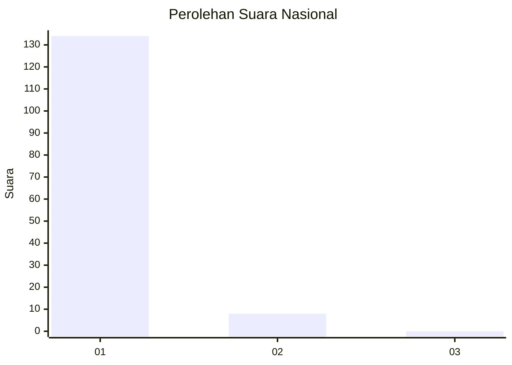
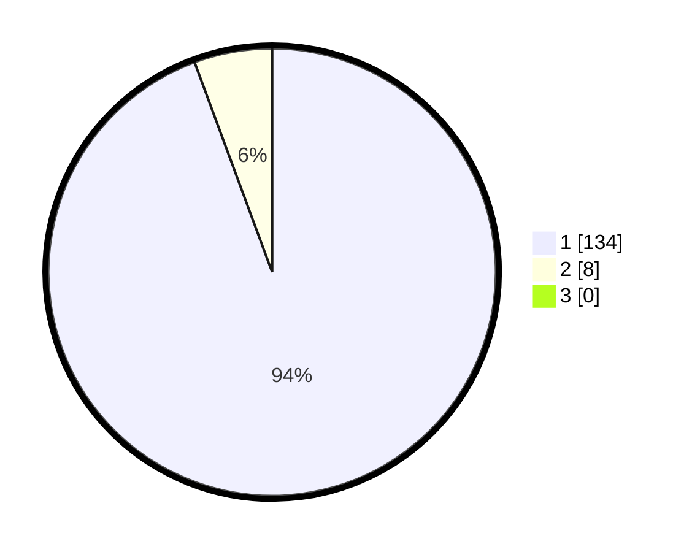

# Hasil

## Grafik

## Tabel

| No. | Nama Paslon    | Suara | Suara (raw) | Persentase |
|:--- |:-------------- | -----:| -----------:| ----------:|
| 1   | ANIES MUHAIMIN | 134   | [134][p-1]  | 94,37      |
| 2   | PRABOWO GIBRAN | 8     | [8][p-2]    | 5,63       |
| 3   | GANJAR MAHFUD  | 0     | [0][p-3]    | 0,00       |

[p-1]: https://github.com/gigit-pemilu/pemilu-2024/blob/main/pilpres/hitung-suara/sub/11-aceh/sub/07-pidie/sub/04-delima/sub/2006-tanjong/sub/002-tps/sub/paslon-1.txt
[p-2]: https://github.com/gigit-pemilu/pemilu-2024/blob/main/pilpres/hitung-suara/sub/11-aceh/sub/07-pidie/sub/04-delima/sub/2006-tanjong/sub/002-tps/sub/paslon-2.txt
[p-3]: https://github.com/gigit-pemilu/pemilu-2024/blob/main/pilpres/hitung-suara/sub/11-aceh/sub/07-pidie/sub/04-delima/sub/2006-tanjong/sub/002-tps/sub/paslon-3.txt

## Foto C Plano

https://sirekap-obj-formc.kpu.go.id/8d88/pemilu/ppwp/11/07/04/20/06/1107042006002-20240215-083701--e6b027a6-50cd-4465-babe-2f0051db642f.jpg

https://sirekap-obj-formc.kpu.go.id/8d88/pemilu/ppwp/11/07/04/20/06/1107042006002-20240215-083745--e2857ac8-5694-49e6-9677-d0e1e3182ec8.jpg

https://sirekap-obj-formc.kpu.go.id/8d88/pemilu/ppwp/11/07/04/20/06/1107042006002-20240215-083805--80484ee0-345f-4e3b-b7cb-106b7245d80b.jpg

## Metadata

| Key        | Value               |
| ---------- | ------------------- |
| Time Stamp | 2024-02-16 03:00:26 |

