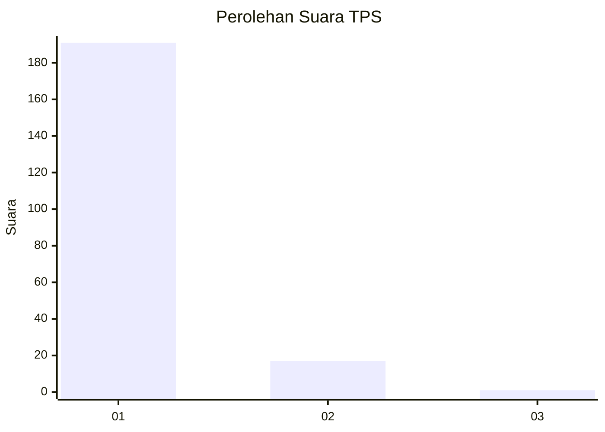
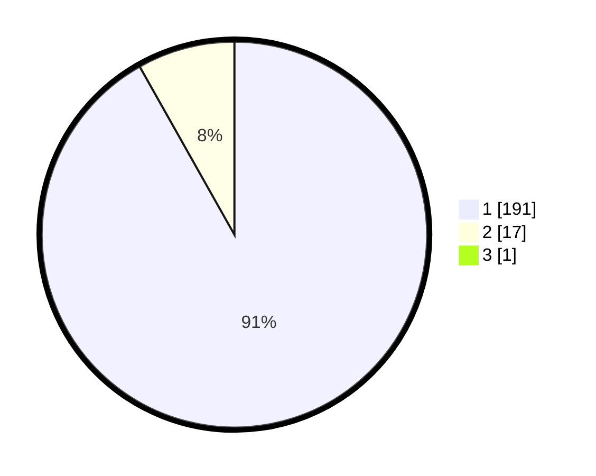

# Hasil

## Grafik

## Tabel

| No. | Nama Paslon    | Suara | Suara (raw) | Persentase |
|:--- |:-------------- | -----:| -----------:| ----------:|
| 1   | ANIES MUHAIMIN | 191   | [191][p-1]  | 91,39      |
| 2   | PRABOWO GIBRAN | 17    | [17][p-2]   | 8,13       |
| 3   | GANJAR MAHFUD  | 1     | [1][p-3]    | 0,48       |

[p-1]: https://github.com/gigit-pemilu/pemilu-2024-11-aceh/blob/main/pilpres/hitung-suara/sub/11-aceh/sub/07-pidie/sub/04-delima/sub/2009-reuba/sub/001-tps/sub/paslon-1.txt
[p-2]: https://github.com/gigit-pemilu/pemilu-2024-11-aceh/blob/main/pilpres/hitung-suara/sub/11-aceh/sub/07-pidie/sub/04-delima/sub/2009-reuba/sub/001-tps/sub/paslon-2.txt
[p-3]: https://github.com/gigit-pemilu/pemilu-2024-11-aceh/blob/main/pilpres/hitung-suara/sub/11-aceh/sub/07-pidie/sub/04-delima/sub/2009-reuba/sub/001-tps/sub/paslon-3.txt

## Foto C Plano

https://sirekap-obj-formc.kpu.go.id/79e4/pemilu/ppwp/11/07/04/20/09/1107042009001-20240214-223337--307b92c8-802a-43a4-a58c-7ef3e7099148.jpg

https://sirekap-obj-formc.kpu.go.id/79e4/pemilu/ppwp/11/07/04/20/09/1107042009001-20240214-225316--ee4c82fa-ac84-4854-bbc0-912b1a65f62f.jpg

https://sirekap-obj-formc.kpu.go.id/79e4/pemilu/ppwp/11/07/04/20/09/1107042009001-20240215-092330--3ad29f2a-a8d6-49f3-9737-25648606d513.jpg

## Metadata

| Key        | Value               |
| ---------- | ------------------- |
| Time Stamp | 2024-02-24 22:31:28 |

