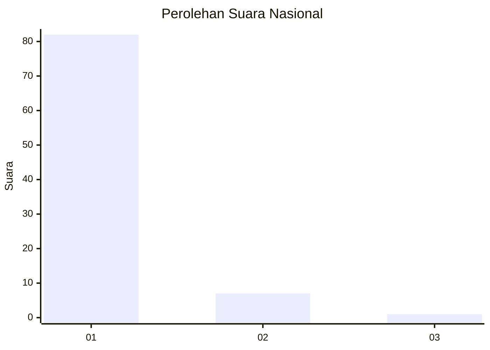
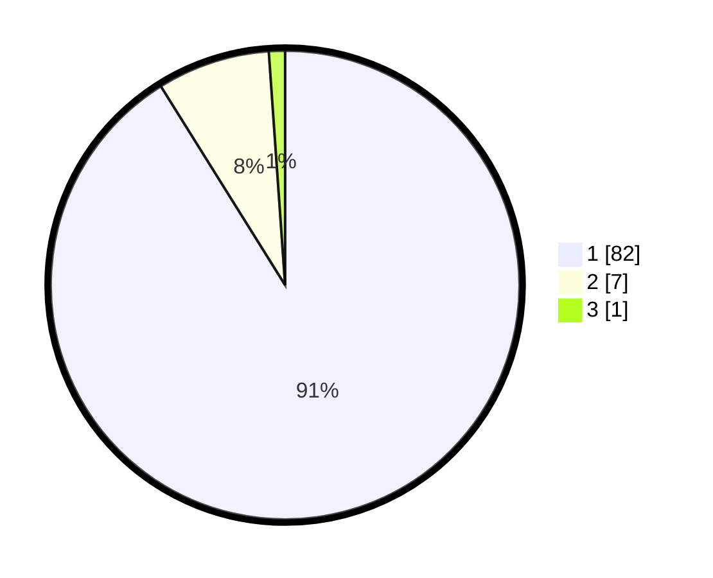

# Hasil

## Grafik

## Tabel

| No. | Nama Paslon    | Suara | Suara (raw) | Persentase |
|:--- |:-------------- | -----:| -----------:| ----------:|
| 1   | ANIES MUHAIMIN | 82    | [82][p-1]   | 91,11      |
| 2   | PRABOWO GIBRAN | 7     | [7][p-2]    | 7,78       |
| 3   | GANJAR MAHFUD  | 1     | [1][p-3]    | 1,11       |

[p-1]: https://github.com/gigit-pemilu/pemilu-2024/blob/main/pilpres/hitung-suara/sub/11-aceh/sub/07-pidie/sub/04-delima/sub/2012-glee/sub/001-tps/sub/paslon-1.txt
[p-2]: https://github.com/gigit-pemilu/pemilu-2024/blob/main/pilpres/hitung-suara/sub/11-aceh/sub/07-pidie/sub/04-delima/sub/2012-glee/sub/001-tps/sub/paslon-2.txt
[p-3]: https://github.com/gigit-pemilu/pemilu-2024/blob/main/pilpres/hitung-suara/sub/11-aceh/sub/07-pidie/sub/04-delima/sub/2012-glee/sub/001-tps/sub/paslon-3.txt

## Foto C Plano

https://sirekap-obj-formc.kpu.go.id/b91d/pemilu/ppwp/11/07/04/20/12/1107042012001-20240215-114832--5d5652d0-7aa4-4b96-b6be-dabaa8e33dab.jpg

https://sirekap-obj-formc.kpu.go.id/b91d/pemilu/ppwp/11/07/04/20/12/1107042012001-20240215-115001--e5f72644-3ded-46b6-aa0e-bd981173eb8b.jpg

https://sirekap-obj-formc.kpu.go.id/b91d/pemilu/ppwp/11/07/04/20/12/1107042012001-20240215-115118--8aaa646c-f57d-4267-94ea-c4750e642ec7.jpg

## Metadata

| Key        | Value               |
| ---------- | ------------------- |
| Time Stamp | 2024-02-16 03:00:26 |

