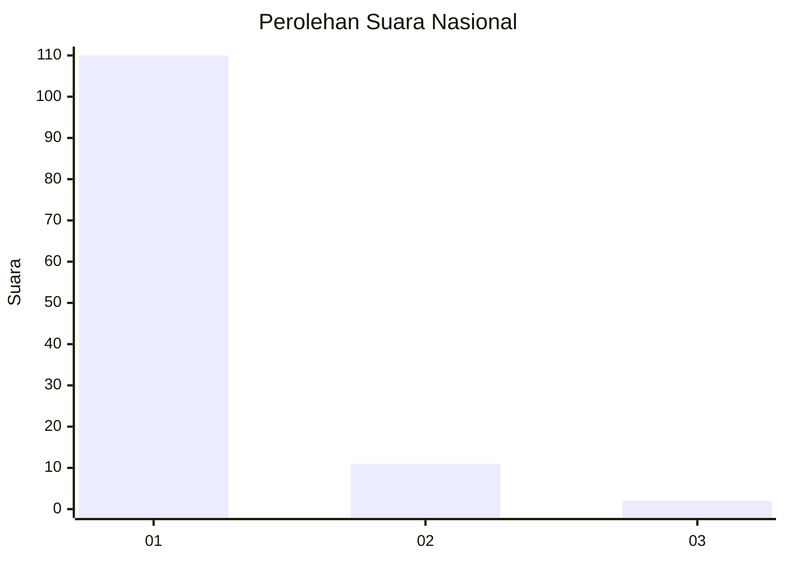
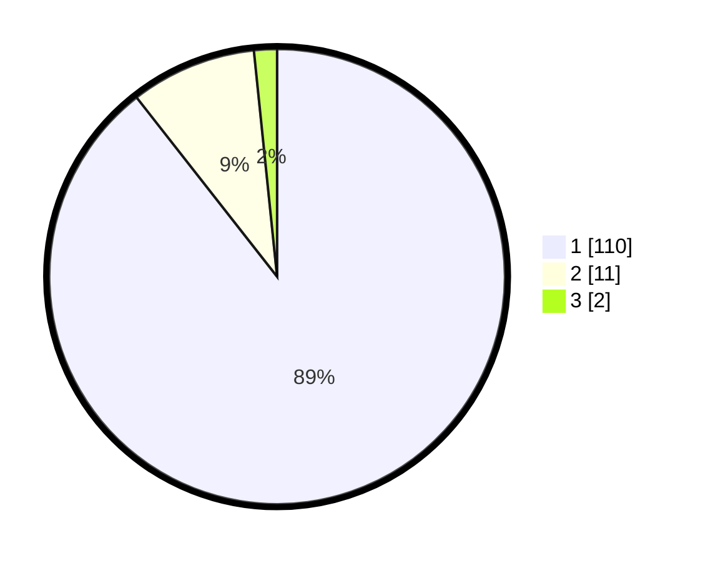

# Hasil

## Grafik

## Tabel

| No. | Nama Paslon    | Suara | Suara (raw) | Persentase |
|:--- |:-------------- | -----:| -----------:| ----------:|
| 1   | ANIES MUHAIMIN | 110   | [110][p-1]  | 89,43      |
| 2   | PRABOWO GIBRAN | 11    | [11][p-2]   | 8,94       |
| 3   | GANJAR MAHFUD  | 2     | [2][p-3]    | 1,63       |

[p-1]: https://github.com/gigit-pemilu/pemilu-2024/blob/main/pilpres/hitung-suara/sub/11-aceh/sub/07-pidie/sub/04-delima/sub/2013-kumbang/sub/001-tps/sub/paslon-1.txt
[p-2]: https://github.com/gigit-pemilu/pemilu-2024/blob/main/pilpres/hitung-suara/sub/11-aceh/sub/07-pidie/sub/04-delima/sub/2013-kumbang/sub/001-tps/sub/paslon-2.txt
[p-3]: https://github.com/gigit-pemilu/pemilu-2024/blob/main/pilpres/hitung-suara/sub/11-aceh/sub/07-pidie/sub/04-delima/sub/2013-kumbang/sub/001-tps/sub/paslon-3.txt

## Foto C Plano

https://sirekap-obj-formc.kpu.go.id/80d6/pemilu/ppwp/11/07/04/20/13/1107042013001-20240215-020105--62bf215d-d43e-4a3c-af4d-a77e362ac785.jpg

https://sirekap-obj-formc.kpu.go.id/80d6/pemilu/ppwp/11/07/04/20/13/1107042013001-20240215-020359--5b498afb-0ec7-4f2a-8ce9-129d3d239a50.jpg

https://sirekap-obj-formc.kpu.go.id/80d6/pemilu/ppwp/11/07/04/20/13/1107042013001-20240215-020609--e6dd92f4-1978-430b-91d3-587b155a040d.jpg

## Metadata

| Key        | Value               |
| ---------- | ------------------- |
| Time Stamp | 2024-02-16 03:00:26 |

