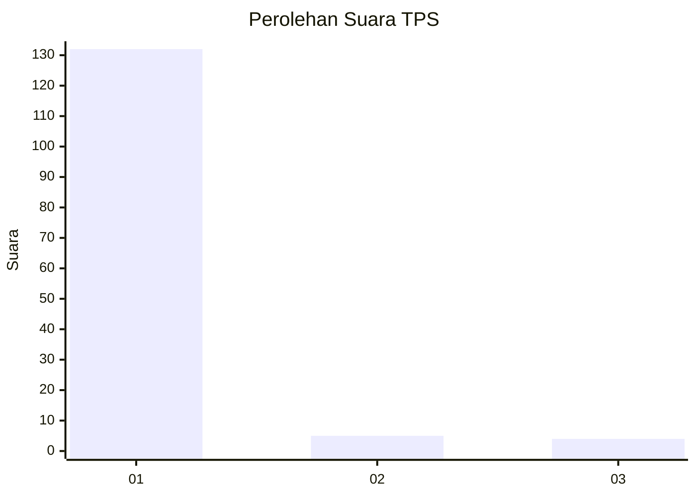
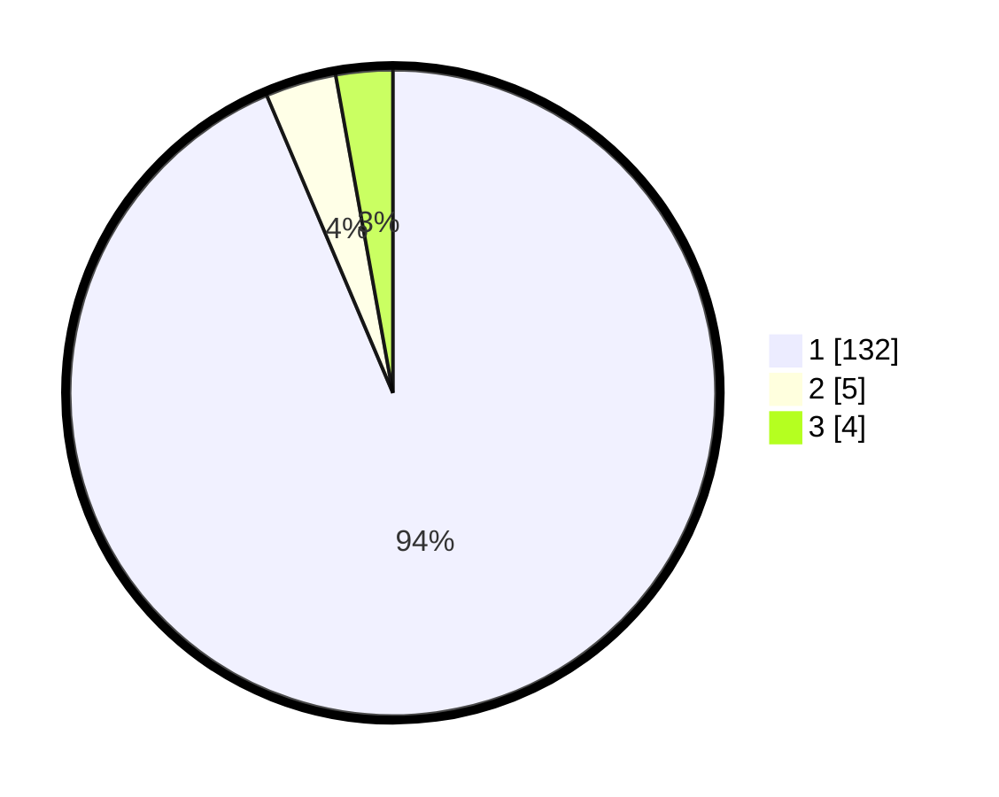

# Hasil

## Grafik

## Tabel

| No. | Nama Paslon    | Suara | Suara (raw) | Persentase |
|:--- |:-------------- | -----:| -----------:| ----------:|
| 1   | ANIES MUHAIMIN | 132   | [132][p-1]  | 93,62      |
| 2   | PRABOWO GIBRAN | 5     | [5][p-2]    | 3,55       |
| 3   | GANJAR MAHFUD  | 4     | [4][p-3]    | 2,84       |

[p-1]: https://github.com/gigit-pemilu/pemilu-2024-11-aceh/blob/main/pilpres/hitung-suara/sub/11-aceh/sub/07-pidie/sub/04-delima/sub/2015-bungo/sub/001-tps/sub/paslon-1.txt
[p-2]: https://github.com/gigit-pemilu/pemilu-2024-11-aceh/blob/main/pilpres/hitung-suara/sub/11-aceh/sub/07-pidie/sub/04-delima/sub/2015-bungo/sub/001-tps/sub/paslon-2.txt
[p-3]: https://github.com/gigit-pemilu/pemilu-2024-11-aceh/blob/main/pilpres/hitung-suara/sub/11-aceh/sub/07-pidie/sub/04-delima/sub/2015-bungo/sub/001-tps/sub/paslon-3.txt

## Foto C Plano

https://sirekap-obj-formc.kpu.go.id/1a73/pemilu/ppwp/11/07/04/20/15/1107042015001-20240215-114141--8f7cb121-e6f8-4143-9df7-e0fac686e2ba.jpg

https://sirekap-obj-formc.kpu.go.id/1a73/pemilu/ppwp/11/07/04/20/15/1107042015001-20240214-204224--f798310e-37c9-4279-beaa-8000787cb420.jpg

https://sirekap-obj-formc.kpu.go.id/1a73/pemilu/ppwp/11/07/04/20/15/1107042015001-20240214-204307--be4f4d8a-b55f-4205-a929-51663d274468.jpg

## Metadata

| Key        | Value               |
| ---------- | ------------------- |
| Time Stamp | 2024-02-16 03:30:26 |

