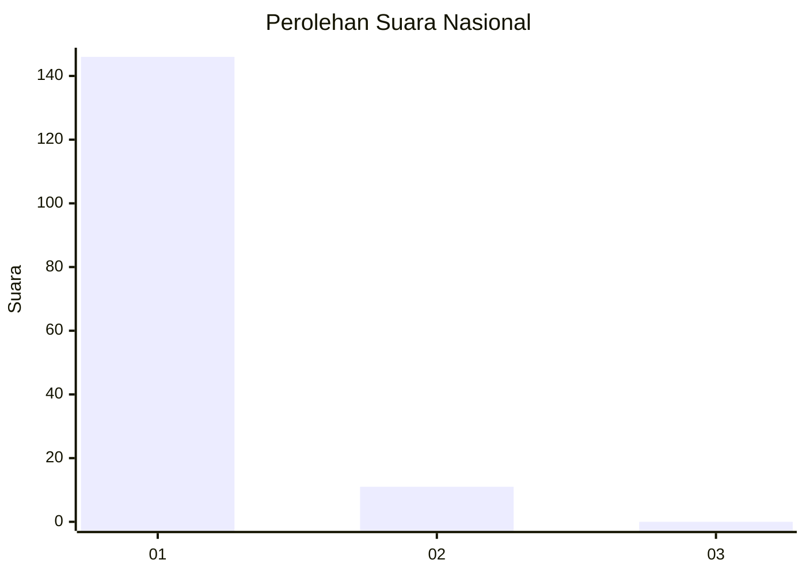
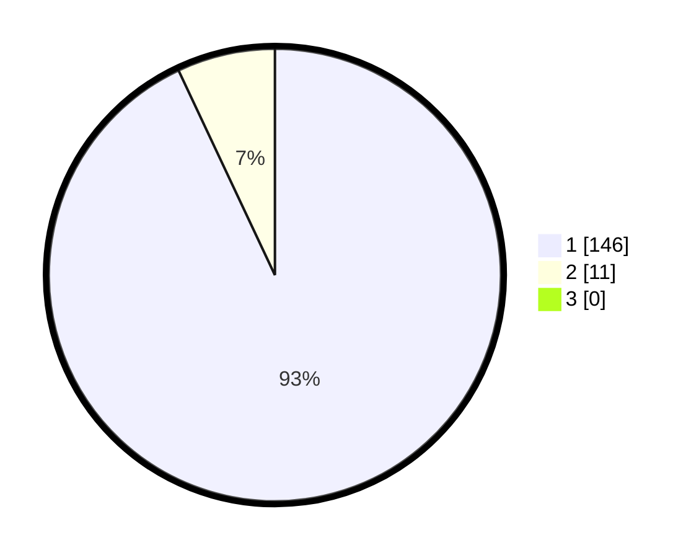

# Hasil

## Grafik

## Tabel

| No. | Nama Paslon    | Suara | Suara (raw) | Persentase |
|:--- |:-------------- | -----:| -----------:| ----------:|
| 1   | ANIES MUHAIMIN | 146   | [146][p-1]  | 92,99      |
| 2   | PRABOWO GIBRAN | 11    | [11][p-2]   | 7,01       |
| 3   | GANJAR MAHFUD  | 0     | [0][p-3]    | 0,00       |

[p-1]: https://github.com/gigit-pemilu/pemilu-2024/blob/main/pilpres/hitung-suara/sub/11-aceh/sub/07-pidie/sub/04-delima/sub/2018-dayah-baro/sub/001-tps/sub/paslon-1.txt
[p-2]: https://github.com/gigit-pemilu/pemilu-2024/blob/main/pilpres/hitung-suara/sub/11-aceh/sub/07-pidie/sub/04-delima/sub/2018-dayah-baro/sub/001-tps/sub/paslon-2.txt
[p-3]: https://github.com/gigit-pemilu/pemilu-2024/blob/main/pilpres/hitung-suara/sub/11-aceh/sub/07-pidie/sub/04-delima/sub/2018-dayah-baro/sub/001-tps/sub/paslon-3.txt

## Foto C Plano

https://sirekap-obj-formc.kpu.go.id/6a5f/pemilu/ppwp/11/07/04/20/18/1107042018001-20240215-095950--62b9a04d-3d34-4fa0-b67c-40caaa69dd82.jpg

https://sirekap-obj-formc.kpu.go.id/6a5f/pemilu/ppwp/11/07/04/20/18/1107042018001-20240215-100146--e3b9d77a-790a-4709-b689-77b00b7fad13.jpg

https://sirekap-obj-formc.kpu.go.id/6a5f/pemilu/ppwp/11/07/04/20/18/1107042018001-20240215-100310--8a873a94-d275-4f25-b2ab-d8083046a3e0.jpg

## Metadata

| Key        | Value               |
| ---------- | ------------------- |
| Time Stamp | 2024-02-16 03:30:26 |

