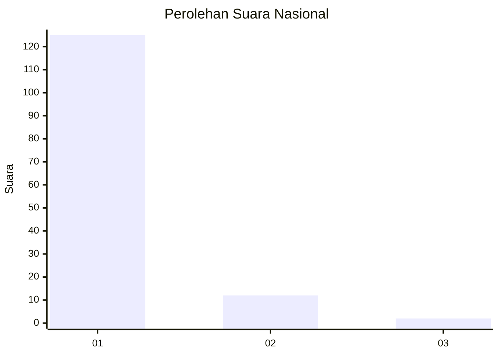
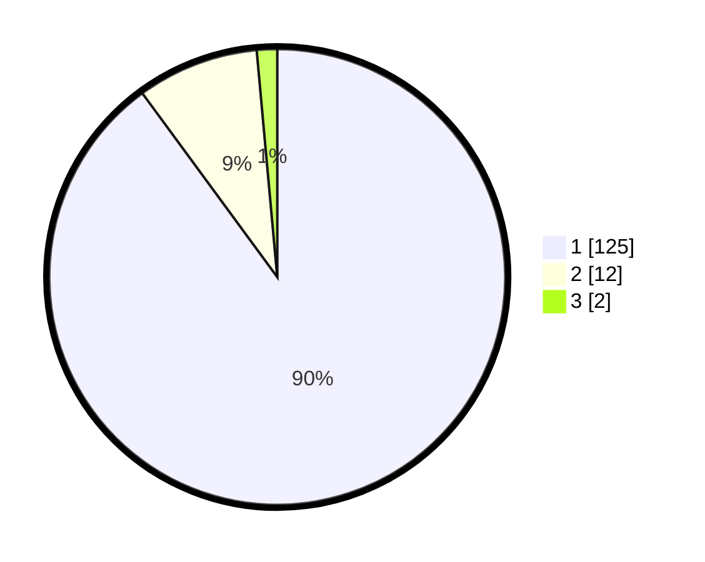

# Hasil

## Grafik

## Tabel

| No. | Nama Paslon    | Suara | Suara (raw) | Persentase |
|:--- |:-------------- | -----:| -----------:| ----------:|
| 1   | ANIES MUHAIMIN | 125   | [125][p-1]  | 89,93      |
| 2   | PRABOWO GIBRAN | 12    | [12][p-2]   | 8,63       |
| 3   | GANJAR MAHFUD  | 2     | [2][p-3]    | 1,44       |

[p-1]: https://github.com/gigit-pemilu/pemilu-2024/blob/main/pilpres/hitung-suara/sub/11-aceh/sub/07-pidie/sub/04-delima/sub/2026-pulo-baroh-aree/sub/002-tps/sub/paslon-1.txt
[p-2]: https://github.com/gigit-pemilu/pemilu-2024/blob/main/pilpres/hitung-suara/sub/11-aceh/sub/07-pidie/sub/04-delima/sub/2026-pulo-baroh-aree/sub/002-tps/sub/paslon-2.txt
[p-3]: https://github.com/gigit-pemilu/pemilu-2024/blob/main/pilpres/hitung-suara/sub/11-aceh/sub/07-pidie/sub/04-delima/sub/2026-pulo-baroh-aree/sub/002-tps/sub/paslon-3.txt

## Foto C Plano

https://sirekap-obj-formc.kpu.go.id/2c5f/pemilu/ppwp/11/07/04/20/26/1107042026002-20240214-225924--a885f202-dd1d-408b-943a-79bf013d6ae9.jpg

https://sirekap-obj-formc.kpu.go.id/2c5f/pemilu/ppwp/11/07/04/20/26/1107042026002-20240214-230140--35e851a7-0b5b-43d5-b626-4d59d4a90c0e.jpg

https://sirekap-obj-formc.kpu.go.id/2c5f/pemilu/ppwp/11/07/04/20/26/1107042026002-20240214-230318--173a3fc3-f8a2-4335-8716-8d64d7080d8a.jpg

## Metadata

| Key        | Value               |
| ---------- | ------------------- |
| Time Stamp | 2024-02-17 16:52:47 |

