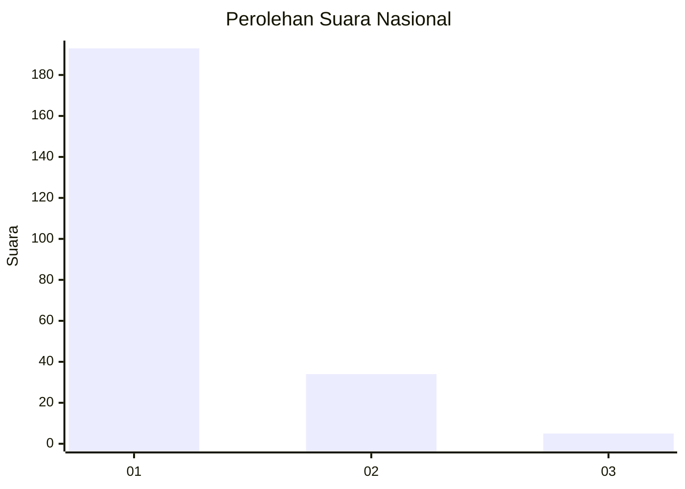
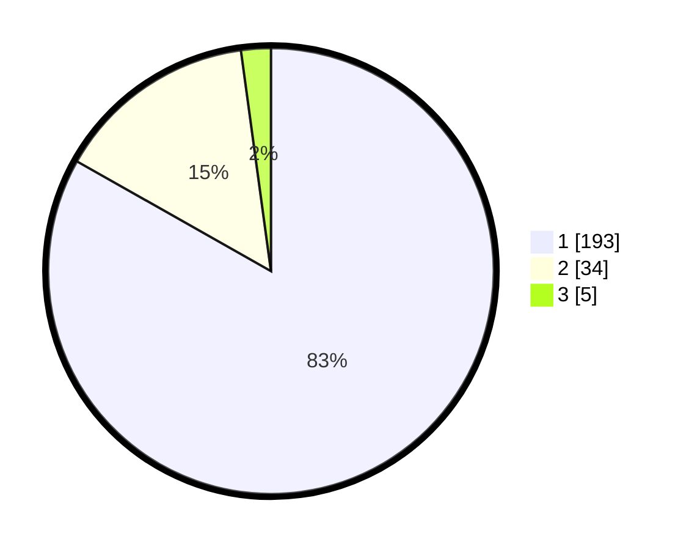

# Hasil

## Grafik

## Tabel

| No. | Nama Paslon    | Suara | Suara (raw) | Persentase |
|:--- |:-------------- | -----:| -----------:| ----------:|
| 1   | ANIES MUHAIMIN | 193   | [193][p-1]  | 83,19      |
| 2   | PRABOWO GIBRAN | 34    | [34][p-2]   | 14,66      |
| 3   | GANJAR MAHFUD  | 5     | [5][p-3]    | 2,16       |

[p-1]: https://github.com/gigit-pemilu/pemilu-2024/blob/main/pilpres/hitung-suara/sub/11-aceh/sub/07-pidie/sub/04-delima/sub/2029-ceurih-kupula/sub/001-tps/sub/paslon-1.txt
[p-2]: https://github.com/gigit-pemilu/pemilu-2024/blob/main/pilpres/hitung-suara/sub/11-aceh/sub/07-pidie/sub/04-delima/sub/2029-ceurih-kupula/sub/001-tps/sub/paslon-2.txt
[p-3]: https://github.com/gigit-pemilu/pemilu-2024/blob/main/pilpres/hitung-suara/sub/11-aceh/sub/07-pidie/sub/04-delima/sub/2029-ceurih-kupula/sub/001-tps/sub/paslon-3.txt

## Foto C Plano

https://sirekap-obj-formc.kpu.go.id/11de/pemilu/ppwp/11/07/04/20/29/1107042029001-20240214-213944--eb91d296-9fd2-4286-9cfa-0b955b8f3251.jpg

https://sirekap-obj-formc.kpu.go.id/11de/pemilu/ppwp/11/07/04/20/29/1107042029001-20240214-214240--4981b0b0-ed75-491c-84d9-c324678ebe5f.jpg

https://sirekap-obj-formc.kpu.go.id/11de/pemilu/ppwp/11/07/04/20/29/1107042029001-20240214-214911--e9423dd4-7e60-43eb-a469-3e95e1e3bedc.jpg

## Metadata

| Key        | Value               |
| ---------- | ------------------- |
| Time Stamp | 2024-02-19 06:16:00 |

