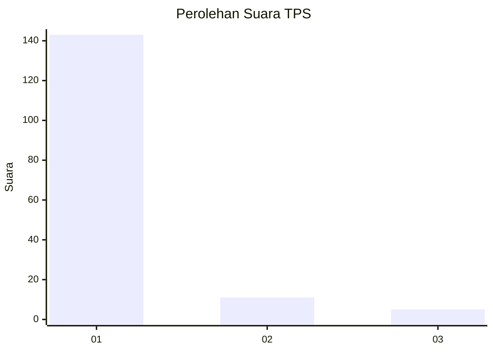
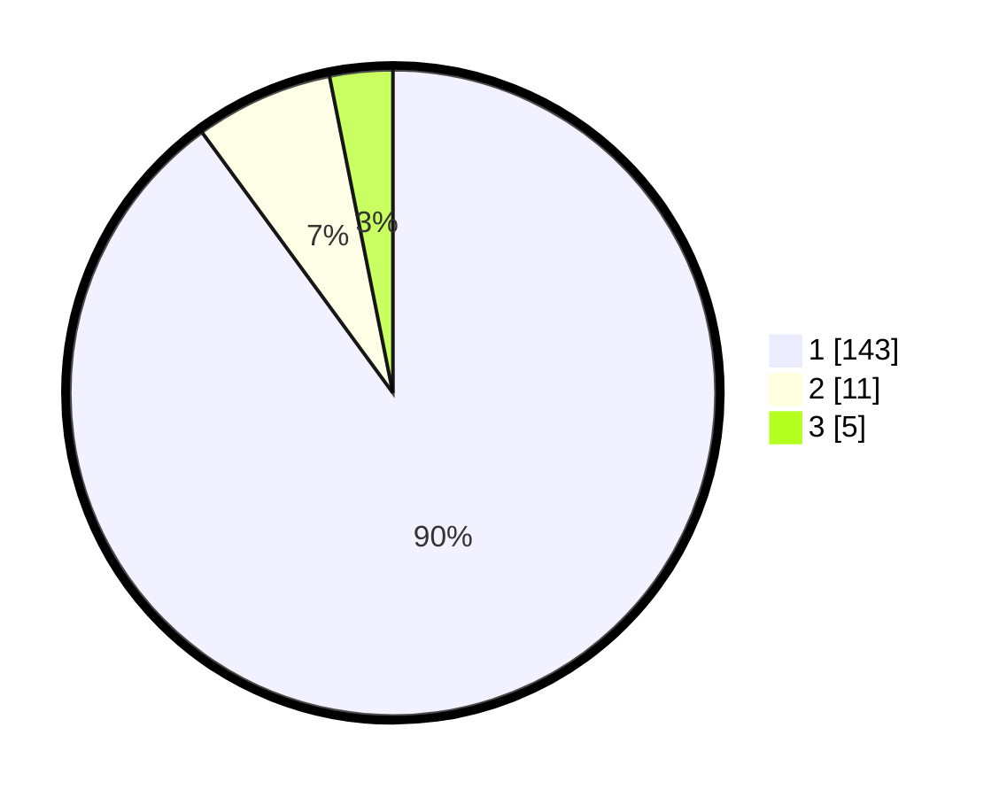

# Hasil

## Grafik

## Tabel

| No. | Nama Paslon    | Suara | Suara (raw) | Persentase |
|:--- |:-------------- | -----:| -----------:| ----------:|
| 1   | ANIES MUHAIMIN | 143   | [143][p-1]  | 89,94      |
| 2   | PRABOWO GIBRAN | 11    | [11][p-2]   | 6,92       |
| 3   | GANJAR MAHFUD  | 5     | [5][p-3]    | 3,14       |

[p-1]: https://github.com/gigit-pemilu/pemilu-2024-11-aceh/blob/main/pilpres/hitung-suara/sub/11-aceh/sub/07-pidie/sub/04-delima/sub/2034-dayah-beuah/sub/002-tps/sub/paslon-1.txt
[p-2]: https://github.com/gigit-pemilu/pemilu-2024-11-aceh/blob/main/pilpres/hitung-suara/sub/11-aceh/sub/07-pidie/sub/04-delima/sub/2034-dayah-beuah/sub/002-tps/sub/paslon-2.txt
[p-3]: https://github.com/gigit-pemilu/pemilu-2024-11-aceh/blob/main/pilpres/hitung-suara/sub/11-aceh/sub/07-pidie/sub/04-delima/sub/2034-dayah-beuah/sub/002-tps/sub/paslon-3.txt

## Foto C Plano

https://sirekap-obj-formc.kpu.go.id/a50e/pemilu/ppwp/11/07/04/20/34/1107042034002-20240214-211111--9dce99b6-5be4-4c13-a11a-9c7815df9b0a.jpg

https://sirekap-obj-formc.kpu.go.id/a50e/pemilu/ppwp/11/07/04/20/34/1107042034002-20240215-085242--5a598f50-5372-419e-8d4b-23866a25d0b9.jpg

https://sirekap-obj-formc.kpu.go.id/a50e/pemilu/ppwp/11/07/04/20/34/1107042034002-20240215-085318--33d292ac-e3b0-4eb2-9556-655830b539db.jpg

## Metadata

| Key        | Value               |
| ---------- | ------------------- |
| Time Stamp | 2024-02-19 06:16:00 |

