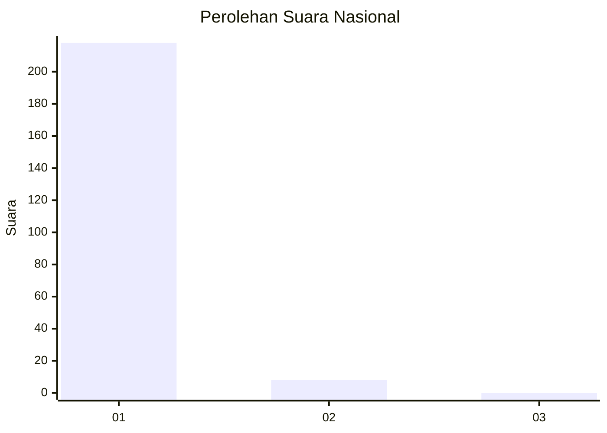
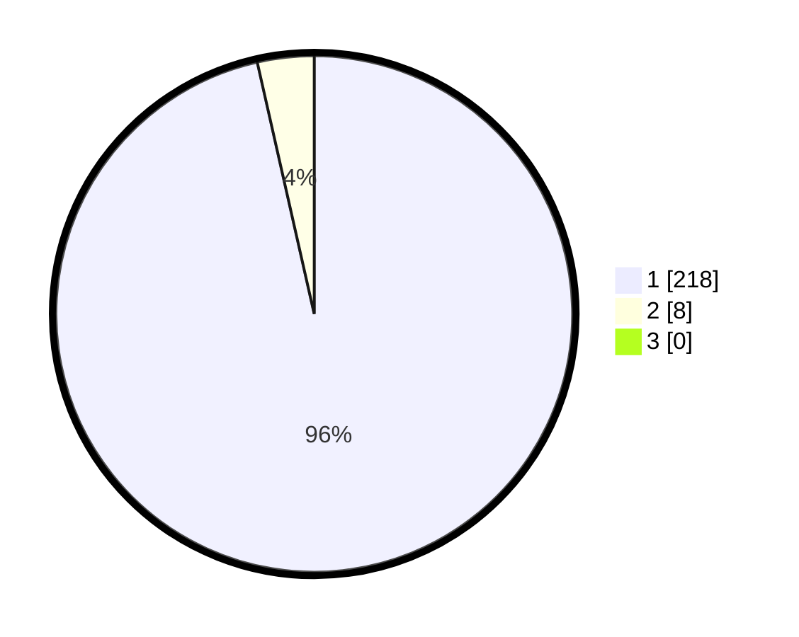

# Hasil

## Grafik

## Tabel

| No. | Nama Paslon    | Suara | Suara (raw) | Persentase |
|:--- |:-------------- | -----:| -----------:| ----------:|
| 1   | ANIES MUHAIMIN | 218   | [218][p-1]  | 96,46      |
| 2   | PRABOWO GIBRAN | 8     | [8][p-2]    | 3,54       |
| 3   | GANJAR MAHFUD  | 0     | [0][p-3]    | 0,00       |

[p-1]: https://github.com/gigit-pemilu/pemilu-2024/blob/main/pilpres/hitung-suara/sub/11-aceh/sub/07-pidie/sub/04-delima/sub/2038-mesjid-bambong/sub/001-tps/sub/paslon-1.txt
[p-2]: https://github.com/gigit-pemilu/pemilu-2024/blob/main/pilpres/hitung-suara/sub/11-aceh/sub/07-pidie/sub/04-delima/sub/2038-mesjid-bambong/sub/001-tps/sub/paslon-2.txt
[p-3]: https://github.com/gigit-pemilu/pemilu-2024/blob/main/pilpres/hitung-suara/sub/11-aceh/sub/07-pidie/sub/04-delima/sub/2038-mesjid-bambong/sub/001-tps/sub/paslon-3.txt

## Foto C Plano

https://sirekap-obj-formc.kpu.go.id/289b/pemilu/ppwp/11/07/04/20/38/1107042038001-20240215-094357--9cc9d69a-d11c-4aa3-b685-29880fd97dfa.jpg

https://sirekap-obj-formc.kpu.go.id/289b/pemilu/ppwp/11/07/04/20/38/1107042038001-20240215-094530--f7a8fc8e-561d-4a3f-870d-2d52a71ce733.jpg

https://sirekap-obj-formc.kpu.go.id/289b/pemilu/ppwp/11/07/04/20/38/1107042038001-20240215-094658--71dcf6f9-2d2f-47bd-865d-cfa3aa9a03b3.jpg

## Metadata

| Key        | Value               |
| ---------- | ------------------- |
| Time Stamp | 2024-02-19 06:16:00 |

