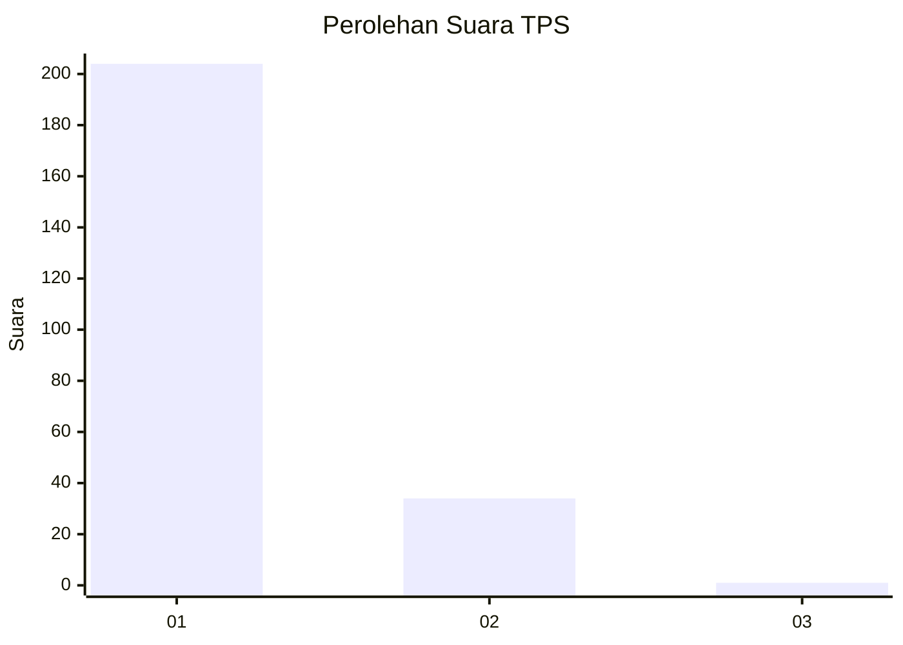
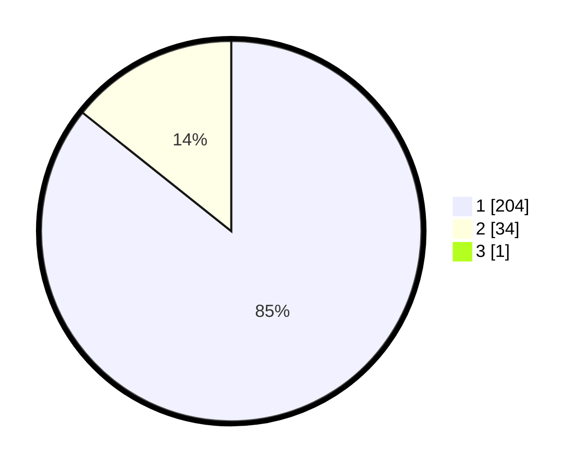

# Hasil

## Grafik

## Tabel

| No. | Nama Paslon    | Suara | Suara (raw) | Persentase |
|:--- |:-------------- | -----:| -----------:| ----------:|
| 1   | ANIES MUHAIMIN | 204   | [204][p-1]  | 85,36      |
| 2   | PRABOWO GIBRAN | 34    | [34][p-2]   | 14,23      |
| 3   | GANJAR MAHFUD  | 1     | [1][p-3]    | 0,42       |

[p-1]: https://github.com/gigit-pemilu/pemilu-2024-11-aceh/blob/main/pilpres/hitung-suara/sub/11-aceh/sub/07-pidie/sub/04-delima/sub/2039-ruseb/sub/001-tps/sub/paslon-1.txt
[p-2]: https://github.com/gigit-pemilu/pemilu-2024-11-aceh/blob/main/pilpres/hitung-suara/sub/11-aceh/sub/07-pidie/sub/04-delima/sub/2039-ruseb/sub/001-tps/sub/paslon-2.txt
[p-3]: https://github.com/gigit-pemilu/pemilu-2024-11-aceh/blob/main/pilpres/hitung-suara/sub/11-aceh/sub/07-pidie/sub/04-delima/sub/2039-ruseb/sub/001-tps/sub/paslon-3.txt

## Foto C Plano

https://sirekap-obj-formc.kpu.go.id/eda1/pemilu/ppwp/11/07/04/20/39/1107042039001-20240215-071029--2e7c65a4-8bbe-49d5-a585-dd6f1e62b326.jpg

https://sirekap-obj-formc.kpu.go.id/eda1/pemilu/ppwp/11/07/04/20/39/1107042039001-20240215-071128--d6549259-7adf-4171-b09b-16002a5a90fd.jpg

https://sirekap-obj-formc.kpu.go.id/eda1/pemilu/ppwp/11/07/04/20/39/1107042039001-20240215-071258--a6487835-9c52-4b24-a2c9-b57600eb140c.jpg

## Metadata

| Key        | Value               |
| ---------- | ------------------- |
| Time Stamp | 2024-02-17 18:30:00 |

