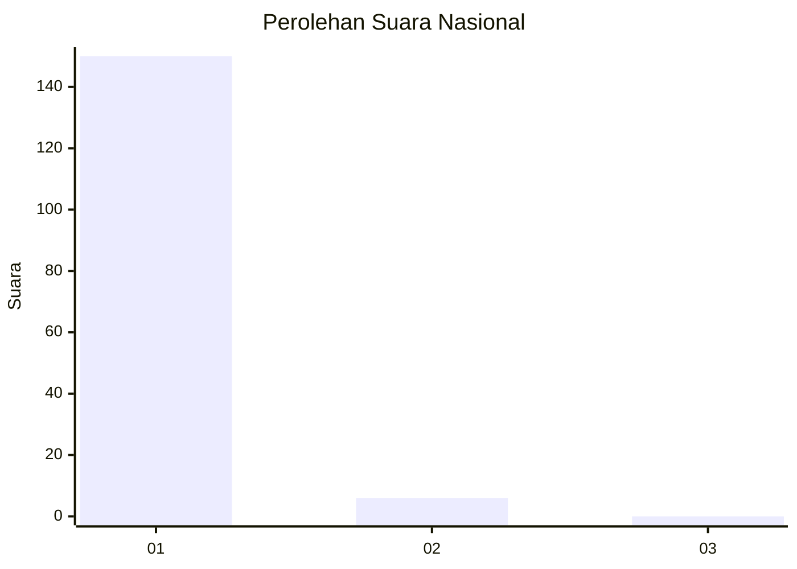
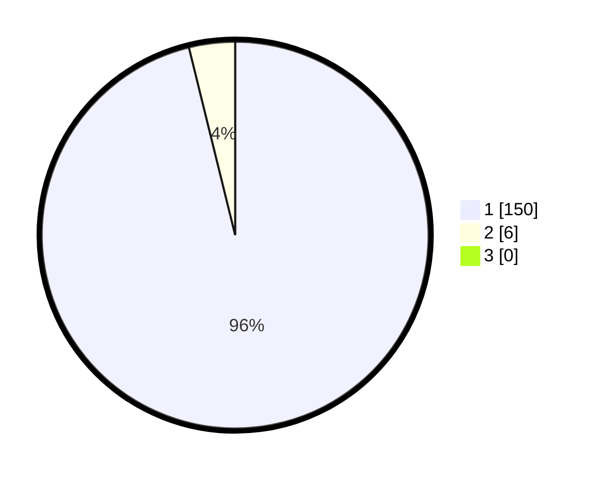

# Hasil

## Grafik

## Tabel

| No. | Nama Paslon    | Suara | Suara (raw) | Persentase |
|:--- |:-------------- | -----:| -----------:| ----------:|
| 1   | ANIES MUHAIMIN | 150   | [150][p-1]  | 96,15      |
| 2   | PRABOWO GIBRAN | 6     | [6][p-2]    | 3,85       |
| 3   | GANJAR MAHFUD  | 0     | [0][p-3]    | 0,00       |

[p-1]: https://github.com/gigit-pemilu/pemilu-2024/blob/main/pilpres/hitung-suara/sub/11-aceh/sub/07-pidie/sub/04-delima/sub/2041-seukeum/sub/001-tps/sub/paslon-1.txt
[p-2]: https://github.com/gigit-pemilu/pemilu-2024/blob/main/pilpres/hitung-suara/sub/11-aceh/sub/07-pidie/sub/04-delima/sub/2041-seukeum/sub/001-tps/sub/paslon-2.txt
[p-3]: https://github.com/gigit-pemilu/pemilu-2024/blob/main/pilpres/hitung-suara/sub/11-aceh/sub/07-pidie/sub/04-delima/sub/2041-seukeum/sub/001-tps/sub/paslon-3.txt

## Foto C Plano

https://sirekap-obj-formc.kpu.go.id/8ecd/pemilu/ppwp/11/07/04/20/41/1107042041001-20240214-224728--26de7b08-ac00-4f1e-8028-7b32be49eab8.jpg

https://sirekap-obj-formc.kpu.go.id/8ecd/pemilu/ppwp/11/07/04/20/41/1107042041001-20240214-224840--f1b963f6-ed03-4138-bd84-9adf6fa1592b.jpg

https://sirekap-obj-formc.kpu.go.id/8ecd/pemilu/ppwp/11/07/04/20/41/1107042041001-20240214-224929--da25f817-1e13-4771-a735-be490254d0c2.jpg

## Metadata

| Key        | Value               |
| ---------- | ------------------- |
| Time Stamp | 2024-02-24 22:31:28 |

